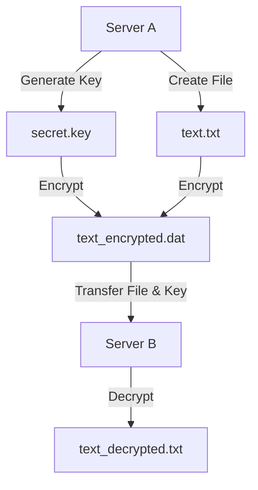
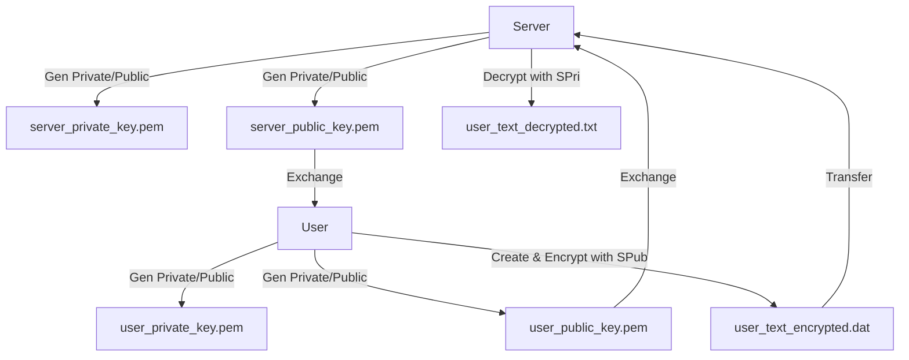

# file encryption

## Requirements

- OpenSSL
- Linux remote servers

## Symmetric Encryption

Uses single shared key for encryption/decryption

- Server A: Encrypts
- Server B: Decrypts



### Step 1: Generate Key (Server A)

``` bash
openssl rand -out secret.key 32
```

- Generate a random key for encryption
- The key should be 256 bits (32 bytes) which is the standard size for AES-256 encryption

### Step 2: Create File (Server A)

```bash
echo "This is a simple line of code" > text.txt
```

### Step 3: Encrypt File (Server A)

``` bash
openssl enc -aes-256-cbc -pbkdf2 -in text.txt -out text_encrypted.dat -pass file:./secret.key
```

- Use the above `secret.key` to encrypt the `text.txt`

### Step 4: Transfer to Server B

``` bash
scp text_encrypted.dat secret.key abc@52.221.181.100:/home/abc/
```

- Use SCP (assuming Server B IP: 52.221.181.100, username: abc)

:::tip
Use SSH/SCP for secure transfer, avoid manual passwords
:::

### Step 5: Decrypt File (Server B)

``` bash
openssl enc -d -aes-256-cbc -pbkdf2 -in text_encrypted.dat -out text_decrypted.txt -pass file:./secret.key
```

- Use the secret key to decrypt the file

### Drawbacks

While symmetric encryption is fast and efficient, it does have some drawbacks, especially when it comes to key distribution and security

- Key sharing insecure in large systems
- Intercepted key compromises all data

## Asymmetric Encryption

Uses public/private key pairs for secure communication

- Server: Generates keys, shares public key
- User: Generates keys, shares public key
- Encrypt with recipient's public key; decrypt with own private key

User to Server



### Step 1: Generate Keys

Server

```bash
openssl genpkey -algorithm RSA -aes256 -out server_private_key.pem
openssl rsa -pubout -in server_private_key.pem -out server_public_key.pem
```

User

```bash
openssl genpkey -algorithm RSA -aes256 -out user_private_key.pem
openssl rsa -pubout -in user_private_key.pem -out user_public_key.pem
```

### Step 2: Exchange Public Keys

User to Server (Server IP: 52.221.181.100, username: abc)

```bash
scp user_public_key.pem abc@52.221.181.100:/home/abc/
```

Server to User

```bash
scp server_public_key.pem user@UserIP:/path/to/user/  # Adjust UserIP/path
```

### Step 3: User Encrypts File

```bash
echo "Is this correct?" > user_text.txt
openssl pkeyutl -encrypt -inkey server_public_key.pem -pubin -in user_text.txt -out user_text_encrypted.dat
```

### Step 4: User Transfers to Server

``` bash
scp user_text_encrypted.dat abc@52.221.181.100:/home/abc/
```

### Step 5: Server Decrypts

``` bash
openssl pkeyutl -decrypt -inkey server_private_key.pem -in user_text_encrypted.dat -out user_text_decrypted.txt
```

- Use `server_private_key.pem` to decrypt the file

### Step 6: Server Encrypts Response

``` bash
echo "This is correct!" > server_text.txt
openssl pkeyutl -encrypt -inkey user_public_key.pem -pubin -in server_text.txt -out server_text_encrypted.dat
```

### Step 7: Server Transfers to User

``` bash
scp server_text_encrypted.dat user@UserIP:/path/to/user/  # Adjust UserIP/path
```

### Step 8: User Decrypts

``` bash
openssl pkeyutl -decrypt -inkey user_private_key.pem -in server_text_encrypted.dat -out server_text_decrypted.txt
```

- Use `user_private_key.pem` to decrypt the file
