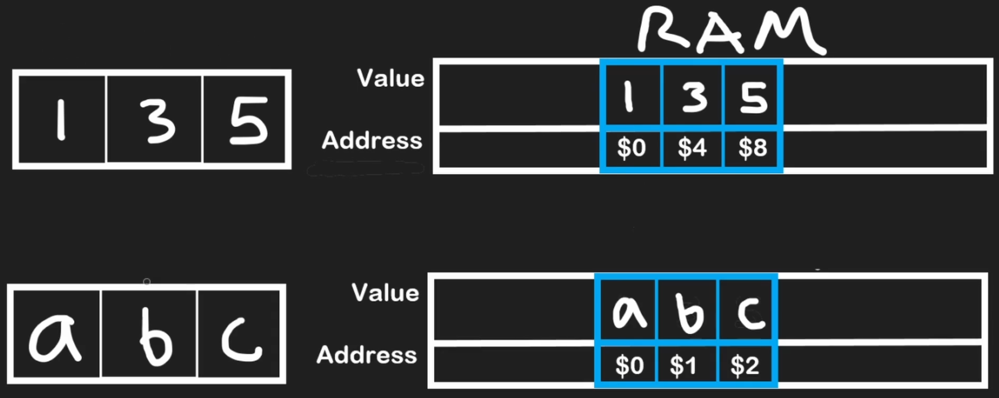
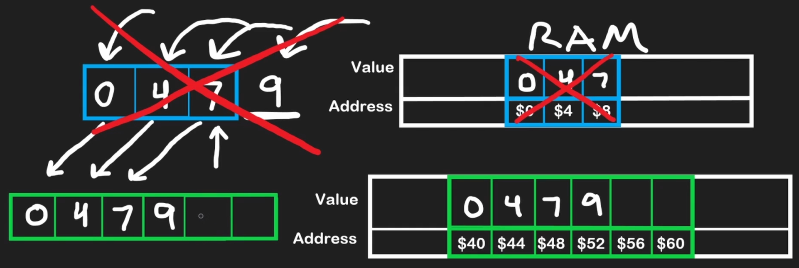
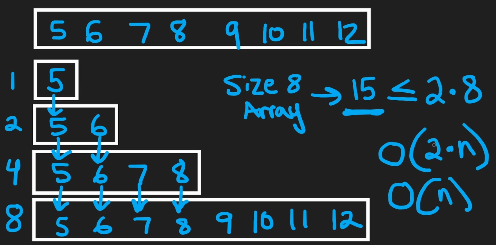
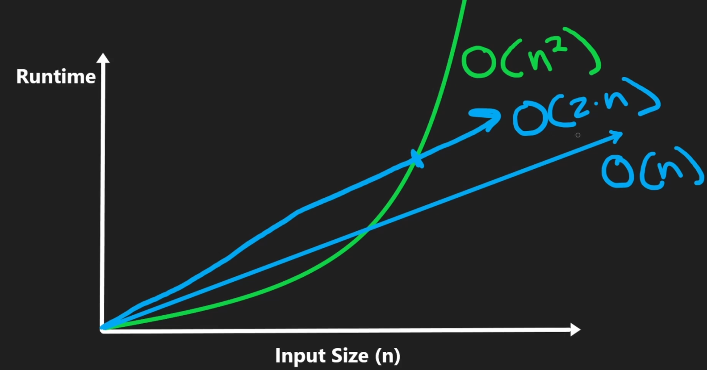
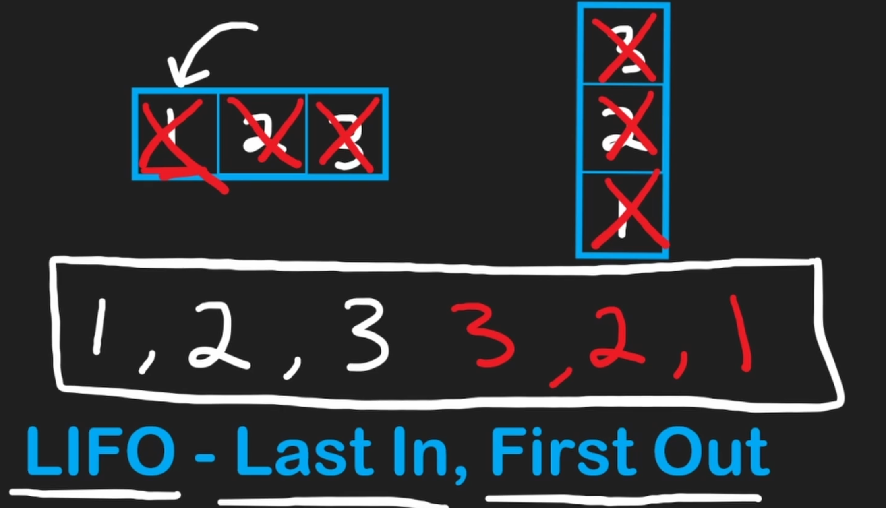

# array

## What is an Array?

- Stores a collection of values in a contiguous block of memory
- Elements are located one after another with no space in between

## How Data is Stored in Memory

- RAM (Random Access Memory)
  - All variables and data structures are stored
  - Composed of billions of bytes
- Byte
  - A byte is a unit of memory made up of 8 bits
- Bit
  - A bit is the most basic unit, representing a single binary digit, either a 0 or a 1

Each element's location in memory has a unique address. Because they are stored sequentially, the address for each subsequent element increases by a fixed amount determined by the data type's size

- Integer: An integer commonly requires 4 bytes of storage (e.g., address 0, address 4, address 8)
- Character: A single character typically only needs 1 byte (e.g., address 0, address 1, address 2)

## Static vs. Dynamic Arrays

- Static: Have a fixed size determined at creation. You can't add or remove elements
  - Examples: C++ (`int[]`), Java (`double[]`)
- Dynamic: Are resizable. You can add or remove elements as needed
  - Examples: C++ (`std::vector`), Java (`ArrayList`), Python (`list`)

### How Dynamic Arrays Work

Dynamic arrays manage a block of memory with a certain capacity

- If you don't specify the size, it will initalize it to some default size depending the programming langauge
- There is a pointer to save the last element of the array
- Size: The number of elements currently in the array
- Capacity: The total number of elements the array can hold before needing to resize

When the size exceeds the capacity, the array automatically

- Allocates a new, larger block of memory (often double the size)
- Copies all existing elements to the new location &rarr; O(n) operation
- Add the new element
- Deallocates the old memory block

### Amortized Complexity

Amortized complexity is the average cost of an operation over many operations. Rare, expensive operations are offset by frequent, cheap ones, spreading high costs for a realistic performance measure

How it applies to a dynamic array

- The action: Adding an element to the end of the array
- The cheap case O(1): When there’s empty space, adding an element is instant
- The expensive case O(n): When full, a resize is needed
  - Create a new, larger array (usually double the size)
  - Copy all elements from the old array (O(n) time, where n is the current number of elements)
- The amortized result O(1): Resizes are infrequent. After one resize, many O(1) additions occur before the next resize. Averaging total cost over all additions yields a constant cost per addition, so the amortized time complexity is O(1)

Example (size 8 array)

- For 8 elements
  - 8 insertions
  - 7 copy operations during resizes (1 for size 1 &rarr; 2, 2 for 2 &rarr; 4, 4 for 4 &rarr; 8)
  - Total cost: 8 (insertions) + 7 (copies) = 15 operations
  - 15 <= 2 * 8 (16), so total cost for n elements is ~ O(2n)

O(2n) vs. O(n)

- In Big O, constants (e.g., 2) are ignored, so O(2n) simplifies to O(n)
- Average cost per insertion: O(2n)/n = O(2) → O(1) after ignoring constants
- This is amortized time complexity: rare, costly resizes are spread over many fast O(1) insertions

## Stack

A stack is a common data structure that supports three main O(1) (constant time) operations

- Push: Adds an element to the end (top) of the stack
- Pop: Removes an element from the end of the stack
- Peek: Looks at the last element without removing it

The defining principle of a stack is LIFO (Last-In, First-Out), which means the last element added is the first one to be removed. A primary use case for this behavior is reversing a sequence of elements, like a string

## Complexity

Static arrays

- Read/Access: O(1)
- Update: O(1)
- Append/Remove from the end: O(1)
- Insert/Remove from the middle: O(n)
  - It requires shifting subsequent elements

Dynamic arrays

- Read/Access: O(1)
- Append/Remove from the end: O(1) amortized
- Insert/Remove from the middle: O(n)

Stack

- Push/Pop/Peek/Top: O(1)
