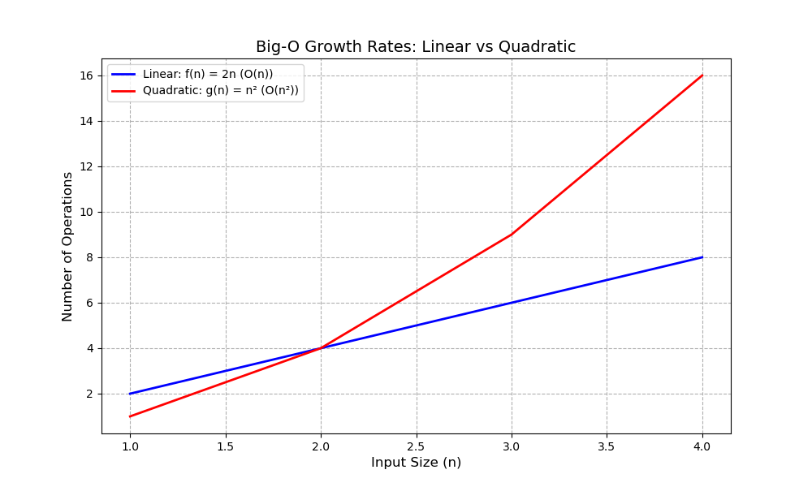
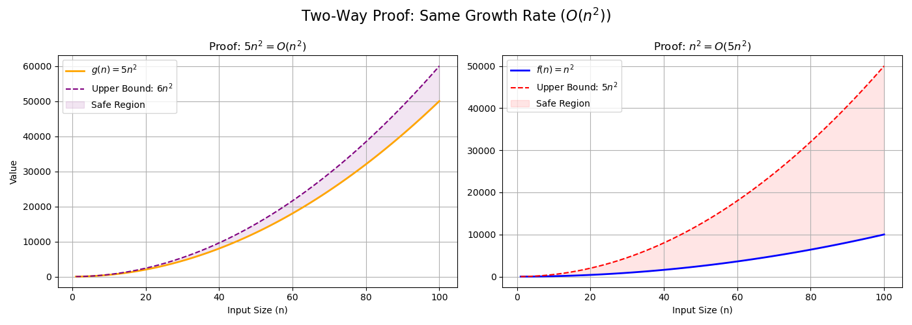
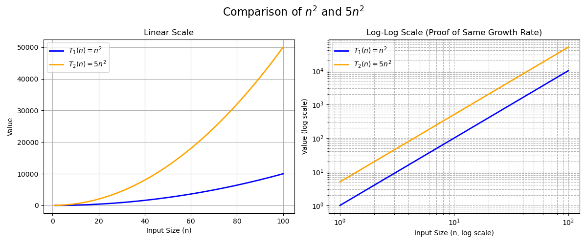
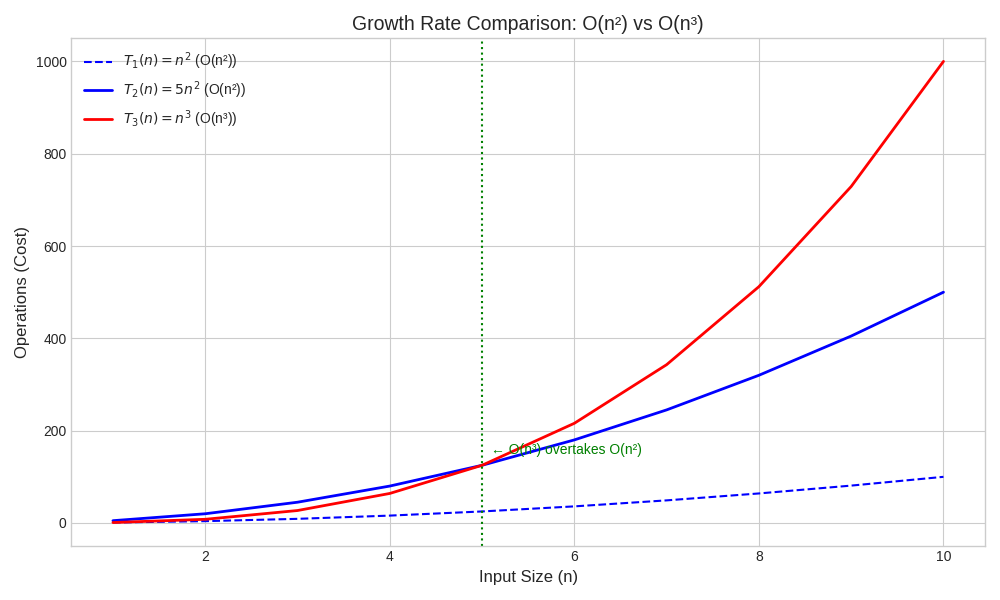
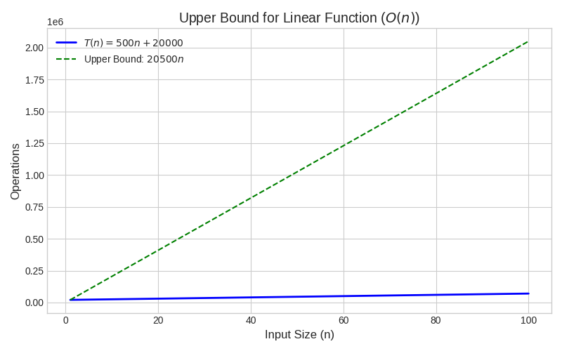
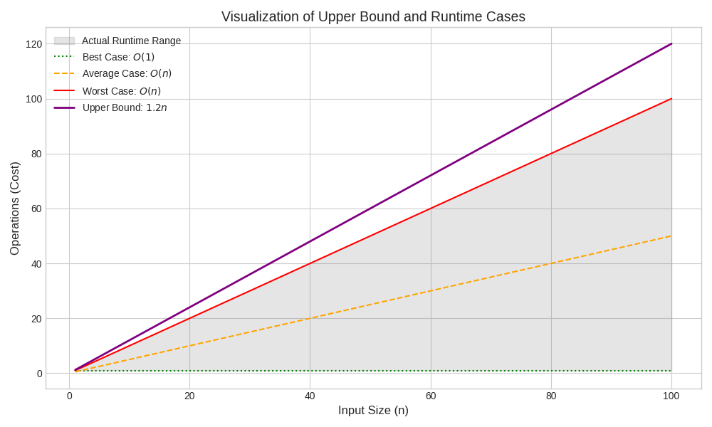
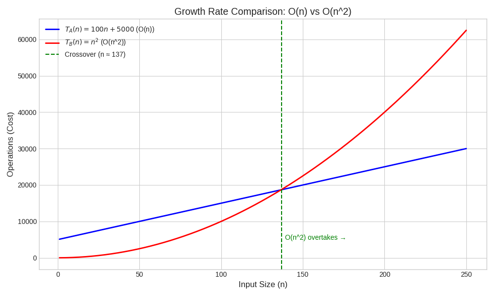

# big-o

## Introduction to Big-O

Big-O notation is a mathematical framework for analyzing algorithm efficiency by describing how the number of operations grows with input size (n). It focuses on long-term behavior, ignoring constants and lower-order terms to classify algorithms into growth rate "families."

Purpose

- Compare algorithms: Enables objective efficiency comparisons for large datasets
- Analyze scalability: Predicts performance as input size increases, critical for scalable systems
- Abstract details: Focuses on the algorithm's core structure, independent of hardware or language specifics

## Core Concepts

### Growth Rate (Asymptotic Behavior)

Big-O examines how an algorithm performs as n approaches infinity, using asymptotic analysis

- Marathon analogy: O(n) (linear) is like a marathon runner with steady pacing, scaling better for large n. O(n^2) (quadratic) is like a sprinter, fast for small n but slowing dramatically as n grows
- Example: Linear (f(n) = 2n) grows steadily (each n adds 2), while quadratic (g(n) = n^2) accelerates explosively (larger n causes bigger jumps)

### Dominant Term

Big-O simplifies complex functions (e.g., T(n) = 5n^2 + 1000n + 5000) to the fastest-growing term (O(n^2))

- Car engine analogy: The dominant term (n^2) is like a car's engine (e.g., V8), defining performance, while constants (5) and lower-order terms (1000n, 5000) are like a stereo or paint job—minor in the long run

### Upper Bound

Big-O provides a worst-case performance guarantee

- Elevator analogy: Like a "Max Load: 500 kg" sign, O(n) guarantees an algorithm's operations won't exceed a linear function for large n, though best-case performance (e.g., O(1)) may be better
- Definition: A function f(n) is O(g(n)) if there exist positive constants c and n₀ such that f(n) ≤ c × g(n) for all n ≥ n₀

## Proving Big-O

Lock and Key Analogy

- Lock: The Big-O definition tests if a function's growth stays at or below g(n)
- Key: A pair (c, n₀) satisfying the inequality
- Proof: Finding one valid (c, n₀) confirms f(n) is O(g(n))

Example: Proving T(n) = n^2 + 1000n + 6000 is O(n^2)

- Goal: Find c, n₀ such that n^2 + 1000n + 6000 ≤ c × n^2 for all n ≥ n₀
- Steps
  - For n ≥ 1: 1000n ≤ 1000n^2 (since n ≤ n^2), and 6000 ≤ 6000n^2 (since 1 ≤ n^2)
  - Substitute: n^2 + 1000n + 6000 ≤ n^2 + 1000n^2 + 6000n^2 = 7001n^2
  - Choose c = 7001, n₀ = 1
- Result: T(n) ≤ 7001n^2 for n ≥ 1, proving T(n) is O(n^2)

## Why Constants Are Ignored

Constants (e.g., 5 in 5n^2) are scaling factors that don't affect growth rates

- Zoologist analogy: A Corgi (n^2) and Husky (5n^2) differ in size but belong to the same "Dog" species (O(n^2))
- Reasoning
  - Constants scale values but not growth (e.g., 5n^2 and n^2 both quadruple when n doubles)
  - Big-O focuses on n approaching infinity, where constants are negligible compared to higher-degree terms (e.g., n^3 outpaces 1000n^2)
  - Ensures hardware- and implementation-independent comparisons

## Comparing Growth Rates

To compare growth rates of f(n) and g(n)

- Compute ratio: f(n)/g(n)
- Evaluate: limit as n approaches infinity of f(n)/g(n)
- Interpret
  - Finite positive constant (e.g., 5): Same growth rate
  - 0: f(n) grows slower
  - Infinity: f(n) grows faster

Example: f(n) = 5n^2 + 3n, g(n) = n^2

- Ratio: (5n^2 + 3n)/n^2 = 5 + 3/n
- Limit: limit as n approaches infinity of (5 + 3/n) = 5
- Conclusion: Same growth rate (O(n^2))

Example: f(n) = 10n^2 + 100n + 1000, g(n) = n^2

- Ratio: (10n^2 + 100n + 1000)/n^2 = 10 + 100/n + 1000/n^2
- Limit: limit as n approaches infinity of (10 + 100/n + 1000/n^2) = 10
- Conclusion: Same growth rate (O(n^2))
- Values

| n     | f(n)       | g(n)      | Difference (f(n) - g(n)) | Ratio (f(n)/g(n)) |
|-------|------------|-----------|--------------------------|-------------------|
| 10    | 3,000      | 100       | 2,900                    | 30                |
| 100   | 111,000    | 10,000    | 101,000                  | 11.1              |
| 1,000 | 10,101,000 | 1,000,000 | 9,101,000                | 10.101            |

- Ratio approaches 10, confirming same growth rate

## Linear vs. Quadratic Growth Examples

Linear Growth

Function: f(n) = 2n

- When n increases from 1 to 2, f(n) goes from 2 to 4 (increase by 2)
- When n increases from 10 to 11, f(n) goes from 20 to 22 (increase by 2)
- Conclusion: Growth is steady; each n increase by 1 adds a constant amount (O(n))

Quadratic Growth

Function: g(n) = n^2

- When n increases from 1 to 2, g(n) goes from 1 to 4 (increase by 3)
- When n increases from 10 to 11, g(n) goes from 100 to 121 (increase by 21)
- Conclusion: Growth accelerates rapidly; larger n causes bigger jumps (O(n^2))

## Practical Insights From T(n) = O(n^2)

--

- Scalability: Runtime grows approximately 100x if n grows 10x (10^2)
- Bottleneck: Nested loops likely cause the n^2 complexity
- Ranking: Less efficient than O(n log n) but better than O(n^3)

## Common Big-O Classes

--

- Logarithmic Time: O(log n)  
  - Example: Binary Search
  - Meaning: Highly efficient, ~30 steps for 1 billion items
- Linear Time: O(n)  
  - Example: T(n) = 500n + 20000
  - Meaning: Cost grows proportionally (e.g., array scanning)
- Linearithmic Time: O(n log n)  
  - Example: T(n) = 2n log n + 30n + 100
  - Meaning: Efficient for sorting (e.g., Merge Sort)
- Quadratic Time: O(n^2)  
  - Example: Bubble Sort
  - Meaning: Common in algorithms with nested loops, less scalable
- Exponential Time: O(2^n)  
  - Example: T(n) = n^4 + 3n^2 + 2^n
  - Meaning: Brute-force algorithms, unscalable for n > 50

## Bubble Sort Analysis

Basic Bubble Sort

- Worst Case (e.g., [n, n-1, ..., 1])
  - Outer loop: n iterations
  - Inner loop: n(n-1)/2 ≈ n^2/2 comparisons
  - Swaps: Up to n(n-1)/2
  - Total: ~n^2 operations
  - Big-O: T₁(n) ≈ n^2 → O(n^2)

Optimized Bubble Sort

- Worst Case
  - Comparisons: n(n-1)/2 ≈ n^2/2
  - Swaps: Up to n(n-1)/2
  - Swapped flag checks: ~n (negligible)
  - Total: ~n^2 operations
  - Big-O: T₂(n) ≈ n^2 → O(n^2)
- Best Case (e.g., [1, 2, ..., n])
  - One iteration, n-1 comparisons, 0 swaps
  - Big-O: O(n)

Comparison

- Worst Case: Both are O(n^2), with ~n(n-1)/2 comparisons
- Ratio: T₁(n)/T₂(n) ≈ 1 for comparisons, slightly higher (e.g., 1.1–1.2) with swaps and checks
- Example (n=5, [5, 4, 3, 2, 1])
  - Basic: 10 comparisons
  - Optimized: 10 comparisons + ~5 checks
  - Ratio: ~1
- Large n (n=1000)
  - Comparisons: ~499,500 for both
  - Optimized adds ~1000 checks (negligible)
  - Ratio: limit as n approaches infinity of T₁(n)/T₂(n) ≈ 1

## Understanding the Worst-Case and Upper Bound Gap

The gap between the worst-case function (e.g., f(n) = n) and the upper bound (e.g., c × n) represents a "safety margin."

- Worst Case (e.g., n): The actual cost in the worst scenario
- Upper Bound (e.g., 1.2 × n): The mathematical "ceiling" guaranteeing performance
- Example: Like promising to arrive before 5 PM but arriving at 4:50 PM—the 10-minute buffer is the gap

### Why the Gap Exists

The gap arises from flexibility in choosing c in f(n) ≤ c × g(n)

- Example: For f(n) = n, g(n) = n
  - c = 1: n ≤ n (no gap)
  - c = 1.2: n ≤ 1.2n (visible gap)
  - c = 2 or 100: n ≤ 2n or n ≤ 100n (larger gap)
- Conclusion: Big-O requires only a valid c, not the tightest, allowing a buffer for simpler proofs

### Why C × G(n) Is the Upper Bound

c × g(n) is the specific upper bound function—the ceiling f(n) never crosses for n ≥ n₀. O(g(n)) is the complexity class, indicating f(n) has an upper bound of the form c × g(n)

#### Benefits of Upper Bounds

- Guarantee: Ensures performance won't exceed the bound, critical for stable systems
- Prediction: Helps estimate scaling (e.g., O(n^2) means a 10x input increase leads to ~100x runtime increase)

### Why Ignore the Constant C?

Big-O ignores c to focus on growth type, not exact speed

- Analogy: Algorithms costing 5n^2 and 7001n^2 are like two V8 engines—one tuned (c=5), one less so (c=7001). Both are O(n^2)
- Reasoning: c depends on external factors (e.g., programming language, hardware, compiler optimizations). Ignoring c ensures universal comparisons

## Visualization

## Conclusion

Big-O notation classifies algorithms by their dominant growth rate, ignoring constants (e.g., 5 in 5n^2) to focus on scalability. Functions like 5n^2, n^2, and 10n^2 + 100n + 1000 are all O(n^2). Bubble Sort (basic and optimized) has O(n^2) Worst-case complexity, but the optimized version achieves O(n) in the best case. The gap between worst-case and upper bound reflects flexibility in choosing c, providing a safety margin for performance guarantees
