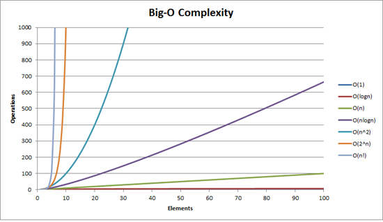

# complexity

## Time Complexity

Time complexity is defined as the amount of time taken by an algorithm to run, as a function of the length of the input

Example:

```python
def sum(arr):
  sum = 0
  for x in arr:
    sum = sum + X
  return sum
```

The time complexity = O(n)

### Common Types

| Name        | Big O Notation | Example: Counting in a group photograph                                                                                                                                                                                                                                                                                                                                                                                                                                                                                                             |
| :---------- | :------------- | :-------------------------------------------------------------------------------------------------------------------------------------------------------------------------------------------------------------------------------------------------------------------------------------------------------------------------------------------------------------------------------------------------------------------------------------------------------------------------------------------------------------------------------------------------- |
| Constant    | $O(1)$         | **Task: Count the number of people in the front row.** Regardless of the total number of people ('n') in the entire group photo, the front row is always planned to have a fixed number of people, say 5. The time it takes you to count to 5 is constant and does not increase even if the total group size grows from 20 to 200                                                                                                                                                                                                                   |
| Logarithmic | $O(\log n)$    | **Task: Find a specific person and count their position from the left in a sorted lineup.** The group is arranged alphabetically. To find "John," you don't need to check every per`son. You can start in the middle. If John's name comes after the person in the middle, you discard the first half and check the middle of the remaining half. By repeatedly halving the search area, you can find John and count his position very quickly. The number of steps grows much slower than the total number of people                               |
| Linear      | $O(n)$         | **Task: Count the total number of people in the photograph.** To do this, you must point to and count each person one by one. If there are 'n' people, you will perform 'n' counting operations. If the number of people doubles, the time it takes you to count them also doubles                                                                                                                                                                                                                                                                  |
| Log-linear  | $O(n \log n)$  | **Task: Count every person and, for each person, find their name on an alphabetically sorted list.** This is a more complex task. One efficient way to do this is to go through each of the 'n' people. For each person, you perform a logarithmic search ($O(\log n)$) on the sorted list to find their name. The total time complexity combines the linear scan with the logarithmic search for each element, resulting in $O(n \log n)$                                                                                                          |
| Quadratic   | $O(n^2)$       | **Task: Count every possible pair of people for a "buddy check".** You need to ensure every person has been introduced to every other person. You would take the first person and pair them with every other person. Then you would take the second person and pair them with the remaining people, and so on. This results in a number of pairings that grows with the square of the number of people. For 'n' people, you would have approximately $n \times n$ (or more precisely, $\frac{n(n-1)}{2}$) pairs to count                            |
| Exponential | $O(2^n)$       | **Task: Count all possible subgroups for smaller photos.** The photographer wants to know how many different groups (of any size) can be formed from the 'n' people. Each person can either be in a subgroup or not. This means for each of the 'n' people, there are two possibilities. The total number of possible unique subgroups you would have to count is $2^n$. The counting effort explodes as more people are added                                                                                                                      |
| Factorial   | $O(n!)$        | **Task: Count all possible seating arrangements in a single row.** If the photographer wants to know every single way 'n' people could be arranged in a single row, you would have to count all permutations. For the first spot, you have 'n' choices. For the second, you have 'n-1' choices left, and so on. The total number of arrangements is $n \times (n-1) \times ... \times 1$, which is 'n factorial' ($n!$). This number grows astonishingly fast and quickly becomes impractical to count even for a relatively small number of people |



### Common Sorts

| Algorithm      | Best Case Time Complexity | Average Case Time Complexity | Worst Case Time Complexity |
| :------------- | :------------------------ | :--------------------------- | :------------------------- |
| Linear Search  | O(1)                      | O(n)                         | O(n)                       |
| Binary Search  | O(1)                      | O(log n)                     | O(log n)                   |
| Bubble Sort    | O(n)                      | O(n²)                        | O(n²)                      |
| Selection Sort | O(n²)                     | O(n²)                        | O(n²)                      |
| Insertion Sort | O(n)                      | O(n²)                        | O(n²)                      |
| Merge Sort     | O(n log n)                | O(n log n)                   | O(n log n)                 |
| Quick Sort     | O(n log n)                | O(n log n)                   | O(n²)                      |
| Heap Sort      | O(n log n)                | O(n log n)                   | O(n log n)                 |
| Bucket Sort    | O(n+k)                    | O(n+k)                       | O(n²)                      |
| Radix Sort     | O(nk)                     | O(nk)                        | O(nk)                      |
| Tim Sort       | O(n)                      | O(n log n)                   | O(n log n)                 |
| Shell Sort     | O(n)                      | O((n log n)²)                | O(1)                       |

## Space Complexity

Space complexity refers to the total amount of memory space used by an algorithm/program, including the space of input values for execution

In the interview, we rarely count the space of input values. However, we're better ask the interviewer.

Example:

```python
def sum(arr):
  sum = 0
  for x in arr:
    sum = sum + X
  return sum
```

The space complexity = O(1) ~ constant
