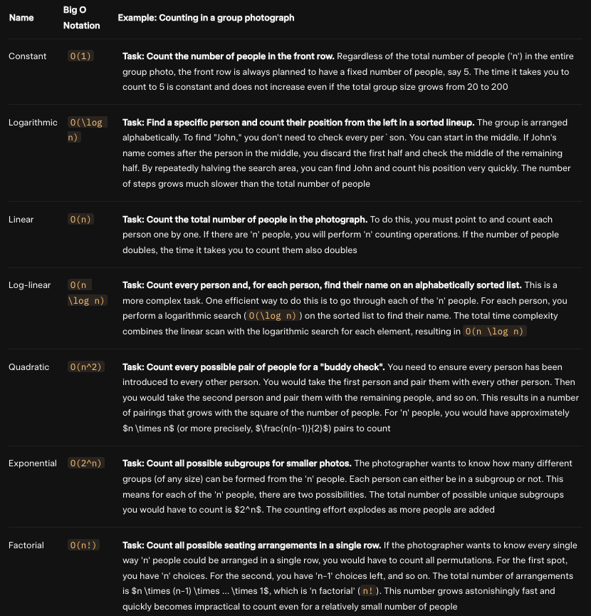

# complexity

## Time Complexity

Time complexity is defined as the amount of time taken by an algorithm to run, as a function of the length of the input

Example

```python
def sum(arr):
  sum = 0
  for x in arr:
    sum = sum + x
  return sum
```

The time complexity = O(n)

### Common Types




### Common Sorts

| Algorithm      | Best Case Time Complexity | Average Case Time Complexity | Worst Case Time Complexity |
| :------------- | :------------------------ | :--------------------------- | :------------------------- |
| Linear Search  | O(1)                      | O(n)                         | O(n)                       |
| Binary Search  | O(1)                      | O(log n)                     | O(log n)                   |
| Bubble Sort    | O(n)                      | O(n²)                        | O(n²)                      |
| Selection Sort | O(n²)                     | O(n²)                        | O(n²)                      |
| Insertion Sort | O(n)                      | O(n²)                        | O(n²)                      |
| Merge Sort     | O(n log n)                | O(n log n)                   | O(n log n)                 |
| Quick Sort     | O(n log n)                | O(n log n)                   | O(n²)                      |
| Heap Sort      | O(n log n)                | O(n log n)                   | O(n log n)                 |
| Bucket Sort    | O(n+k)                    | O(n+k)                       | O(n²)                      |
| Radix Sort     | O(nk)                     | O(nk)                        | O(nk)                      |
| Tim Sort       | O(n)                      | O(n log n)                   | O(n log n)                 |
| Shell Sort     | O(n)                      | O((n log n)²)                | O(n²)                      |

## Space Complexity

Space complexity refers to the total amount of memory space used by an algorithm/program, including the space of input values for execution

In the interview, we rarely count the space of input values. However, we're better ask the interviewer.

Example

```python
def sum(arr):
  sum = 0
  for x in arr:
    sum = sum + x
  return sum
```

The space complexity = O(1) ~ constant
