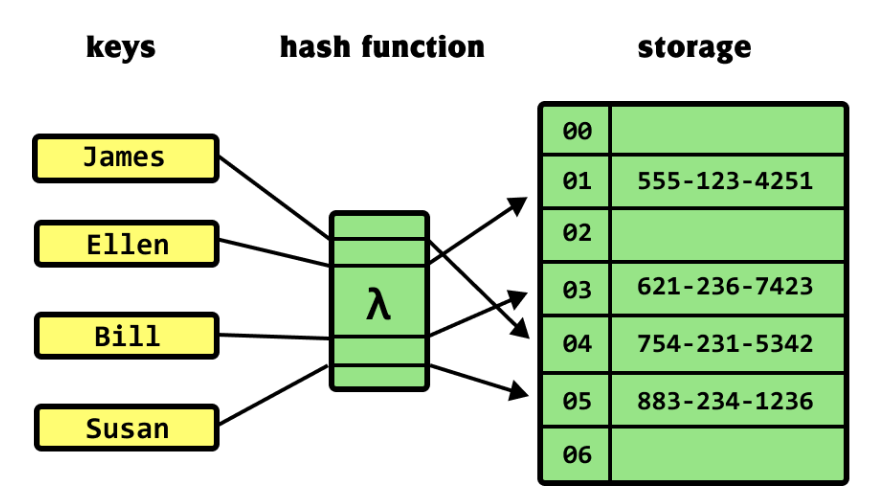
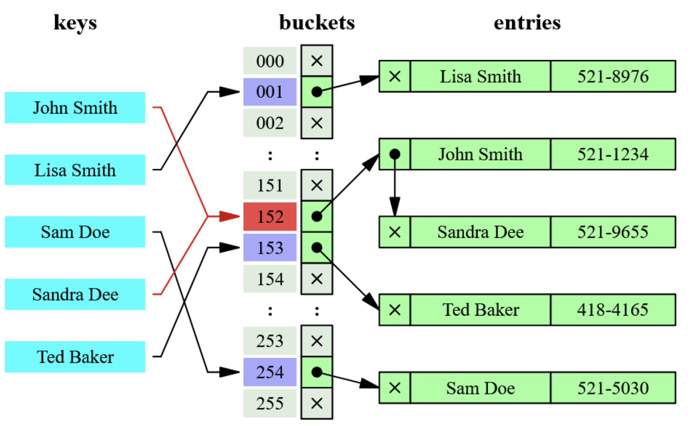

# hash map

## Introduction

--

- We know that accessing an index of an array is O(1) operation if we know the memory address of an array
- Now we want to build a data structure to store key, value pairs for fast insertion and lookup
- Example: in a company, each employee has a name and a unique id
  - 100, "Alice"
  - 123, "Bob"
  - 234, "Collin"
  - 500, "Dave"
- Idea: use a hash function on the keys to map them into indexes of an array. Then store the ‹key,value> pair in that index

## Collision

Collision happens when 2 keys hash to the same index

Option 1: Linear probing

- Tries to find the next open slot

Option 2: Separate chaining

- Use linkedlist to store key, value pairs hash to same index

## Complexity

Time (Average case)

- Search: O(1)
- Insert: O(1)
- Delete: O(1)
