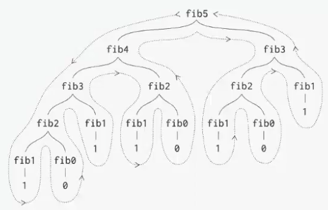

# recursion

## What is recursion?

--

- Recursion is solving a problem by breaking it down to smaller instances of the same problem
  - Factorial function: `n! = n * (n-1)!`
  - Fibonacci sequence: `f(n) = f(n-1) + f(n-2)`
  - In nature, they are like a tree
- In programming, recursion is a concept where a function calls itself
- Applications: Sorting algorithms (merge sort, quick sort), graph algorithms (DFS), etc.

Implementation

- Base case: Stopping condition, allows recursion to terminate
- Recursive case: breaks problem into smaller ones

### Factorial

- Code

```python
def factorial(n: int) -> int:
  # base case
  if n == 0:
      return 1
  # recursion
  return n * factorial(n - 1)
```

- How it works with `factorial(3)`

```text
Call
3 * factorial(2) => It pauses the current work and goes to calculate factorial(2)
  2 * factorial(1) => It pauses the current work and goes to calculate factorial(1)
    1 * factorial(0) => It pauses the current work and goes to calculate factorial(0)
      factorial(0) returns 1 (Base Case)

Return
    factorial(1) = 1 * 1 = 1
  factorial(2) = 2 * 1 = 2
factorial(3) = 3 * 2 = 6
```

- Complexity
  - Finding a tight bound of recursive algorithm is hard
  - Can be estimated based on number of calls to the method
  - Number of calls: O(n)
  - Each call: O(1) time, O(1) memory
  - Total: O(n) time, O(n) memory

### Fibonacci

- Code

```python
def fibonacci(n: int) -> int:
  # base case
  if n < 2:
      return n
  # recursion
  return fibonacci(n - 1) + fibonacci(n - 2)
```

- How it works with `fibonacci(4)` (in order)

```text
Call
fibonacci(4) = fibonacci(3) + fibonacci(2)
  fibonacci(3) = fibonacci(2) + fibonacci(1)
    fibonacci(2) = fibonacci(1) + fibonacci(0)
      fibonacci(1) returns 1 (Base Case)
      fibonacci(0) returns 0 (Base Case)
    fibonacci(1) returns 1 (Base Case)
  fibonacci(2) = fibonacci(1) + fibonacci(0)
    fibonacci(1) returns 1 (Base Case)
    fibonacci(0) returns 0 (Base Case)

Return
    fibonacci(2) = 1 + 0 = 1
  fibonacci(3) = 1 + 1 = 2
  fibonacci(2) = 1 + 0 = 1
fibonacci(4) = 2 + 1 = 3
```

- First, `fibonacci(3) = fibonacci(4) -> fibonacci(3) -> fibonacci(2) -> fibonacci(1) và fibonacci(0)`
- Then, `fibonacci(2) = fibonacci(2) -> fibonacci(1) và fibonacci(0)`



// COmplexity needs to be

## Recursive vs. Iterative

So sanh giua parse and reference (quan trojng) - thuc te (overhead)

xem clip compelxity

## Base Knowledge

### Factorial function

Meaning

- The factorial of a natural number n (denoted as n!) is the product of all positive integers from 1 up to n
  - Example: `5! = 5 * 4 * 3 * 2 * 1 = 120`

Explaining the formula `n! = n * (n-1)!`

- This formula describes the factorial recursively. Let's break it down with the `5!` example
  - According to the formula, `5! = 5 * (5-1)! = 5 * 4!`
  - Similarly, to calculate`4!`, we apply the formula again: `4! = 4 * (4-1)! = 4 * 3!`
  - This continues as follows: `3! = 3 * 2!` and `2! = 2 * 1!` and `1! = 1 * 0!`
- This process stops at a point called the "base case". For factorials, the base case is defined as: `0! = 1`

As you can see, the formula `n! = n * (n-1)!` is a concise and elegant way to define the calculation of any factorial by reducing it to the problem of calculating the factorial of a smaller number

### Fibonacci sequence

Meaning

- The Fibonacci sequence is an infinite series of numbers where each number (from the third one onwards) is the sum of the two preceding ones
- The sequence most commonly starts with 0 and 1 (or sometimes 1 and 1). By the most common convention, the sequence is: `0, 1, 1, 2, 3, 5, 8, 13, 21, 34, ...`
  - `1 = 0 + 1` and `2 = 1 + 1` and `3 = 1 + 2` and `5 = 2 + 3`, and so on

Explaining the formula `f(n) = f(n-1) + f(n-2)`

- This formula defines the `n`-th Fibonacci number (denoted as `f(n)`) based on the two numbers that come directly before it, `f(n-1)` and `f(n-2)`
- For this formula to work, it also needs "base cases". These are the first two numbers in the sequence: `f(0) = 0` and `f(1) = 1`
- Now, let's use the formula to find a few numbers in the sequence
  - `f(2): f(2) = f(1) + f(0) = 1 + 0 = 1`
  - `f(3): f(3) = f(2) + f(1) = 1 + 1 = 2`
  - `f(4): f(4) = f(3) + f(2) = 2 + 1 = 3`
  - `f(5): f(5) = f(4) + f(3) = 3 + 2 = 5`

The Fibonacci sequence appears frequently in nature, such as in the arrangement of flower petals, the branching of trees, or the spiral patterns of seashells
