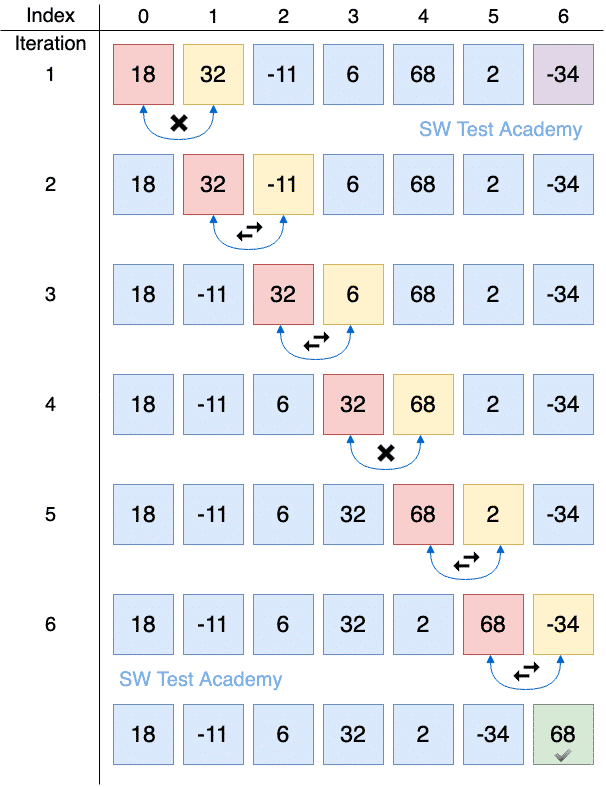
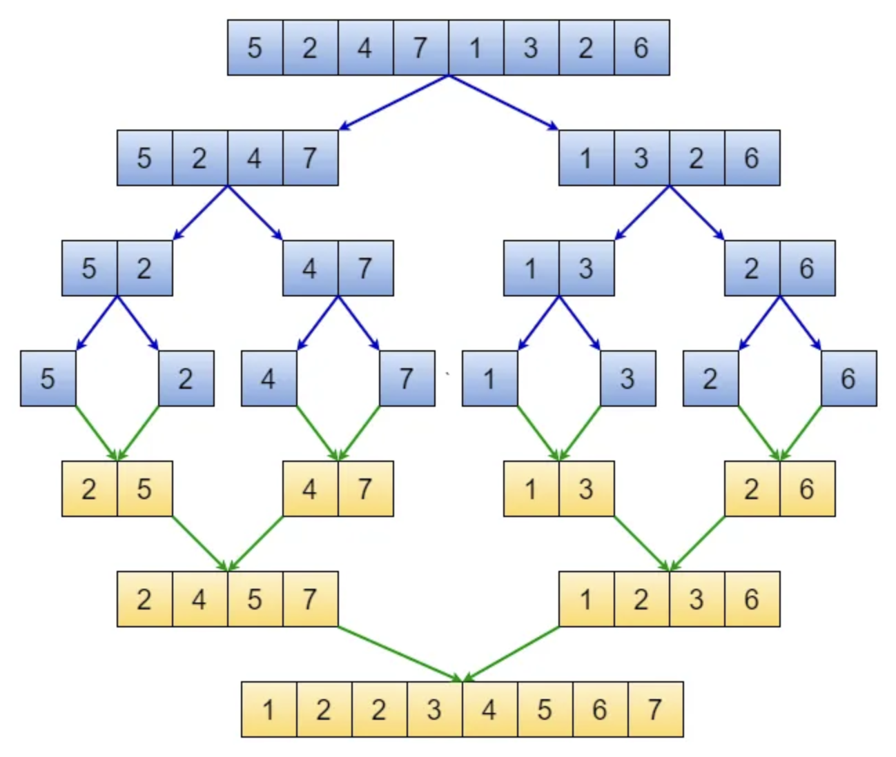
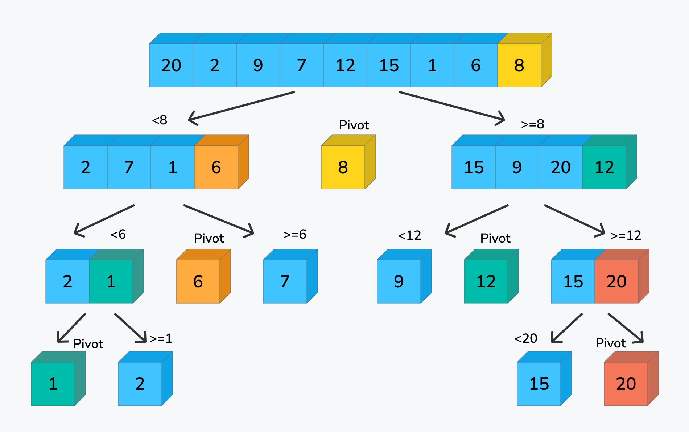

# sorting

Sorting is the act of rearranging elements in a sequence in order, either in numerical or lexicographical order, and either ascending or descending

```text
| 2 | 7 | 4 | 1 | 5 | 3 | Unsorted array
| 1 | 2 | 3 | 4 | 5 | 7 | Array sorted in increasing order
| 7 | 5 | 4 | 3 | 2 | 1 | Array sorted in decreasing order
```

Another example: sort string in lexicographical order

```text
| "aaa" | "a" | "ab" | "bc" | "bcd" | "d" | Unsorted array
| "a"   | "aaa" | "ab" | "bc" | "bcd" | "d" | Array sorted in increasing order
| "d"   | "bcd" | "bc" | "ab" | "aaa" | "a" | Array sorted in decreasing order
```

There are a lot sorting algorithms

- Bubble sort
- Insertion sort
- Selection sort
- Quicksort
- Mergesort
- Heapsort
- Counting sort
- Radix sort

But you don't need to remember the details in interview. Because most programming languages should already provide the "sort" function

## Bubble Sort

Algorithm

- Traverse from left and compare adjacent elements and the higher one is placed at right side
- In this way, the largest element is moved to the rightmost end at first
- This process is then continued to find the second largest and place it and so on until the data is sorted

Complexity

- Time: O(n²)
- Space: O(1)



```python
def bubble_sort(arr):
  n = len(arr)
  for i in range(n-1):
    for j in range(n-i-1):
      if arr[j] > arr[j + 1]:
        tmp = arr[j]
        arr[j] = arr[j+1]
        arr[j+1] = tmp
```

## Merge Sort

Algorithm

- Divide the array into two halves
- Sort each half
- Then merge the sorted halves back together
- This process is repeated until the entire array is sorted

Complexity

- Time: O(nlogn)
  - For example
    - `n=8` &rarr; we need 3 divisions &rarr; `2^3 = 8` &rarr; `log2(8) = 3`
    - `n=16` &rarr; `log2(16) = 4` &rarr; 4 divisions
- Space complexity: O(n)

Merge phase in details

- We has 2 pointers for the 2 arrays
- We compare the 2 elements
- We put the smaller element into the result and increment the pointer



```python
def merge(left_half, right_half, arr):
  i = j = k = 0

  while i < len(left_half) and j < len(right_half):
    if left_half[i] < right_half[j]:
      arr[k] = left_half[i]
      i +=1
    else:
      arr[k] = right_half[j]
      j += 1
    k += 1
  while i < len(left_half):
    arr[k] = left_half[i]
    i += 1
    k += 1
  while j < len(right_half):
    arr[k] = right_half[j]
    j += 1
    k += 1

def merge_sort(arr):
  if len(arr) > 1:
    mid = len(arr) // 2
    left_half = arr[:mid]
    right_half = arr[mid:]

    merge_sort(left_half)
    merge_sort(right_half)
    
    merge(left_half, right_half, arr)
```

- `//` in an integer division operator, which means it always rounds down to the nearest integer
  - `5 // 2 = 2` &rarr; `left_half: 0-2` and `right_half: 2-5`
    - With odd arrays, the right sub-array will have 1 more element than the left sub-array
  - `6 // 2 = 3` &rarr; `left_half: 0-3` and `right_half: 3-6`
    - With even arrays, the two sub-arrays have equal length

## Quick Sort

Algorithm

- An array is divided into subarrays by selecting a pivot element (element selected from the array)
- Position the pivot in a such a way that:
  - Elements less than pivot are kept on the left side of the pivot
  - Elements greater than pivot are on the right side of the pivot
- The left and right subarrays are also divided using the same approach. This process continues until each subarray contains a single element
- At this point, elements are already sorted. Finally, elements are combined to form a sorted array

Complexity

- Time
  - Best case and average case: O(nlogn)
  - Worst case: O(n²)
- Space
  - Best case and average case: O(logn)
  - Worst case: O(n)

Partition phase with pivot in details

- Keep a pointer pointing to the pivot element
- Keep another pointer "i" keep track of the smaller elements of pivot
- Iterate from left to right
- If we encounter element < pivot value, swap the current element with the one in index "i" Then increment "i"
- Finally, we swap the pivot element with the element in index "i"

```python
def partition(arr, left, right):
  pivot = arr[right]
  i = left
  for j in range(left, right):
    if arr[j] < pivot:
      arr[i], arr[j] = arr[j], arr[i]
      i += 1
  arr[i], arr[right] = arr[right], arr[i]

  return i

def quick_sort(arr, left, right):
  if left < right:
    pI = partition(arr, left, right)
    quick_sort(arr, left, pI - 1)
    quick_sort(arr, pI + 1, right)
```



## Sorting Functions

--

- C++:std::sort()
- Python: sort()
- Java
  - Arrays.sort() and Arrays.sort() with comparator
  - Collections.sort() and Collections.sort() with comparator
- Note: In interview, just say that all sort functions has O(nlogn) time complexity
