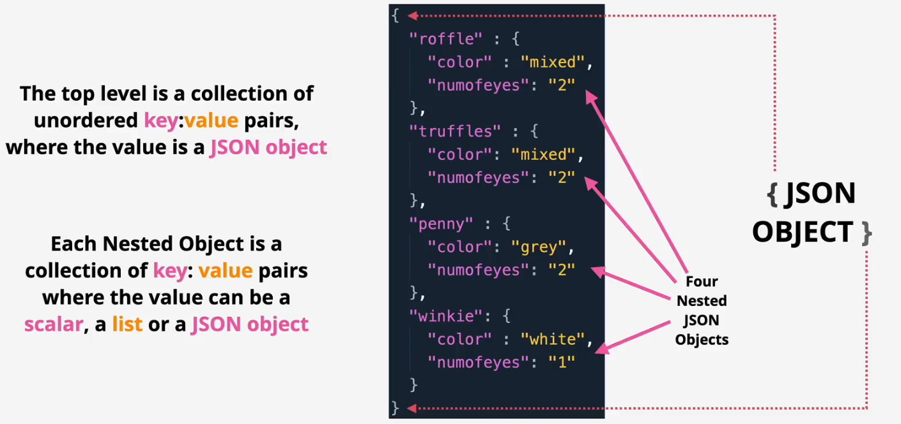

# data formats

## YAML

Human readable data serialization language

Formats

- Key and value

- List

- Dictionary
  - A collection of key value pairs which are unordered
- Structure

Example - CloudFormation

## JSON

JSON (JavaScript Object Notation) is a lightweight data-interchange format. It is easy for humans to read and write. It is easy for machines to parse and generate

Formats

- Key and value

- Objects and lists

- Documents

Example - CloudFormation

