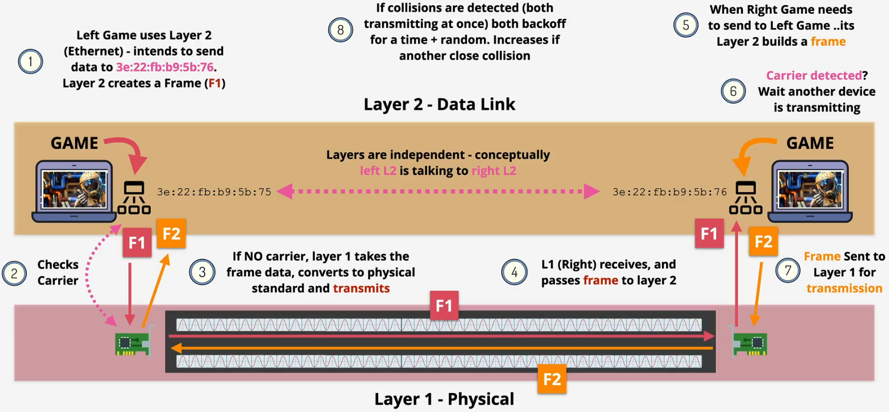
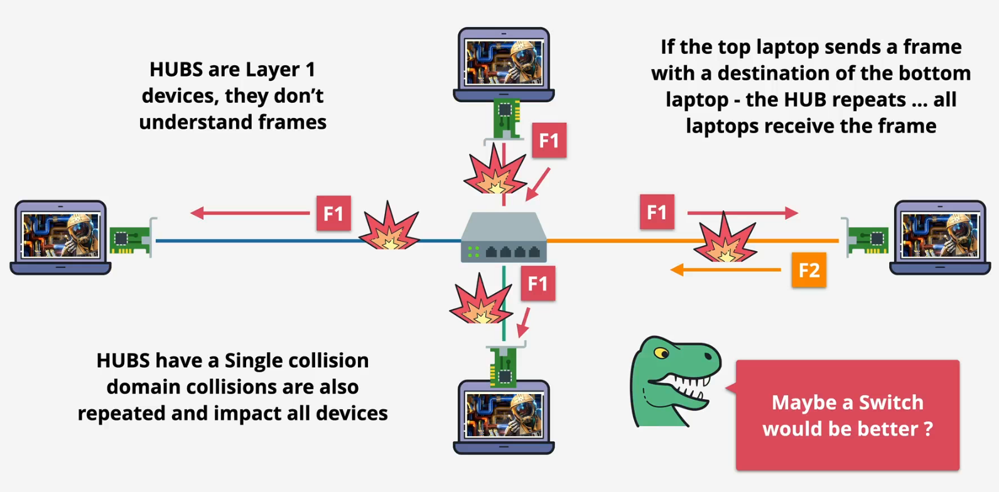

# networking

## OSI Model

Components

- Local networking - Ethernet
- Routing
- Segmenting, ports and sessions
- Applications

Key features

- Higher layer built on lower layer, adding features and capabilities
- .. to be encapsulated ,... will be decapsulated

### Layer 1 - Physical - Bit

Key features

- Layer 1 (Physical) specifications define the transmission and reception of raw bit streams between a device and a shared physical medium
- It defines things like voltage levels, timing, rates, distances, modulation, and connectors
- Physical medium can be copper (electrical), fibre (light), or wifi (RF)

Physical HUB

Summary

- Physical shared medium
- Standards for transmitting onto the medium
- Standards for receiving from the medium
- No access control
- No uniquely identified devices
- No devices &rarr; Device communications

### Layer 2 - Data Link - Frame

Components on frame

- Preamble and SFD: Define the start of the frame
- MAC header: Contains the destination and source MAC addresses and the EtherType field (layer 3 protocol)
- Payload: The data encapsulated within the frame
- FCS: Check to detect any transmission errors

CSMA/CD - Carrier-sense Multiple Access / Collision Detection

- Challenge

- Solution

Switch

- Problem

- Solution

Summary

- Identifiable devices
- Media access control (sharing)
- Collision detection
- Unicast 1:1
- Broadcast 1:ALL
- Switches - Like Hubs with Super powers (Layer 2)
