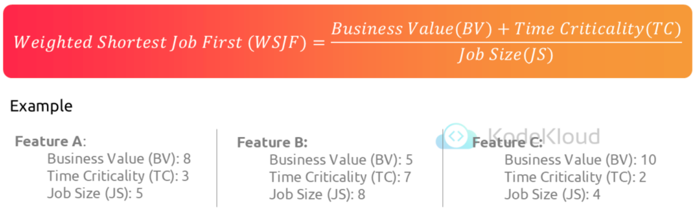
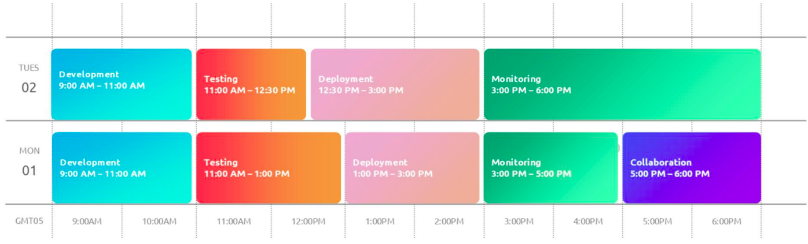
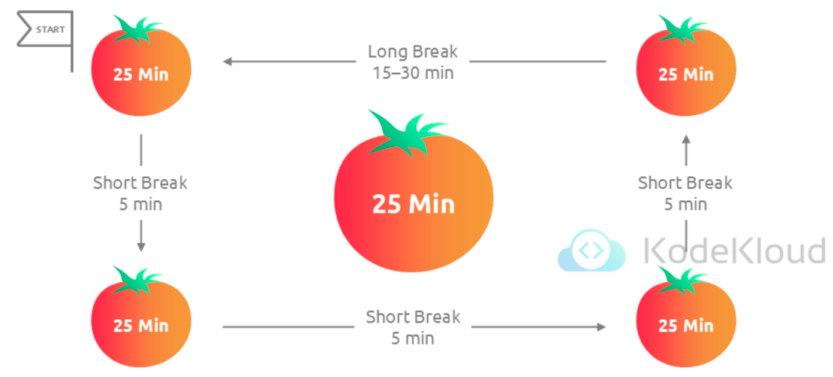

# priority time capacity management (done - not learn yet)

This section is focused on various aspects of priority, time, and capacity management

There is no one-size-fits-all solution, it depends on the nature of the work you are doing

Our scenario/story video is all about "When someone adds to your workload"

What you prioritize is arguably just as important as the results you produce

## The art of prioritization

Why?

- Structuring what you work on and when is beneficial and essential for success and for signaling your team that you are working on the "right" things

Understanding prioritization

- Prioritization is a task management tool and a strategic approach to achieving optimal outcomes

Strategies for prioritization - WSJF

- Break down work
- Identify the level of effort (time)
- What is the level of value (impact)
- What items will have the most impact for the least amount of time?

WSJF - Illustration

Strategies for prioritization - Pareto

- Commonly 80% of our effort comes from 20% of our efforts

Strategies for prioritization - Experiment

- Research and experiment with different prioritization techniques like Pareto, WSJF, Eisenhower Grid, and FIFO to choose a method that aligns with your outcomes

Adapting to rapidly changing inputs

- Stay aligned while adapting to current realities!

Effective communication of priority changes

- Communication of priority changes is as important as the priorities themselves

Project work vs interrupt-driven work

- Mixing these types of work is very hard and must be communicated
- Try to keep these workflows separate
- Isolate different time blocks to each
- Teams doing a high level of interrupt work (like support) will never make their deadlines

The power of visualizing work

- Visualizing work enhances understanding and effective management
- To do &rarr; in progress &rarr; completed

Intersection of prioritization, time management, and capacity planning

- Effective prioritization is deeply interconnected with time management and capacity planning

**Summary**

- This section highlights the alignment created by prioritizing tasks that align with the highest and most effective business need
- Prioritization is usually done by assessing effort, time, value, and urgency
- Strategies include using the 80/20 rule from the Pareto Principle, Weighted Shortest Job First from Lean, and more
- There is an intersection between capacity, time, and priority, but the most important thing is choosing the method(s) that work best for your business need

## The science of time management

Why?

- Time is a non-renewable resource –how we manage it determines our success

Understanding time management

- Where every second counts, mastering time management is a skill and a competitive advantage
- DevOps tasks throughout the day: development &rarr; testing &rarr; deployment &rarr; monitoring &rarr; collaboration

Techniques - Parkinson's Law

- Work expands to fill the time available for its completion

Techniques - Time Blocking

Techniques - Pomodoro technique

Tools and technologies - Calendars and scheduling tools

- Google calendar, calendly, microsoft outlook calendar, apple calendar, doodle, etc.

Tools and technologies - project management servers

- Clickup, trello, microsoft, notion, doodle, etc.

Tools and technologies - Time-tracking apps

- toggl track, hour stack, timely, memtime, tracking time

Common challenges - Context switching

Common challenges - Unplanned interruptions

Common challenges - Underestimating tasks

Intersection with capacity and priority

- Effective time management is deeply interconnected with prioritization and capacity planning

**Summary**

- Time management is critically important to almost all aspects of DevOps, IT, and Software Delivery
- Parkinson’s Law, Time Blocking, and other methods were covered to understand time management concepts
- The Pomodoro technique, the Two-Minute Rule, and other techniques help with time management
- Time management is essential for prioritizing the right things for whom you work

## The magic of capacity planning

Why?

- Capacity planning is essential personally and professional in understanding how much we can handle at one time

The foundation

- Where agility and efficiency are paramount, capacity planning emerges as a key driver of success
- Assessing current resources &rarr; forecasting future needs &rarr; allocating resources to projects &rarr; adjusting resources

Problem it solves

- Managing fluctuating workloads
- Preventing burnout
- Aligning team effort with requirements
- Minimize waste
- Maximize outcomes

Effective capacity planning

- Understand the work and workload
- Assess your capability and resources
- Clarify the constraints (time, money, skills, tools, and availability)
- Identify the risks

Strategies - Regular workload review timeline

- Start &rarr; initial review &rarr; first stage review &rarr; second stage review &rarr; final review &rarr; end

Strategies - Historical data line graph

Strategies - Capacity planning tools

Benefits

- Improved project workflow
- Enhanced morale
- Better risk management
- Sustainable output

Visualization

- A picture is worth a thousand words, and in capacity planning, visual tools can be worth even more

**Summary**

- Capacity planning is an essential part of connecting resources with tasks
- Capacity planning is fueled by Prioritization and sustained by time management
- Teams and individuals benefit from the consistency of sustainable and intentional ways of working
- At a minimum, understanding that capacity planning is important and how to do it is essential

## Story - when someone adds to your work
