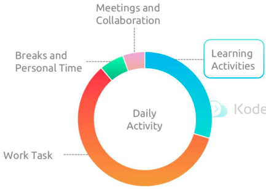
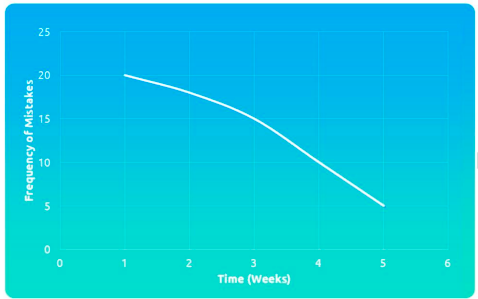

# growing learning adapting to change

This section opens and closes with an assessment about adaptability and change

The core content covers how to create habits of growing, learning, and adapting to change

The scenario/story video will cover a situation of what to do when there is too much to know/learn

The overall focus for this section is how to maintain knowledge, skills, and concepts in an ever-changing and expanding IT landscape

## A Mindset of Continual Learning

Why?

- Continuous learning is an option and a necessity for staying relevant and effective
- Learning new skills &rarr; Applying in practice &rarr; Receiving feedback &rarr; Refining approaches &rarr; [Repeat]

Making learning a must

- Prioritizing learning supports personal growth and keeps you agile in a rapidly evolving field
  - Integrating learning into your daily work
  - Creating a learning-friendly environment
  - Make learning part of workload assessment and planning

Preparing to be uncomfortable

- Learning requires the mindset to accept that at first, you may "not know the answers", "not be good at something" or "Not see immediate results"
- Success lies in the small habits and choices you make every single day

Risk of stagnation

- In a rapidly evolving field, stagnation halts progress and leads to obsolescence

Accepting new tools and new ideas

- Embrace change for innovation, survival, and success

Beyond technical skills

- This includes areas like collaboration, communication, leadership, and strategic thinking

Growing your value to the business

- As you grow, your value to the business grows especially in areas that the business needs
- Learn &rarr; Business &rarr; Value

**Summary**

- A mindset of continual improvement is necessary to be in the right frame of mind to grow and learn
- This section covered the various benefits of having a learning mindset
- There are many risks particularly in IT if you do not grow your skills, concepts, and new ways of working
- Growing your skills increases your value and your value to the business for which you work

## Rituals for Growth and Learning

Why?

- Cultivating strong learning habits is the key to staying ahead
- Start &rarr; Learning &rarr; Skill development &rarr; Professional growth &rarr; Success

Identifying learning opportunities

- Explore areas that align with your passions and interests
- Stay updated on industry trends related to business, project, and work
- Request feedback from peers, both inside and outside your company or industry
- Learn from failure to improve future success
- &rarr; Every challenge and task presents a unique opportunity for learning and growth

Setting learning goals

- Set goals for direction and measurement
- Make your goals SMART (Specific, Measurable, Achievable, Relevant, Time-bound)
- Balance passion with realism and past experience
- Track your progress regularly
- &rarr; You don't have to learn everything, just relevant things!

Creating a learning routine

- A learning routine is a time-boxed, repeatable commitment to do, learn, and grow every day
- Learning is a marathon, not a sprint

Leveraging resources and tools

- Learning platforms and resources
- Digital tools (apps, note-taking systems, courses)
- Communities and networks
- Personal learning toolkit

Applying learning in practice

- Understand the concept
- Practice in a safe environment
- Apply it to a real project
- RReflect on the outcome
- &rarr; Learning is only as valuable as its application in real-world scenarios
- &rarr; Knowledge is potential, application is where the real power lies

**Summary**

- This section is all about habits of learning and growing
- Setting learning goals that are S.M.A.R.T. and relevant to your business, organization, department, or project is essential
- Tracking those goals and balancing passion with relevancy are important
- This is a lifelong journey, more like a marathon than a sprint, so engage it with an eye on sustainability

## The Truth About Skill Acquisition

Why?

- Learning new tech skills is tough but common because transforming knowledge into competence is inherently challenging
- Common skill areas: Cloud Computing, AI, Blockchain, Scripting, and Automation

Time, effort, and failure

- Skill acquisition requires time, sustained effort, and the willingness to fail along the way to success

Realistic expectations

Learning to love mistakes

- The fear of appearing uninformed can hinder learning
- Without acceptance of mistakes, valuable teaching opportunities are missed

Overcoming cognitive challenges

- Cultivate
  - The right mindset
  - A supportive environment
  - Clear, meaningful goals
- Additional strategies
  - Take things slowly and in small, manageable chunks
  - Vary your learning methods to maintain engagement
  - Apply knowledge whenever possible
  - Don't quit unless you've gained something from the effort

Persistence is key

- Set achievable goals
- Create a supportive learning environment
- Reflect on your progress
- Establish accountability
- Schedule protected time for learning
- Enlist a "cheerleader" or mentor for support and encouragement

Keep it interesting!

- Use a variety of learning formats
  - Videos
  - Books
  - Webinar
  - Articles
  - Tutorials

Exploring learning styles

- Abstract vs concrete
  - Abstract: Focus on expertise and concepts
  - Concrete: Emphasize hands-on experience
- Switch mediums
  - Combine different formats like videos, books, live lectures, and group collaboration
- Send instead of receiving
  - Teach others what you're learning - explaining a concept often deepens your own understanding
  - Practice simplifying and explaining ideas in plain language

**Summary**

- The section covers the difficulty and challenges of learning something
- It focuses on persistence and long-term versus quick, short-term efforts
- Your personal needs and commitments will increase or ease your resistance so your foundations are in place
- Variety and accountability help to foster a commitment to learning and growing

## Story - What to Learn When There Is Too Much to Know

Context

- The IT and DevOps landscape in 2024 is overwhelming - rapid change, constant evolution, and way too many tools and platforms to keep up with
- AI has dramatically shifted the game in just the past 18 months, automating tasks that used to require manual work
- Engineers today are expected to juggle everything from databases to Kubernetes, from CI/CD pipelines to multi-cloud deployments
- The sheer amount of tech knowledge out there creates confusion, especially for beginners who don't know where to start
- Learning everything is impossible - and trying to will leave you burnt out and stuck
- Success requires a focused, strategic approach to learning that balances current needs with long-term goals

Actions and result

- Focus on the present
  - Learn only what's relevant to your current role or task - for example, if you're setting up GitLab CI/CD, go deep on that instead of exploring unrelated tools
  - You perform better in your current role, feel less overwhelmed, and build real-world experience that matters now
- Build a strong foundation
  - Start with core concepts (like basic Kubernetes) and then incrementally build on them - link each new tool or idea back to what you already understand
  - You develop deeper knowledge over time without drowning in complexity, and retain information more effectively
- Stay strategic
  - Spend 80% of your learning time on what you need now, and 20% on where you want your career to go - like security, SRE, or AI operations
  - You build a career path, not just a random set of skills. You're not just surviving - you're growing toward your future
- Embrace meta-skills
  - Intentionally improve in areas like communication, collaboration, and learning how to learn - things that aren't tech tools but are critical in the workplace
  - You stand out as a more effective, well-rounded engineer who can thrive in fast-moving, team-driven environments
