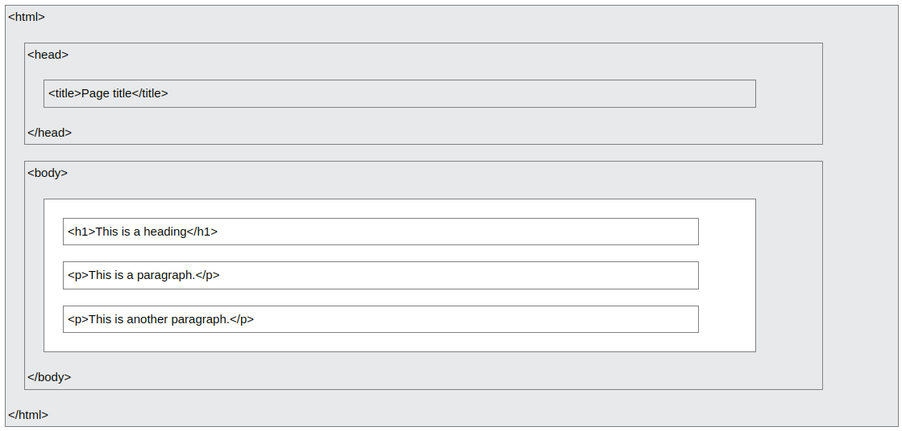

# tutorial

Following to this [W3Schools](https://www.w3schools.com/html/)

## Page Structure



## Basic

- Heading: `<h1>` to `<h6>`
  - `<h1>This is heading 1</h1>`
- Paragraphs: `<p>`
  - `<p>This is a paragraph.</p>`
- Links: `<a>`
  - `<a href="https://www.w3schools.com">This is a link</a>`
  - The link's destination is specified in the `href` attribute
- Images: ``
  - ``

## Elements

Elements

- Defined by a start tag, some content, and an end tag
- Examples
  - `<h1>My First Heading</h1>`
  - `<p>My first paragraph.</p>`

Some HTML elements have no content (like the `<br>` element defines a line break)

- These elements are called empty elements
- Empty elements do not have an end tag!
- `<p>This is a <br> paragraph with a line break.</p>`

Nested elements

```html
<!DOCTYPE html>
<html>
<body>

<h1>My First Heading</h1>
<p>My first paragraph.</p>

</body>
</html>
```

Never skip the end tag

- Some HTML elements will display correctly, even if you forget the end tag
- However, never rely on this! Unexpected results and errors may occur if you forget the end tag!

HTML is not case sensitive

- `<P>` is not the same to `<p>`

## Attributes

Attributes

- All HTML elements can have attributes
- Provide additional information about elements
- Be always specified in the start tag
- Usually come in name/value pairs like: name="value"

href attribute

- `<a href="https://www.w3schools.com">Visit W3Schools</a>`
- `<a>` tag defines a hyperlink, `href` attribute specifies the URL

src attribute

- ``
- Specifies the path to the image. It could be absolute URL or relative URL

width and heigh attribute

- ``

alt attribute

- ``
- Specifies an alternate text for an image, if the image for some reason cannot be displayed

style attribute

- `<p style="color:red;">This is a red paragraph.</p>`
- Add styles to an element, such as color, font, size, and more

lang attribute

```html
<!DOCTYPE html>
<html lang="en-US">
<body>
...
</body>
</html>
```

- Declare the language of the web page
- Language and country code

title attribute

- `<p title="I'm a tooltip">This is a paragraph.</p>`
- Defines some extra information about an element

We suggest

- Always use lowercase attributes
- Always quote attribute values
  - Double quotes is common
  - In some situations, when the attribute value itself contains double quotes, it is necessary to use single quotes

## Heading

Headings are important

- Search engines use the headings to index the structure and content of your web pages
- Users often skim a page by its headings. It is important to use headings to show the document structure

Bigger headings

- `<h1 style="font-size:60px;">Heading 1</h1>`
- `style` attribute with CSS `font-size` property

## Paragraphs

Paragraphs `<p>`

- Always start on a new line
- Browsers automatically add some white space (a margin) before and after a paragraph
- Usually a block of text

HTML display

- Cannot change the display by adding extra spaces or extra lines in your HTML code
- The browser will automatically remove any extra spaces and lines when the page is displayed

HTML horizontal rules

```html
<h1>This is heading 1</h1>
<p>This is some text.</p>
<hr>
<h2>This is heading 2</h2>
<p>This is some other text.</p>
<hr>
```

- `<hr>` - empty element defines a thematic break

HTML line breaks

- `<p>This is<br>a paragraph<br>with line breaks.</p>`
- `<br>` - empty element defines a line break

The poem problem

```html
<pre>
  My Bonnie lies over the ocean

  My Bonnie lies over the sea

  My Bonnie lies over the ocean

  Oh, bring back my Bonnie to me
</pre>
```

- `</pre>` element defines preformatted text

## Styles

Style attribute

- Syntax: `<tagname style="property:value;">`
- `property` is a CSS property, `value` is a CSS value

Background color

```html
<body style="background-color:powderblue;">

<h1 style="background-color:powderblue;">This is a heading</h1>
<p style="background-color:tomato;">This is a paragraph.</p>

</body>
```

Text color

- `<h1 style="color:blue;">This is a heading</h1>`

Font color

- `<p style="font-family:courier;">This is a paragraph.</p>`

Text size

- `<h1 style="font-size:300%;">This is a heading</h1>`

Text alignment

- `<p style="text-align:center;">Centered paragraph.</p>`

## Text Formatting

Formatting elements were designed to display special types of text

- `<b>` - bold text
- `<strong>` - important text
- `<i>` - italic text
- `<em>` - emphasized text
- `<mark>` - marked text
- `<small>` - smaller text
- `<del>` - deleted text
- `<ins>` - inserted text
- `<sub>`- subscript text
- `<sup>` - superscript text

Examples

- `<p>Do not forget to buy <mark>milk</mark> today.</p>`
- `<i>This text is italic</i>`

## Quotation and Citation Elements

Elements

- `<blockquote>` - a section that is quoted from another source
  - `<blockquote cite="http://www.worldwildlife.org/who/index.html"> ... </blockquote>`
- `<q>` - a short quotation
  - `<p>WWF's goal is to: <q> ... </q></p>`
- `<abbr>` - an abbreviation or acronym
  - `<p>The <abbr title="World Health Organization">WHO</abbr> was founded in 1948.</p>`
- `<address>` - defines the contact information (italic)

```html
<address>
Written by John Doe.<br>
Visit us at:<br>
Example.com<br>
Box 564, Disneyland<br>
USA
</address>
```

- `<cite>` - defines the title of a creative work (book, poem, song, etc.)
  - `<p><cite>The Scream</cite> by Edvard Munch. Painted in 1893.</p>`
- `<bdo>` - bi-directional override
  - `<bdo dir="rtl">This text will be written from right to left</bdo>`

## Comment Tag

```html
<!-- This is a comment -->
<p>This is a paragraph.</p>
<!-- Remember to add more information here -->

<p>This is a paragraph.</p>
<!--
<p>Look at this cool image:</p>

-->
<p>This is a paragraph too.</p>

<p>This <!-- great text --> is a paragraph.</p>
```

## Colors

Background color

- `<p style="background-color:Tomato;">Lorem ipsum...</p>`

Text color

- `<h1 style="color:Tomato;">Hello World</h1>`

Border color

- `<h1 style="border:2px solid Tomato;">Hello World</h1>`

Color values

- Can also be specified using RGB values, HEX values, HSL values, RGBA values, and HSLA values

```html
<h1 style="background-color:rgb(255, 99, 71);">...</h1>
<h1 style="background-color:#ff6347;">...</h1>
<h1 style="background-color:hsl(9, 100%, 64%);">...</h1>
<h1 style="background-color:hsla(9, 100%, 64%, 0.5);">...</h1>
```

RGB and RGBA color

- An RGB color value represents RED, GREEN, and BLUE light sources
- An RGBA color value is an extension of RGB with an Alpha channel (opacity)
- Each parameter (red, green, and blue) defines the intensity of the color with a value between 0 and 255
- This means that there are 256 x 256 x 256 = 16777216 possible colors!
- To display black, set all color parameters to 0, like this: rgb(0, 0, 0)
- To display white, set all color parameters to 255, like this: rgb(255, 255, 255)
- The alpha parameter is a number between 0.0 (fully transparent) and 1.0 (not transparent at all)

HEX color

- A hexadecimal color is specified with: #RRGGBB, where the RR (red), GG (green) and BB (blue) hexadecimal integers specify the components of the color
- For example, #ff0000 is displayed as red, because red is set to its highest value (ff), and the other two (green and blue) are set to 00
- Another example, #00ff00 is displayed as green, because green is set to its highest value (ff), and the other two (red and blue) are set to 00
- To display black, set all color parameters to 00, like this: #000000
- To display white, set all color parameters to ff, like this: #ffffff

HSL color

- Hue is a degree on the color wheel from 0 to 360. 0 is red, 120 is green, and 240 is blue
- Saturation is a percentage value. 0% means a shade of gray, and 100% is the full color
- Lightness is also a percentage value. 0% is black, and 100% is white

HSLA color

- HSLA color values are an extension of HSL color values, with an Alpha channel - which specifies the opacity for a color
- An HSLA color value is specified with: hsla(hue, saturation, lightness, alpha)
- The alpha parameter is a number between 0.0 (fully transparent) and 1.0 (not transparent at all)

## CSS

CSS

- Cascading Style Sheets (CSS) is used to format the layout of a webpage
- With CSS, you can control the color, font, the size of text, the spacing between elements, how elements are positioned and laid out, what background images or background colors are to be used, different displays for different devices and screen sizes, and much more!
- The word cascading means that a style applied to a parent element will also apply to all children elements within the parent. So, if you set the color of the body text to "blue", all headings, paragraphs, and other text elements within the body will also get the same color (unless you specify something else)!

Using CSS

- Inline - by using the `style` attribute inside HTML elements
- Internal - by using a `<style>` element in the `<head>` section
- External - by using a `<link>` element to link to an external CSS file
- The most common way to add CSS, is to keep the styles in external CSS files. However, in this tutorial we will use inline and internal styles, because this is easier to demonstrate, and easier for you to try it yourself

Inline CSS

```html
<h1 style="color:blue;">A Blue Heading</h1>

<p style="color:red;">A red paragraph.</p>
```

- An inline CSS uses the style attribute of an HTML element

Internal CSS

```html
<!DOCTYPE html>
<html>
<head>
<style>
body {background-color: powderblue;}
h1   {color: blue;}
p    {color: red;}
</style>
</head>
<body>

<h1>This is a heading</h1>
<p>This is a paragraph.</p>

</body>
</html>
```

- An internal CSS is defined in the `<head>` section of an HTML page, within a `<style>` element

External CSS

```html
<!DOCTYPE html>
<html>
<head>
  <link rel="stylesheet" href="styles.css">
</head>
<body>

<h1>This is a heading</h1>
<p>This is a paragraph.</p>

</body>
</html>
```

- To use an external style sheet, add a link to it in the `<head>` section of each HTML page
- The external style sheet can be written in any text editor. The file must not contain any HTML code, and must be saved with a .css extension

```html
// styles.css
body {
  background-color: powderblue;
}
h1 {
  color: blue;
}
p {
  color: red;
}
```

CSS colors, fonts, and sizes

```html
<!DOCTYPE html>
<html>
<head>
<style>
h1 {
  color: blue;
  font-family: verdana;
  font-size: 300%;
}
p {
  color: red;
  font-family: courier;
  font-size: 160%;
}
</style>
</head>
<body>

<h1>This is a heading</h1>
<p>This is a paragraph.</p>

</body>
</html>
```

CSS border - a border around an HTML element

```html
p {
  border: 2px solid powderblue;
}
```

CSS padding - a padding (space) between the text and the border

```html
p {
  border: 2px solid powderblue;
  padding: 30px;
}
```

CSS margin - a margin (space) outside the border

```html
p {
  border: 2px solid powderblue;
  margin: 50px;
}
```

Link to external CSS

```html
<link rel="stylesheet" href="https://www.w3schools.com/html/styles.css">
<link rel="stylesheet" href="/html/styles.css">
<link rel="stylesheet" href="styles.css">
```

## Links

## Images

## Favicon

## Page Title

## Tables

Table cells

- Each table cell is defined by a `<td>` and a `</td>` tag (table data)
- Everything between `<td>` and `</td>` is the content of a table cell
- A table cell can contain all sorts of HTML elements: text, images, lists, links, other tables, etc.

Table rows

- Each table row starts with a `<tr>` and ends with a `</tr>` tag (table row)
- You can have as many rows as you like in a table; just make sure that the number of cells are the same in each row

Table headers

- Use `<th>` to define table header cells (table header)

```html
<table>
  <tr>
    <th>Person 1</th>
    <th>Person 2</th>
    <th>Person 3</th>
  </tr>
  <tr>
    <td>Emil</td>
    <td>Tobias</td>
    <td>Linus</td>
  </tr>
  <tr>
    <td>16</td>
    <td>14</td>
    <td>10</td>
  </tr>
</table>
```

Other tags

- `<caption>` defines a table caption
- `<colgroup>` specifies a group of one or more columns in a table for formatting
- `<col>` specifies column properties for each column within a `<colgroup>` element
- `<thead>` groups the header content in a table
- `<tbody>` groups the body content in a table
- `<tfoot>` groups the footer content in a table

Table border

```html
table, th, td {
  border: 1px solid black;
}
```

Collapsed table borders

```html
table, th, td {
  border: 1px solid black;
  border-collapse: collapse;
}
```

## Lists

## Block & Inline
