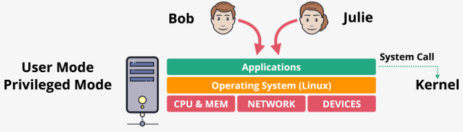

# fundamentals

## Virtualization

Overview

- Enables running multiple OSs on a single physical server, providing IaaS through EC2
- Traditionally, a server runs one OS in privileged mode (kernel) with direct hardware access, while applications run in user mode, requiring system calls to interact with hardware

Types of virtualization

- Emulated virtualization
  - A host OS runs a hypervisor in privileged mode, managing guest OSs within virtual machines (VMs)
  - Guest OSs are unmodified, believing they run on real hardware, but the hypervisor emulates resources (CPU, memory, disk, network)
  - Guest OSs attempt to execute privileged instructions to control the hardware
  - Privileged calls are intercepted via binary translation, which is slow, halving performance, limiting adoption for demanding workloads

Para virtualization

- Guest OSs are modified to make hypercalls to the hypervisor instead of privileged hardware calls, requiring OS source code changes
- Uses para-virtual drivers for network and storage, improving performance but only works with specific, modified OSs tailored to the hypervisor

Hardware assisted virtualization

- CPUs are virtualization-aware, with instructions to support hypervisors, trapping and redirecting privileged calls without crashing
- Offers near-native performance but struggles with I/O operations (network and disk), as virtual devices rely on shared physical hardware

SR-IOV

- Hardware devices (e.g., network cards) are virtualization-aware, presenting as multiple logical devices directly to guest OSs
- Eliminates hypervisor translation, enabling direct hardware access, resulting in faster speeds, lower and consistent latency, and reduced host CPU usage
- In EC2, SR-IOV powers enhanced networking, significantly improving network performance

Features

- AWS uses advanced virtualization techniques, including its Nitro hypervisor, which enables high-end EC2 features (covered in later lessons)
- SR-IOV is leveraged for enhanced networking and can extend to other hardware, making devices virtualization-aware for improved performance

Purpose and benefits

- Virtualization allows efficient resource utilization by running multiple isolated OSs on one server
- Advanced techniques like hardware-assisted virtualization and SR-IOV minimize performance penalties, making EC2 suitable for demanding workloads