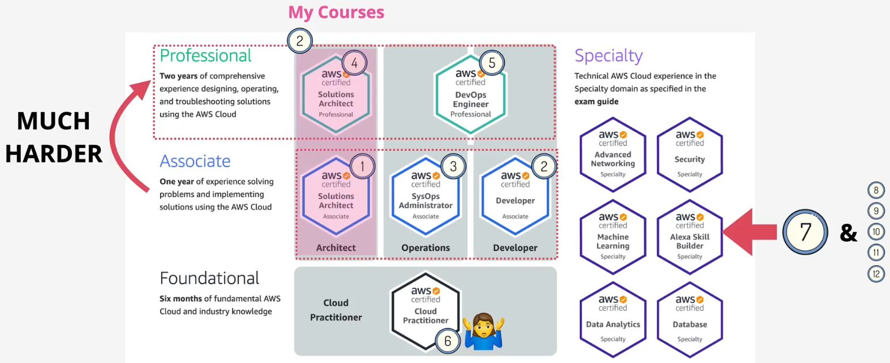

# aws certifications

## AWS Certifications

Cloud practitioner and associate

- Share the same knowledge pool, associate goes into more depth

Professional

- Builds on associate with more depth and breadth requirements

Specialty

- Is a 50%/50% split between the specialty skill covered and AWS skills between the associate and professional level

