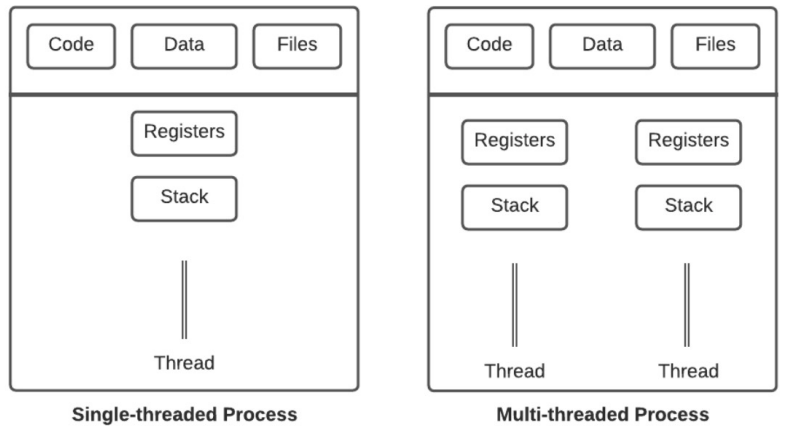
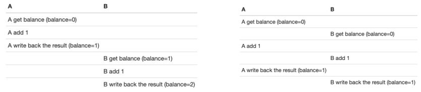

# terms

## Concurrency

### Concurrency

Concurrency means multiple computations happening at the same time

- Many computers in a computer network
- Many applications running simultaneously on one computer
- Many processors (multi-core chips) in one computer
- A website needing to handle many concurrent accesses

Two common models for concurrent programming

- Shared memory: Concurrent modules interact by reading and writing shared objects in memory
- Message passing: Concurrent modules interact by sending messages to each other through a communication channel

### Process and Thread

| Feature           | Process                                                                    | Thread                                                                                     |
| ----------------- | -------------------------------------------------------------------------- | ------------------------------------------------------------------------------------------ |
| Concept           | A process is a program being executed (running)                           | A thread is a sub-component of a process A process can run multiple threads concurrently |
| Memory            | Processes are independent; they do not share memory space with each other | Threads share memory space                                                                |
| Creation          | Requires many system calls to create multiple processes, taking more time | Can create multiple threads with one system call, taking less time                        |
| Termination       | Takes more time than threads                                              | Takes less time than processes                                                            |
| Communication     | Requires using IPC (Inter-Process Communication), which is more expensive | Less expensive than processes                                                             |
| Context switching | Slower than threads                                                       | Much faster than processes                                                                |



- Code, data, and files are shared

How does the OS run 100 processes concurrently if there is only 1 CPU?

- The OS handles this by virtualizing the CPU. For example, it executes one process, pauses it, and runs another process
- This concept is called CPU time-sharing (time-slicing), which allows users to run multiple processes
- The ability to stop one process and run another is called context switching

States of a process

- Running: The process is running on a processor and executing instructions
- Ready: The process is ready to execute, but the operating system (OS) has not decided to run it at this time
- Blocked: The process has completed some action that prevents it from running until another event occurs
  - For example, if a process requests I/O to a disk, it will be blocked. This allows another process to use the CPU

### Interleaving

```java
private static void deposit() { 
  balance = balance + 1;
}
```

- The deposit function, when translated to low-level, will execute as follows
  - Get the current value of balance (balance = 0)
  - Add 1
  - Write the result (balance = 1)
- When two threads, A and B, run concurrently, their low-level instructions can interleave. Therefore, the execution order of instructions for thread A and B is arbitrary
  - For example, the left side shows the correct result, while the right side is missing 1
  - This phenomenon is called race-condition



### Thread Safety

--

- A data type or a function is thread-safe if it always executes correctly when used by multiple threads, regardless of how the threads are executed
- In Java, there are classes that support thread-safety in addition to regular classes
  - Example: StringBuffer is thread-safe, while StringBuilder does not support thread-safe operations
  - Thread-safe collections: BlockingQueue, ConcurrentMap, CopyOnWriteArrayList
  - Thread-safe classes often have lower performance than their unsafe counterparts

## Networking

### Client and Server Pattern

--

- The client and server pattern communicates via message passing
- Consists of two main types of processes: client and server
- The client initiates communication and establishes a connection to the server. The client sends requests to the server, and the server sends back responses. The client closes the connection
- A server can handle connections to multiple clients concurrently, and a client can also connect to multiple servers concurrently
  - Example: Web browser
- On the internet, client and server processes run on different machines and connect through a network

### Network Concepts

--

- IP address: Used to identify a network interface. IPv4 has 32 bits
  - Examples: 1.2.3.4 or 127.0.0.1 (localhost)
- Hostname: A name that can be converted to an IP address. One hostname can point to multiple IPs, and multiple hostnames can point to the same IP
  - Examples: google.com, localhost
- Port: Used to connect directly to a running process. A network interface has many ports, from 1 to 65535. A port can only be listened to by one process
  - Some common ports: 22 - SSH; 25 - email server; 80 - web; 443 - HTTPS
- Socket: An endpoint of a connection between a client and a server
- Protocol: A set of messages exchanged between two parties
  - Some common protocols: HTTP, SMTP

## Git

--

- Git is a version control system
- A version control system helps record changes to files over time. It can
  - Revert file changes to the past
  - Compare changes between versions
  - See who made the changes
- Some important concepts
  - Repository: A directory containing all files, with two types: local and remote repository
  - Commit (or revision): A snapshot of files at a specific point in time
  - Add (or stage): The state of files required before they can be committed
  - Clone: Downloading a repository to your machine to create a local repository
  - Push: Pushing a local commit to the remote repository
  - Pull: Downloading the latest commits from the remote repository
- When you push, the commit might be rejected because your local repository does not have the latest changes from the remote repository. In that case, you will need to pull from the remote, and then push again
- Unfortunately, your code changes might conflict with the latest code changes on the remote. For example, you and a colleague might modify the same line or block of code. In such cases, you will need to resolve the conflict
  - Tips: To avoid conflicts, always pull before making changes
- Git branch is an independent line of development that can be created from another branch. It can be used when developing new features (or fixing bugs) to separate them from the main branch

## JUnit

Test

- The purpose is to identify potential issues or bugs
- Helps detect issues before software is deployed (released), making bug fixes easier and less costly
- Improves product quality by checking if functional requirements are met
- Enhances user experience: for example, UI/UX tests

Unit test

- Used to test independent modules/components
- Usually written by developers
- Short execution time, easy to process results
- Easy to maintain and update when needed

JUnit

- JUnit is a Java unit testing framework
- JUnit supports annotations
  - @Test, @BeforeEach, @AfterEach
  - @BeforeAll, @AfterAll
  - @Ignore
- Best practices: Test naming convention should include 3 parts
  - Name of the function to be tested
  - Scenario to be tested
  - Expected result when running the scenario
- Best practices: Test implementation should include 3 parts
  - Arrange (Given): Initialize objects
  - Act (When): Actions (methods) with objects
  - Assert (Then): Check conditions that need to be satisfied

## Code Review

Reference: [Link](https://mtlynch.io/code-review-love/)

--

- Code Review is performed whenever there is any change to the source code
  - Example: You work on task A, and to complete task A, you will make changes (add, edit, delete code) on your machine. These changes will then be pushed to a review system (e.g., GitHub, GitLab) for reviewers to read, provide feedback, and approve
- The reviewer can be a colleague from your team
- After approval by the reviewer, the code is merged into the main branch and deployed to production
- Issues to consider when reviewing code
  - Bugs or potential bugs
    - Code duplication (DRY – Don't repeat yourself)
    - Inconsistency between code and requirements
    - Off-by-one error
    - Variable scope too large
    - Magic numbers
  - Unclear code
    - Poorly named variables, functions
    - Inconsistent indentation
    - Variables/functions used for multiple purposes

## Dependency Injection

Problem

```java
public class UserService {
  private DatabaseConnection dbConnection = new DatabaseConnection();

  public User getUser (int userId) {
    return dbConnection.fetchUser(userId);
  }
}
```

- Each instance of UserService creates a new DatabaseConnection (an expensive object – costly in time and resources)
- UserService is tightly-coupled with DatabaseConnection. If the new() method of DatabaseConnection changes, UserService must also change accordingly
- It will be difficult to test the getUser function because it depends on dbConnection, meaning it depends on the test environment with a connection to the DB

Improvement with Dependency Injection

```java
public class UserService {
  private DatabaseConnection dbConnection

  // Constructor injection
  public UserService(DatabaseConnection dbConnection) {
    this.dbConnection = db.Connection;
  }

  public User getUser (int userId) {
    return dbConnection.fetchUser(userId);
  }
}
```

- Pass dbConnection as a parameter to the UserService constructor
- UserService no longer directly creates dbConnection and can use any implementation of DatabaseConnection
- Can test by mocking DatabaseConnection with a mock object and providing custom results
  
Benefits of Dependency Injection

- Removes tight coupling through the use of dependency with setter or constructor injection
- Improves testability by replacing dependent objects with mock objects (e.g., using the Mockito framework)

An application consists of many different components, each with a different task, coordinating with other components to complete work. When the application runs, each component needs to be initialized and passed into each other

Spring supports a container (often called the Spring application context) to initialize and manage application components. These components (or beans) are wired together to form the application. This process is called dependency injection

Spring supports auto-configuration by

- Autowiring: Automatically injecting the beans that components need to use
- Component scanning: Automatically finding components and creating corresponding beans in the Spring application context

## Spring Framework

Introduction

- Spring makes Java programming faster, easier, and safer
- Spring focuses on speed, simplicity, and efficiency
- Spring is the most popular Java framework
- Spring has contributors from big names in technology, including: Amazon, Google, Microsoft, Alibaba

## Build Tools

--

Build tools are used to

- Compile source code
- Manage dependencies
- … many other tasks, e.g., running tests

Popular build tools

- Apache Maven and Gradle

## First Spring Boot Application

Initialize Spring Boot

- [Link](https://start.spring.io)

Using plugins in VS Code

- Spring Boot Extension Pack

Some other useful plugins

- Extension Pack for Java
- Git Graph
- Gradle for Java

@SpringBootApplication consists of 3 features

- @EnableAutoConfiguration: Uses Spring Boot's auto-config feature, allowing automatic guessing and configuration of beans based on dependencies
- @ComponentScan: Helps @Component scan within the application's package
- @Configuration: Helps initialize other beans in the context or add custom configuration classes

@Component: Is an annotation that helps Spring automatically recognize a bean. This means Spring will

- Scan the entire app to find classes marked with @Component
- Initialize them and inject dependencies if any

@Autowired: Used for automatic dependency injection

To clarify which layer a component belongs to, Spring provides additional annotations

- @Service
- @Repository
- @Controller
