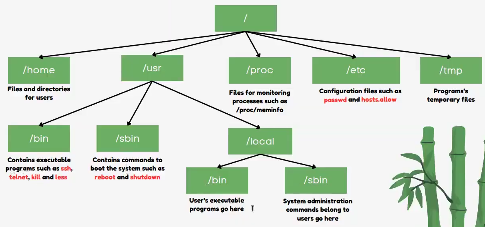

# linux

## GNU/Linux

History

- Started in 1983 by Richard Stallman, the GNU Project aimed to build a free Unix-like OS
- By the early 1990s, GNU lacked a kernel until Linus Torvalds created the Linux kernel in 1991, released under the GNU GPL in 1992
- Together, they formed GNU/Linux, a free, open-source alternative to proprietary Unix
- GNU/Linux is packaged into user-friendly distributions like Ubuntu, Debian, and Fedora, each offering unique features and interfaces

Key features

- Free and open-source, unlike paid Unix systems
- GNU tools paired with the Linux kernel
- Kernel manages CPU, memory, and storage
- Distributions (e.g., Ubuntu for beginners, Debian for stability, Fedora for cutting-edge updates) make GNU/Linux accessible

Learn more

- [Linux and GNU](https://www.gnu.org/gnu/linux-and-gnu.en.html)

## Linux Directory Structure



## Shell, Console, and Terminal

Console

- Physical devices to interact with the computer such as screen, keyboard, and mouse

Terminal

- A program acts as a wrapper to enter commands

Shell

- A command line interpreter that receives and executes commands

## Basic Commands

Fun fact

- A directory is a just a file containing the names of other files
- Sudo: Superuser do

| Category                    | Popular Commands                                                                  |
| :-------------------------- | :-------------------------------------------------------------------------------- |
| File & Directory Management | ls, cd, pwd, cp, mv, rm, mkdir, touch, ln -s                                      |
| Viewing & Editing Files     | cat, less, head, tail, nano, vim                                                  |
| Searching Files & Text      | find, grep, locate, wc                                                            |
| User & Group Management     | sudo, su, useradd, usermod, userdel, groupadd, passwd, id, who, whoami, last, w   |
| Permissions & Security      | chmod, chown, chgrp, visudo, getfacl, setfacl, openssl, fail2ban                  |
| Process & Performance       | ps, top, htop, kill, killall, vmstat, iostat, free, lsof, ulimit -a               |
| Disk & Filesystem           | df -h, du -sh, lsblk, mount, umount, fdisk -l, mkfs                               |
| System & Hardware Info      | uname, uptime, hostname, lscpu, lsblk, lspci, lsusb, lshw, dmidecode              |
| Networking                  | ping, ip/ifconfig, ssh, scp, wget, curl, ss, netstat, traceroute, nmap, dig, host |
| System Services (systemd)   | systemctl (start, stop, enable, status), journalctl, shutdown, reboot             |
| Firewall Management         | iptables, firewalld (firewall-cmd), ufw                                           |
| Archiving & Backup          | tar, gzip, gunzip, zip, unzip, rsync, dd, dump, restore                           |
| Package Management          | apt/dnf/yum/pacman (install, remove, update, search)                              |
| Remote Administration       | ssh, scp, tmux, screen, watch                                                     |
| System Logging              | journalctl, dmesg, tail -f /var/log/syslog, logrotate                             |
| Job Scheduling              | crontab -e, crontab -l, at                                                        |
| Shell & Environment         | echo, export, alias, source, env, history, man, --help, clear                     |
| Development & Misc. Tools   | git, make, gcc/g++, tee, sleep, which, type, xargs                                |
| Web & Database Services     | apachectl, nginx -s, mysql, psql                                                  |
| Containerization            | docker/podman (ps, images, run, stop), virsh, kvm                                 |

### Practice

```bash
telnet google 80
man telnet
telnet --help
which telnet

ls /usr/bin | grep telnet

docker ps -a | awk 'NR>2 {print $2}'

find . -type f -size +1G
find . -type d -size +1G

du -sh *
df -h

top

su kyphan -s /bin/bash
chmod o-rx tmp
chmod -R o-rx tmp

cd /etc
cat passwd
cat group
cat hosts
cat sudoers
```
