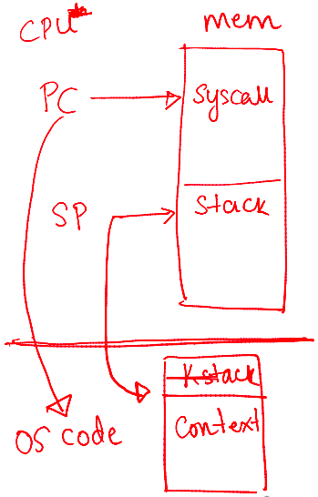

# mechanism of process execution

## Process Execution

--

- OS allocates memory and creates memory image
  - Code and data (from executable)
  - Stack and heap
- Points CPU program counter to next instruction
  - Other registers may store operands, return values, etc.
- After setup, OS is out of the way - completed and process executes directly on CPU
- OS is not involved in every single instruction execution

## How a Simple Function Call Works?

Things to recall

- Program Counter (PC) holds the memory address of the next instruction to be executed by the CPU
- Stack Pointer (SP) points to the current top of the stack in memory
- Base Pointer (BP) / Frame Pointer (FP) points to a fixed location within the current stack frame, making access to function arguments, local variables, and other stack frame data easier
- Stack manages function calls, stores temporary data like local variables and return addresses

How a simple function call works in a sequential flow

- When calling
  - A function call (e.g., myFunction()) translates to a specific CPU instruction - CALL
  - The CALL instruction performs two primary, sequential actions
    - It pushes the return address onto the stack - the address in the calling function where execution resumes after the called function finishes
    - PC points to the next instruction (memory address) where the function's code begins
- Inside called function
  - Once execution begins inside the called function, a new stack frame is created on the stack
  - SP points to the top of the stack

## How Is a System Call Different?

--

- CPU hardware has multiple privilege levels
  - One to run user code: user mode
  - One to run OS code like system calls: kernel mode
  - Some instructions execute only in kernel mode
- The kernel does not trust or use the user stack
  - Uses a separate kernel stack when in kernel mode
  - User stack: each user process has its own stack in user space
  - Kernel stack: when a system call is made, the CPU switches to a separate kernel stack that belongs to the calling process but exists in kernel space
- Kernel does not trust user-provided addresses to jump to
  - Kernel sets up the Interrupt Descriptor Table (IDT) at boot time
  - IDT has addresses of kernel functions to run for system calls and other events

## Trap Instruction

Trap instruction execution steps

- When a system call must be made, a special trap instruction is run (usually hidden from the user by libc)
- Trap instruction execution
  - Move CPU to higher privilege level
  - Switch to kernel stack
  - Save context (old PC, registers) on kernel stack
  - Look up address in IDT and jump to trap handler function in OS code

Triggers for trap instructions and IDT lookup

- Trap instruction is executed on hardware in the following cases
  - System call (program needs OS service)
  - Program fault (program does something illegal, e.g., accesses memory it doesn’t have access to)
  - Interrupt (external device needs attention of OS, e.g., a network packet has arrived on network card)
- Across all cases, the mechanism is: save context on kernel stack and switch to OS address in the IDT
- IDT has many entries/functions, which to use?
  - System calls/interrupts store a number in a CPU register before calling trap, to identify which IDT entry to use

Return from trap and exit kernel mode

- When OS is done handling syscall or interrupt, it calls a special instruction - return-from-trap
  - Restore context of CPU registers from kernel stack
  - Change CPU privilege from kernel mode to user mode
  - Restore PC and jump to user code after trap
- User process unaware that it was suspended, resumes execution as normal
- Will you always return to the same user process from kernel mode? No
- Before returning to user mode, the OS checks whether it should continue running the same process or switch to another process

## Why Switch Between Processes?

--

- Sometimes when the OS is in kernel mode, it cannot return to the same process it left
  - Process has exited or must be terminated (e.g., segfault)
  - Process has made a blocking system call (e.g., reading data from disk, waiting for network input, waiting for a timer)
    - The process transfers control to the kernel to handle the request
    - The kernel starts the operation
    - The kernel blocks the process while operating &rarr; the process is in waiting or blocked state &rarr; the process cannot use the CPU
    - A context switch is performed by OS to select another process from the "ready" queue to run on the CPU
    - After finishing the operation, the kernel updates process state from "blocked" to "ready"
- Sometimes, the OS does not want to return to the same process
  - The process has run for too long
  - Must timeshare CPU with other processes
- In such cases, OS performs a context switch to switch from one process to another

## The OS Scheduler

--

- OS scheduler has two parts
  - Policy to pick which process to run
  - Mechanism to switch to that process
- Non-preemptive (cooperative) schedulers are polite
  - Switch only if process cannot run - blocked or terminated
- Preemptive (non-cooperative) schedulers can switch even when process is ready to continue
  - CPU generates periodic timer interrupt
  - After servicing interrupt, OS checks if the current process has run for too long

## Mechanism of Context Switch

Example: process A has moved from user to kernel mode, OS decides it must switch from A to B

- Save context (PC, registers, kernel stack pointer) of A on kernel stack
- Switch SP to kernel stack of B
- Restore context from B’s kernel stack
  - Who has saved registers on B’s kernel stack?
    - OS did, when it switched out B in the past
- Now, CPU is running B in kernel mode, return-from-trap to switch to user mode of B

## A Subtlety on Saving Context

--

- Context (PC and other CPU registers) saved on the kernel stack in two different scenarios
- When going from user mode to kernel mode, user context (e.g., which instruction of user code you stopped at) is saved on kernel stack by the trap instruction
  - Restored by return-from-trap
- During a context switch, kernel context (e.g., where you stopped in the OS code) of process A is saved on the kernel stack of A by the context switching code
  - Restores kernel context of process B
