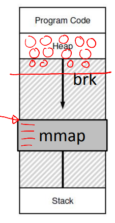

# intro to virtual memory

## Why Virtualize Memory?

--

- Because the real view of memory is messy
- Earlier, memory had only code of one running process (and the OS code)
- Now, multiple active processes timeshare the CPU
  - Memory of many processes
  - Non-contiguous
- Need to hide this complexity from user

- Three processes: Sharing memory

## Abstraction: (Virtual) Address Space

--

- Virtual address space: Each process believes it has a large, continuous block of memory, starting from address 0 up to a maximum limit
  - In reality, this memory may not be fully available or contiguous in physical RAM. The virtual memory system creates the illusion of a seamless memory space for each process
- Components
  - Program code and static data: The executable instructions and fixed data
  - Heap: Dynamically allocated memory that grows downward as needed
  - Stack: Memory used for function calls, growing upward during execution
- CPU operations: The CPU uses virtual addresses to read from (load) or write to (store) memory, relying on the virtual memory system to map these to physical memory

## How Is Actual Memory Reached?

--

- Address Translation: Converts virtual addresses (VA) used by a process into physical addresses (PA) in actual memory
  - The CPU sends load/store commands using virtual addresses, but the memory hardware works with physical addresses
- The OS manages memory allocation and keeps track of where each process's data is stored in physical memory
- Memory Management Unit (MMU): Special hardware that performs the translation from virtual to physical addresses, using information provided by the OS

- Virtual address space - the right one
  - This is not stored anywhere physically
  - It is an abstraction created by the OS for each process to simplify memory management
  - It exists as a concept to give each process its own isolated memory view
- RAM - the left one

## Example: Paging

--

- The OS splits the virtual address space into equal-sized chunks called pages, and physical memory (RAM) into matching chunks called frames
- To assign memory, the OS maps a virtual page to an available physical frame
- A table that keeps track of these mappings for each process (e.g., virtual page 0 might map to physical frame 3)
- The MMU uses the page table to convert virtual addresses (VA) into physical addresses (PA) during memory access

## Goals of Memory Virtualization

--

- Transparency: User programs should not be aware of the messy details
- Efficiency: Minimize overhead and wastage in terms of memory space and access time
- Isolation and protection: A user process should not be able to access anything outside its address space

## How Can a User Allocate Memory?

--

- OS allocates a set of pages to the memory image of the process
- Within this image
  - Static/global variables are allocated in the executable
  - Local variables of a function on stack
  - Dynamic allocation with malloc on the heap

## Memory Allocation System Calls

--

- malloc implemented by C library
  - Algorithms for efficient memory allocation and free space management
- To grow heap, libc uses the brk/sbrk system call
- A program can also allocate a page sized memory using the mmap() system call
  - Gets "anonymous" page from OS

## A Subtle Point: What Is the Address Space of the OS?

--

- OS is not a separate process with its own address space
- Instead, OS code is part of the address space of every process
- A process sees OS as part of its code (e.g., library)
- Page tables map the OS addresses to OS code

## How Does the OS Allocate Memory?

--

- OS needs memory for its data structures
- For large allocations, OS allocates a page
- For smaller allocations, OS uses various memory allocation algorithms (more later)
  - Cannot use libc and malloc in kernel!
