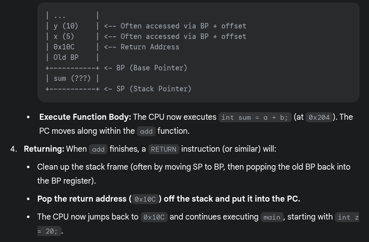

# processes

## Introduction

### What Is an Operating System?

What is an operating system?

- Middleware between programs and system hardware
- Manages hardware, including the CPU, memory, and I/O devices

When a program runs

- A compiler translates high-level programs into an executable (e.g., ".c" source code to "a.out" on disk)
- The executable contains
  - Instructions that the CPU can understand
  - Program data (all numbered with addresses)
- Instructions run on the CPU, which implements an Instruction Set Architecture (ISA)
- The CPU includes several registers
  - Program Counter (PC): Points to the next instruction to be executed
  - Registers for operands, memory addresses, and temporary data

### What Happens When You Run a Program?

- To run an executable, the CPU
  - Fetches the instruction pointed by the PC from memory
  - Increments the PC to point to the next instruction
  - Loads data required into registers
  - Decodes and executes the instruction
  - Stores results back to memory, if needed
- Most recently used instructions and data are stored in CPU caches for faster access

### What Does the OS Do?

--

- Manages program memory
  - Loads the program executable (code, data) from disk to memory
- Manages the CPU
  - Initializes the Program Counter (PC) and other registers to begin execution
- Manages external devices
  - Handles reading from and writing files to the disk

### How Does the OS Manage CPU?

--

- Provides the process abstraction
  - A process is a running program
  - The OS creates and manages processes
- Gives each process the illusion of having exclusive access to the CPU by virtualizing the CPU
  - Multiple processes (e.g., listening to music, browsing the web) run concurrently
- Timeshares the CPU between processes
- Enables coordination between processes

### How Does the OS Manage Memory?

--

- Manages the memory of a process, including code, data, stack, heap, etc.
  - Each process believes it has a dedicated memory space, with code and data numbered starting from 0 (virtual addresses)
- Abstracts the details of actual memory placement, translating virtual addresses to physical addresses
  - Processes are unaware of how memory is implemented

### How Does the OS Manage Devices?

--

- Uses device drivers to manage hardware such as disks, network cards, and other external devices
- Device drivers communicate in the language of the hardware
  - Issue instructions to devices (e.g., fetch data from a file)
  - Respond to interrupt events from devices (e.g., a keypress on the keyboard)
- Organizes persistent data as a filesystem on disk

### Goals of the OS

--

- Abstracts detailed hardware resources for user programs
- Optimizes the use of the CPU, memory, and other resources
- Ensures separation between multiple processes

### History of the OS

--

- Began as a library to provide common functionality across programs to
  - Abstract the hardware that can be used across different programs
  - Access the devices
- Evolved from procedure calls to system calls
- When a system call is made, the CPU executes OS code at a higher privilege level
- Progressed from running a single program to managing multiple processes concurrently

## Process Abstraction

### What Is Process Abstraction?

--

- When you run an executable file, the OS creates a process, which is a running program
- The OS timeshares the CPU across multiple processes, virtualizing the CPU
- The OS has a CPU scheduler that selects one of the many active processes to execute on a CPU
- A CPU scheduler contains
  - Policy: Defines which process to run
  - Mechanism: Defines how to perform a "context switch" between processes

### What Constitutes a Process?

- A unique identifier (PID)
- Memory image
  - Code and data (static)
  - Stack and heap (dynamic)
    - Stack: Stores function calls, local variables, etc.
    - Heap: Holds dynamically allocated memory
- CPU context: Registers
  - Program Counter (PC)
  - Current operands
  - Stack pointer
- File descriptors
  - Pointers to open files and devices

### How Does the OS Create a Process?

- Allocates memory and creates a memory image
  - Loads code and data from the disk executable
  - Initializes a runtime stack and heap
- Opens basic files: `STDIN`, `STDOUT`, `STDERR`
- Initializes CPU registers
  - Sets the Program Counter (PC) to point to the first instruction

### States of a Process

States

- Running: Currently executing on the CPU
- Ready: Waiting to be scheduled
- Blocked: Suspended, not ready to run
  - Why? Waiting for some event (e.g., the process issues a read from disk)
  - When unblocked? The disk issues an interrupt when data is ready
- New: Being created, not yet running
- Dead: Terminated

- Ready &rarr; Running: The OS scheduler assigns the CPU to the process
- Running &rarr; Ready: The OS reclaims the CPU (e.g., time limit reached)
- Running &rarr; Blocked: The process initiates a wait (e.g., starts I/O)
- Blocked &rarr; Ready: The awaited event finishes (e.g., I/O done), making the process runnable again (waiting for the CPU)

Example

### OS Data Structures

--

- The OS maintains a data structure (e.g., a list) of all active processes
- Information about each process is stored in a Process Control Block (`PCB`)
  - Process identifier
  - Process state
  - Pointers to other related processes (e.g., parent process)
  - CPU context of the process (saved when the process is suspended)
  - Pointers to memory locations
  - Pointers to open files

## System Calls for Process Management

### What API Does the OS Provide to User Programs?

--

- `API` = Application Programming Interface
  - Functions available to write user programs
- The `API` provided by the OS is a set of "system calls"
  - A system call is a function call into OS code that runs at a higher privilege level of the CPU
  - Access to sensitive operations (e.g., access to hardware) is allowed only at a higher privilege level
  - Some "blocking" system calls cause the process to be blocked and descheduled (e.g., read from disk)

### Should We Rewrite Programs for Each OS?

--

- `POSIX` (Portable Operating System Interface) `API`: A standard set of system calls that an OS must implement
  - Programs written to the `POSIX API` can run on any `POSIX`-compliant OS
  - Most modern OSes are `POSIX`-compliant
  - Ensures program portability
- Programming language libraries hide the details of invoking/canceling system calls
  - The `printf` function in the C library calls the `write` system call to write to the screen
  - User programs usually do not need to worry about invoking system calls

### System Call Processes in Unix

System calls

- `fork()` creates a new child process
  - All processes are created by forking from a parent
  - The `init` process is the ancestor of all processes
- `exec()` makes a process execute a given executable
- `exit()` terminates a process
- `wait()` causes a parent to block until the child terminates or waits for a process to finish

Many variants exist of the above system calls with different arguments

### What Happens During a Fork()?

- A new process is created by making a copy of the parent's memory image
- The new process is added to the OS process list and scheduled
- The parent and child start execution just after `fork()` (with different return values)
- The parent and child execute and modify memory data independently

- In the child process, `fork()` returns 0
- In the parent process, `fork()` returns the `PID` of the newly created child process

### Waiting for a Child Process to Terminate

--

- Process termination scenarios
  - Normal: By calling `exit()` (`exit` is called automatically when the end of the `main` function is reached)
  - Abnormal: The OS terminates a misbehaving process
- A terminated process exists as a zombie - it still consumes memory
- When a parent calls `wait()`, the zombie child is cleaned up or reaped
- What if the parent terminates before the child?
  - The `init` process adopts orphans and reaps them

### What Happens During Exec()?

--

- After `fork()`, the parent and child are running the same code
  - Not too useful
- A process can run `exec()` to load another executable into its memory image
- A child can run a different program from the parent
  - Replaces the memory image of the current process (code, data, heap, and stack) with the new program
- Variants of `exec()`, e.g., to pass command-line arguments to the new executable

### How Does a Shell Work?

--

- In a basic OS, the `init` process is created after the initialization of hardware (on modern systems, `systemd` or `init` with `PID` 1)
- The `init` process spawns a shell (like `bash`, `zsh`, or `sh`)
- The shell reads a user command, forks a child, `execs` the command executable, waits for it to finish, and then reads the next command
- Common commands like `ls` are all executables that are simply `exec`'ed by the shell

Example with general steps

- The shell reads the command `ls`
- The shell parses the command and locates the `ls` executable in `$PATH` (e.g., `/bin/ls`)
- The shell forks a child process
- The child process calls `execve("/bin/ls", ["ls"], [env])`
- The parent shell calls `waitpid()` and pauses
- The child process writes the result to its standard output
- The child process finishes execution and terminates
- The parent shell resumes after `waitpid()` returns and updates the `$?` status variable
- The parent shell displays the prompt (`$`), ready for the next command

### More Funky Things About the Shell

--

- The shell can manipulate the child in strange ways
- Suppose you want to redirect output from a command to a file
- `prompt>ls > foo.txt`
- The shell spawns a child, redirects its standard output to a file using `open()`, then calls `exec` on the child

## Process Execution Mechanism

### Process Execution

--

- The OS allocates memory and creates a memory image
  - Code and data (from the executable)
  - Stack and heap
- Sets the CPU Program Counter (PC) to the next instruction
  - Other registers may store operands, return values, etc.
- After setup, the OS steps aside, and the process executes directly on the CPU
- The OS is not involved in every instruction's execution

### How Does a Simple Function Call Work?

Key concepts

- The Program Counter (PC) holds the memory address of the next instruction to be executed by the CPU
- The Stack Pointer (SP) points to the current top of the stack in memory
- The Base Pointer (BP) or Frame Pointer (FP) points to a fixed location within the current stack frame, simplifying access to function arguments, local variables, and other stack frame data
- The stack manages function calls and stores temporary data, such as local variables and return addresses

How a simple function call works in sequential flow

- When calling
  - The complier turns a function call (e.g., `myFunction()`) into a CPU instruction: `CALL`
  - The `CALL` instruction performs two sequential actions
    - Saves the return address by pushing it onto the stack (the address in the calling function where execution resumes after the called function finishes)
    - Updates the PC to point to the memory address where the code for `myFunction` starts
- Inside the called function
  - A new stack frame is created on the stack
  - The SP points to the top of the stack

### How Is a System Call Different?

--

- CPU hardware supports multiple privilege levels
  - User mode: For running user code
  - Kernel mode: For running OS code, such as system calls
  - Certain instructions execute only in kernel mode
- The kernel does not trust or use the user stack
  - Because the user program might have bugs, or it could be malicious, deliberately setting up its stack to trick the kernel or crash it
  - Uses a separate kernel stack in kernel mode
  - User stack: Each user process has its own stack in user space
  - Kernel stack: When a system call is made, the CPU switches to a kernel stack unique to the calling process but located in kernel space
- The kernel does not trust user-provided addresses for jumps
  - The kernel sets up the Interrupt Descriptor Table (IDT) at boot time
  - The IDT contains addresses of kernel functions for system calls and other events
    - When a user program wants to make a system call, it might trigger a specific interrupt (e.g., INT 0x80 on older Linux/x86)
    - The CPU hardware then consults the IDT (which only the kernel can set up) to find the correct kernel handler address

### Trap Instruction

Trap instruction execution steps

- When a system call is needed, a special trap instruction is executed (typically hidden from the user by `libc`)
- Trap execution
  - Moves the CPU to a higher privilege level (kernel mode)
  - Switches to the kernel stack
  - Saves context (PC, registers) on the kernel stack
  - Looks up the address in the IDT and jumps to the trap handler function in OS code

Triggers for `trap` instructions and `IDT` lookup

- The `trap` instruction is executed on hardware in the following cases
  - System call (program needs OS service)
  - Program fault (program does something illegal, e.g., accesses memory it doesn't have access to)
  - Interrupt (external device needs the attention of the OS, e.g., a network packet has arrived on the network card)
- Across all cases, the mechanism is: Save context on the kernel stack and switch to the OS address in the `IDT`
- The `IDT` has many entries/functions; which to use?
  - System calls/interrupts store a number in a CPU register before calling `trap`, to identify which `IDT` entry to use

Return from `trap` and exit kernel mode

- When the OS is done handling a syscall or interrupt, it calls a special instruction - `return-from-trap`
  - Restores the context of CPU registers from the kernel stack
  - Changes CPU privilege from kernel mode to user mode
  - Restores the PC and jumps to user code after the `trap`
- The user process is unaware that it was suspended and resumes execution as normal
- Will you always return to the same user process from kernel mode? No
- Before returning to user mode, the OS checks whether it should continue running the same process or switch to another process

Before the trap

After the trap

### Why Switch Between Processes?

--

- When the OS is in kernel mode, it cannot return to the same process it left
  - The process has exited or must be terminated (e.g., segfault)
  - The process has made a blocking system call (e.g., reading data from disk, waiting for network input, waiting for a timer)
    - The process transfers control to the kernel to handle the request
    - The kernel starts the operation
    - The kernel blocks the process while operating &rarr;The process is in a waiting or blocked state &rarr; The process cannot use the CPU
    - A context switch is performed by the OS to select another process from the "ready" queue to run on the CPU
    - After finishing the operation, the kernel updates the process state from "blocked" to "ready"
- The OS does not want to return to the same process
  - The process has run for too long
  - It must timeshare the CPU with other processes
- &rarr; The OS performs a context switch to switch from one process to another

### The OS Scheduler

--

- The OS scheduler has two parts
  - A policy to pick which process to run
  - A mechanism to switch to that process
- Non-preemptive (cooperative) schedulers are polite
  - Switch only if the process cannot run - blocked or terminated
- Preemptive (non-cooperative) schedulers can switch even when the process is ready to continue
  - The CPU generates a periodic timer interrupt
  - After servicing the interrupt, the OS checks if the current process has run for too long

### Mechanism of Context Switch

Example: Process A has moved from user mode eto kernel mode, the OS decides it must switch from A to B

- Save the context (PC, registers, kernel stack pointer) of A on its kernel stack
- Switch the `SP` to the kernel stack of B
- Restore context from B's kernel stack
  - Who has saved registers on B's kernel stack?
    - The OS did, when it switched out B in the past
- Now, the CPU is running B in kernel mode, `return-from-trap` to switch to user mode of B

### A Subtlety on Saving Context

--

- Context (PC and other CPU registers) is saved on the kernel stack in two different scenarios
  - When going from user mode to kernel mode, user context (e.g., which instruction of user code you stopped at) is saved on the kernel stack by the `trap` instruction
    - Restored by `return-from-trap`
  - During a context switch, the kernel context (e.g., where you stopped in the OS code) of process A is saved on the kernel stack of A by the context switching code
    - Restores the kernel context of process B

## Scheduling Policies

### What Is a Scheduling Policy?

--

- During a context switch, which process should run next from the set of ready processes?
- The OS scheduler manages the CPU requests (bursts) of processes
  - CPU burst: The CPU time used by a process in a continuous stretch
  - A process returning after an I/O wait starts a new CPU burst

### What Are We Trying to Optimize?

--

- Maximize utilization: The fraction of time the CPU is used
- Minimize average turnaround time: The time from a process's arrival to its completion
- Minimize average response time: The time from a process's arrival to its first scheduling
- Fairness: Ensure all processes are treated equally
- Minimize overhead: Run a process long enough to amortize (reduce) the cost of a context switch (~1 microsecond)

### First-in-First-Out (FIFO)

FIFO runs processes in arrival order (e.g., A, B, C arriving at t=0) without preemption until completion

- Pros
  - Simple to implement
  - Fair based on arrival order
- Cons
  - The convoy effect delays short jobs behind long ones
  - High turnaround times, especially for processes arriving later or short jobs stuck behind longer ones

### Shortest Job First (SJF)

SJF runs the shortest job first, non-preemptively; it is optimal when jobs arrive simultaneously

- Pros
  - Minimizes wait time for simultaneous arrivals
  - Efficient for varied job lengths
- Cons
  - Short jobs wait if a long job starts first
  - Requires accurate job length estimates

### Shortest Time-to-Completion First (STCF)

STCF (also known as SRTF) preempts for the job with the shortest remaining time when new processes arrive

- Pros
  - Dynamically reduce wait time
  - Prioritizes jobs nearing completion
- Cons
  - High context switch overhead
  - Requires accurate estimates of remaining time
  

### Round Robin (RR)

RR assigns each process a fixed time slice, preempting and cycling through a queue

- Pros
  - Ensure fair CPU sharing
  - Provides good response time for interactive systems
- Cons
  - Poor turnaround for long jobs due to frequent interruptions
  - Time quantum size impacts efficiency
    - Too small: Increases context switch overhead
    - Too large: Mimics FIFO behavior

### Schedulers in Real Systems

--

- Real-world schedulers are more complex
- For example, Linux uses a Multi-Level Feedback Queue (MLFQ)
  - Multiple queues, ordered by priority
  - The highest-priority queue's process is scheduled first
  - Within the same priority, an algorithm like RR may be used
  - A process's priority decreases as it ages

## Inter-Process Communication

### Inter-Process Communication (IPC)

--

- Processes do not share memory with each other
  - Each process has its own separate memory space
- Some processes need to collaborate on tasks, requiring them to communicate information
- IPC mechanisms enable information sharing between processes

### Shared Memory

--

- Processes can access the same region of memory using the `shmget()` system call
  - `int shmget (key_t key, int size, int shmflg)`
- By providing the same key, two processes can access the same memory segment
- Processes read from or write to this memory to communicate
- Synchronization is needed to prevent one process from overwriting another's data

### Signals

--

- A certain set of signals is supported by the OS
  - Some signals have a fixed meaning (e.g., terminating a process)
  - Others are user-defined
- Signals can be sent to a process by the OS or another process (e.g., pressing Ctrl+C sends a `SIGINT` signal to the running process)
- Signal handler
  - Each process has default code to execute for each signal
  - For example, exiting on a terminate signal
- Some signal handlers can be overridden to do other things

### Sockets

--

- Sockets enable communication between processes on the same or different machines
  - TCP/UDP sockets for communication across machines
  - Unix sockets for communication on the local machine
- Communication via sockets
  - Processes open sockets and connect them
  - Messages written into one socket can be read from another
  - The OS transfers data through the socket buffer

### Pipes

--

- The pipe system call returns two file descriptors
  - A read handle and a write handle
  - Pipes provide half-duplex (one-way) communication
  - Data written to one file descriptor can be read from the other
- Regular pipes
  - Both file descriptors are initially in the same process
  - After a `fork()`, the parent and child share the file descriptors
  - For example, the parent writes to one end, and the child reads from the other
- Named pipes
  - Allow two different processes to connect to the pipe's endpoints
- Pipe data is buffered in OS buffers between write and read operations

### Message Queues

--

- Provide a mailbox abstraction
  - A process can open a mailbox at a specified location
  - Processes can send and receive messages through the mailbox
- The OS buffers messages between send and receive operations

### Blocking vs. Non-Blocking Communication

--

- Some IPC actions can block
  - Reading from an empty socket, pipe, or message queue
  - Writing to a full socket, pipe, or message queue
- System calls for reading/writing offer
  - Blocking versions: Wait until the operation can complete
  - Non-blocking versions: Return an error code if the operation cannot proceed immediately (e.g., a socket read returns an error if no data is available)
