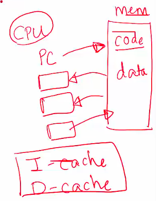

# intro

## What Is an Operating System?

What is an operating system?

- Middleware between programs and system hardware
- Manages hardware, including the CPU, memory, and I/O devices

When a program runs

- A compiler translates high-level programs into an executable (e.g., ".c" source code to "a.out" on disk)
- The executable contains
  - Instructions that the CPU can understand
  - Program data (all numbered with addresses)
- Instructions run on the CPU, which implements an Instruction Set Architecture (ISA)
- The CPU includes several registers
  - Program Counter (PC): Points to the next instruction to be executed
  - Registers for operands, memory addresses, and temporary data

## What Happens When You Run a Program?

- To run an executable, the CPU
  - Fetches the instruction pointed by the PC from memory
  - Increments the PC to point to the next instruction
  - Loads data required into registers
  - Decodes and executes the instruction
  - Stores results back to memory, if needed
- Most recently used instructions and data are stored in CPU caches for faster access

## What Does the OS Do?

--

- Manages program memory
  - Loads the program executable (code, data) from disk to memory
- Manages the CPU
  - Initializes the Program Counter (PC) and other registers to begin execution
- Manages external devices
  - Handles reading from and writing files to the disk

## How Does the OS Manage CPU?

--

- Provides the process abstraction
  - A process is a running program
  - The OS creates and manages processes
- Gives each process the illusion of having exclusive access to the CPU by virtualizing the CPU
  - Multiple processes (e.g., listening to music, browsing the web) run concurrently
- Timeshares the CPU between processes
- Enables coordination between processes

## How Does the OS Manage Memory?

--

- Manages the memory of a process, including code, data, stack, heap, etc.
  - Each process believes it has a dedicated memory space, with code and data numbered starting from 0 (virtual addresses)
- Abstracts the details of actual memory placement, translating virtual addresses to physical addresses
  - Processes are unaware of how memory is implemented

## How Does the OS Manage Devices?

--

- Uses device drivers to manage hardware such as disks, network cards, and other external devices
- Device drivers communicate in the language of the hardware
  - Issue instructions to devices (e.g., fetch data from a file)
  - Respond to interrupt events from devices (e.g., a keypress on the keyboard)
- Organizes persistent data as a filesystem on disk

## Goals of the OS

--

- Abstracts detailed hardware resources for user programs
- Optimizes the use of the CPU, memory, and other resources
- Ensures separation between multiple processes

## History of the OS

--

- Began as a library to provide common functionality across programs to
  - Abstract the hardware that can be used across different programs
  - Access the devices
- Evolved from procedure calls to system calls
- When a system call is made, the CPU executes OS code at a higher privilege level
- Progressed from running a single program to managing multiple processes concurrently
