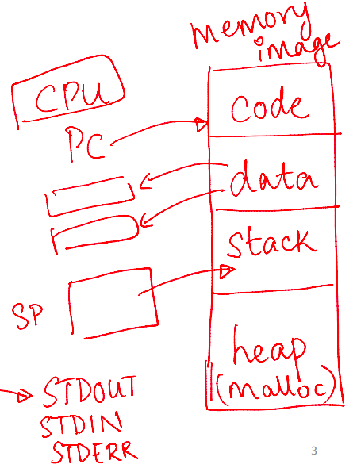
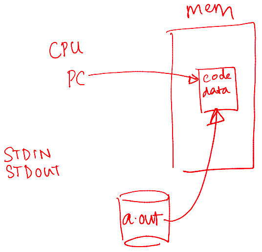
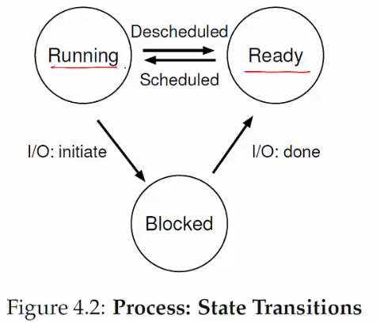
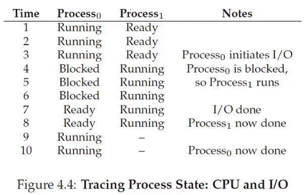

# process abstraction

## What Is Process Abstraction?

--

- When you run an executable file, the OS creates a process, which is a running program
- The OS timeshares the CPU across multiple processes, virtualizing the CPU
- The OS has a CPU scheduler that selects one of the many active processes to execute on a CPU
- A CPU scheduler contains
  - Policy: Defines which process to run
  - Mechanism: Defines how to perform a "context switch" between processes

## What Constitutes a Process?

- A unique identifier (PID)
- Memory image
  - Code and data (static)
  - Stack and heap (dynamic)
    - Stack: Stores function calls, local variables, etc.
    - Heap: Holds dynamically allocated memory
- CPU context: Registers
  - Program Counter (PC)
  - Current operands
  - Stack pointer
- File descriptors
  - Pointers to open files and devices

## How Does the OS Create a Process?

- Allocates memory and creates a memory image
  - Loads code and data from the disk executable
  - Initializes a runtime stack and heap
- Opens basic files: `STDIN`, `STDOUT`, `STDERR`
- Initializes CPU registers
  - Sets the Program Counter (PC) to point to the first instruction

## States of a Process

States

- Running: Currently executing on the CPU
- Ready: Waiting to be scheduled
- Blocked: Suspended, not ready to run
  - Why? Waiting for some event (e.g., the process issues a read from disk)
  - When unblocked? The disk issues an interrupt when data is ready
- New: Being created, not yet running
- Dead: Terminated

- Ready &rarr; Running: The OS scheduler assigns the CPU to the process
- Running &rarr; Ready: The OS reclaims the CPU (e.g., time limit reached)
- Running &rarr; Blocked: The process initiates a wait (e.g., starts I/O)
- Blocked &rarr; Ready: The awaited event finishes (e.g., I/O done), making the process runnable again (waiting for the CPU)

Example

## OS Data Structures

--

- The OS maintains a data structure (e.g., a list) of all active processes
- Information about each process is stored in a Process Control Block (`PCB`)
  - Process identifier
  - Process state
  - Pointers to other related processes (e.g., parent process)
  - CPU context of the process (saved when the process is suspended)
  - Pointers to memory locations
  - Pointers to open files
