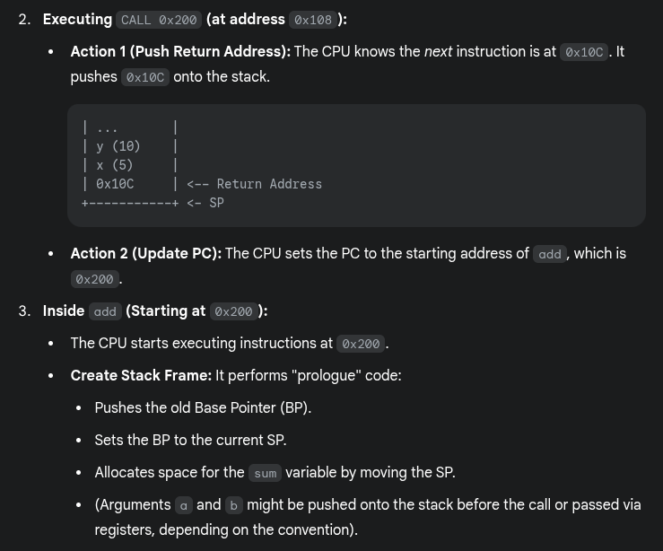

# process execution

## Process Execution

--

- The OS allocates memory and creates a memory image
  - Code and data (from the executable)
  - Stack and heap
- Sets the CPU Program Counter (PC) to the next instruction
  - Other registers may store operands, return values, etc.
- After setup, the OS steps aside, and the process executes directly on the CPU
- The OS is not involved in every instruction's execution

## How Does a Simple Function Call Work?

Key concepts

- The Program Counter (PC) holds the memory address of the next instruction to be executed by the CPU
- The Stack Pointer (SP) points to the current top of the stack in memory
- The Base Pointer (BP) or Frame Pointer (FP) points to a fixed location within the current stack frame, simplifying access to function arguments, local variables, and other stack frame data
- The stack manages function calls and stores temporary data, such as local variables and return addresses

How a simple function call works in sequential flow

- When calling
  - The complier turns a function call (e.g., `myFunction()`) into a CPU instruction: `CALL`
  - The `CALL` instruction performs two sequential actions
    - Saves the address of the instruction immediately following the call instruction by pushing it onto the stack (the address where execution resumes after the called function finishes)
    - Updates the PC to point to the memory address where the code for `myFunction` starts
- Inside the called function
  - A new stack frame is created on the stack
  - The SP points to the top of the stack

## How Is a System Call Different?

--

- CPU hardware supports multiple privilege levels
  - User mode: For running user code
  - Kernel mode: For running OS code, such as system calls
  - Certain instructions execute only in kernel mode
- The kernel does not trust or use the user stack
  - Because the user program might have bugs, or it could be malicious, deliberately setting up its stack to trick the kernel or crash it
  - Uses a separate kernel stack in kernel mode
  - User stack: Each user process has its own stack in user space
  - Kernel stack: When a system call is made, the CPU switches to a kernel stack unique to the calling process but located in kernel space
- The kernel does not trust user-provided addresses for jumps
  - The kernel sets up the Interrupt Descriptor Table (IDT) at boot time
  - The IDT contains addresses of kernel functions for system calls and other events
    - When a user program wants to make a system call, it might trigger a specific interrupt (e.g., INT 0x80 on older Linux/x86)
    - The CPU hardware then consults the IDT (which only the kernel can set up) to find the correct kernel handler address

## Trap Instruction

Trap instruction execution steps

- When a system call is needed, a special trap instruction is executed (typically hidden from the user by `libc`)
- Trap execution
  - Moves the CPU to a higher privilege level (kernel mode)
  - Switches to the kernel stack
  - Saves context (PC, registers) on the kernel stack
  - Looks up the address in the IDT and jumps to the trap handler function in OS code

Triggers for `trap` instructions and `IDT` lookup

- The `trap` instruction is executed on hardware in the following cases
  - System call (program needs OS service)
  - Program fault (program does something illegal, e.g., accesses memory it doesn't have access to)
  - Interrupt (external device needs the attention of the OS, e.g., a network packet has arrived on the network card)
- Across all cases, the mechanism is: Save context on the kernel stack and switch to the OS address in the `IDT`
- The `IDT` has many entries/functions; which to use?
  - System calls/interrupts store a number in a CPU register before calling `trap`, to identify which `IDT` entry to use

Return from `trap` and exit kernel mode

- When the OS is done handling a syscall or interrupt, it calls a special instruction - `return-from-trap`
  - Restores the context of CPU registers from the kernel stack
  - Changes CPU privilege from kernel mode to user mode
  - Restores the PC and jumps to user code after the `trap`
- The user process is unaware that it was suspended and resumes execution as normal
- Will you always return to the same user process from kernel mode? No
- Before returning to user mode, the OS checks whether it should continue running the same process or switch to another process

Before the trap

After the trap

## Why Switch Between Processes?

--

- When the OS is in kernel mode, it cannot return to the same process it left
  - The process has exited or must be terminated (e.g., segfault)
  - The process has made a blocking system call (e.g., reading data from disk, waiting for network input, waiting for a timer)
    - The process transfers control to the kernel to handle the request
    - The kernel starts the operation
    - The kernel blocks the process while operating &rarr;The process is in a waiting or blocked state &rarr; The process cannot use the CPU
    - A context switch is performed by the OS to select another process from the "ready" queue to run on the CPU
    - After finishing the operation, the kernel updates the process state from "blocked" to "ready"
- The OS does not want to return to the same process
  - The process has run for too long
  - It must timeshare the CPU with other processes
- &rarr; The OS performs a context switch to switch from one process to another

## The OS Scheduler

--

- The OS scheduler has two parts
  - A policy to pick which process to run
  - A mechanism to switch to that process
- Non-preemptive (cooperative) schedulers are polite
  - Switch only if the process cannot run - blocked or terminated
- Preemptive (non-cooperative) schedulers can switch even when the process is ready to continue
  - The CPU generates a periodic timer interrupt
  - After servicing the interrupt, the OS checks if the current process has run for too long

## Mechanism of Context Switch

Example: Process A has moved from user mode eto kernel mode, the OS decides it must switch from A to B

- Save the context (PC, registers, kernel stack pointer) of A on its kernel stack
- Switch the `SP` to the kernel stack of B
- Restore context from B's kernel stack
  - Who has saved registers on B's kernel stack?
    - The OS did, when it switched out B in the past
- Now, the CPU is running B in kernel mode, `return-from-trap` to switch to user mode of B

## A Subtlety on Saving Context

--

- Context (PC and other CPU registers) is saved on the kernel stack in two different scenarios
  - When going from user mode to kernel mode, user context (e.g., which instruction of user code you stopped at) is saved on the kernel stack by the `trap` instruction
    - Restored by `return-from-trap`
  - During a context switch, the kernel context (e.g., where you stopped in the OS code) of process A is saved on the kernel stack of A by the context switching code
    - Restores the kernel context of process B
