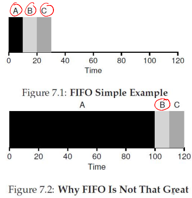
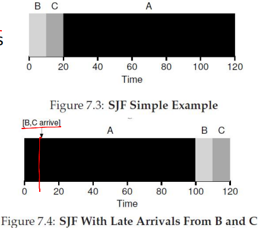
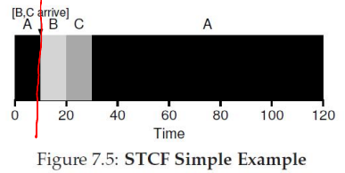
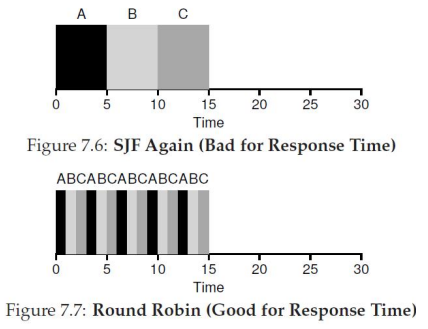

# scheduling policies

## What Is a Scheduling Policy?

--

- During a context switch, which process should run next from the set of ready processes?
- The OS scheduler manages the CPU requests (bursts) of processes
  - CPU burst: The CPU time used by a process in a continuous stretch
  - A process returning after an I/O wait starts a new CPU burst

## What Are We Trying to Optimize?

--

- Maximize utilization: The fraction of time the CPU is used
- Minimize average turnaround time: The time from a process's arrival to its completion
- Minimize average response time: The time from a process's arrival to its first scheduling
- Fairness: Ensure all processes are treated equally
- Minimize overhead: Run a process long enough to amortize (reduce) the cost of a context switch (~1 microsecond)

## First-in-First-Out (FIFO)

FIFO runs processes in arrival order (e.g., A, B, C arriving at t=0) without preemption until completion

- Pros
  - Simple to implement
  - Fair based on arrival order
- Cons
  - The convoy effect delays short jobs behind long ones
  - High turnaround times, especially for processes arriving later or short jobs stuck behind longer ones

## Shortest Job First (SJF)

SJF runs the shortest job first, non-preemptively; it is optimal when jobs arrive simultaneously

- Pros
  - Minimizes wait time for simultaneous arrivals
  - Efficient for varied job lengths
- Cons
  - Short jobs wait if a long job starts first
  - Requires accurate job length estimates

## Shortest Time-to-Completion First (STCF)

STCF (also known as SRTF) preempts for the job with the shortest remaining time when new processes arrive

- Pros
  - Dynamically reduce wait time
  - Prioritizes jobs nearing completion
- Cons
  - High context switch overhead
  - Requires accurate estimates of remaining time
  

## Round Robin (RR)

RR assigns each process a fixed time slice, preempting and cycling through a queue

- Pros
  - Ensure fair CPU sharing
  - Provides good response time for interactive systems
- Cons
  - Poor turnaround for long jobs due to frequent interruptions
  - Time quantum size impacts efficiency
    - Too small: Increases context switch overhead
    - Too large: Mimics FIFO behavior

## Schedulers in Real Systems

--

- Real-world schedulers are more complex
- For example, Linux uses a Multi-Level Feedback Queue (MLFQ)
  - Multiple queues, ordered by priority
  - The highest-priority queue's process is scheduled first
  - Within the same priority, an algorithm like RR may be used
  - A process's priority decreases as it ages
