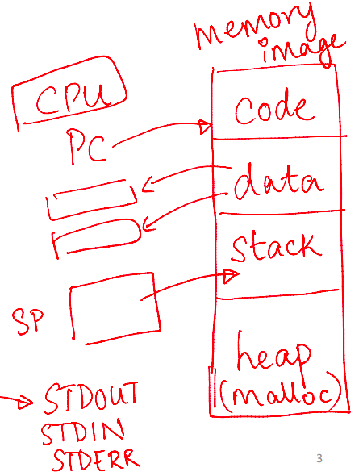
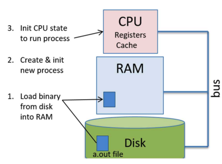
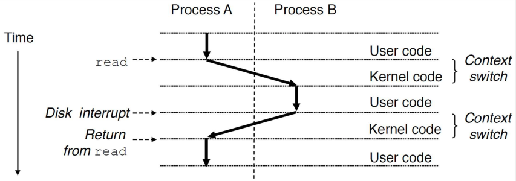
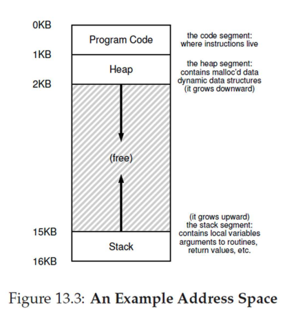
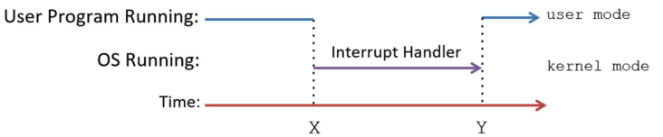
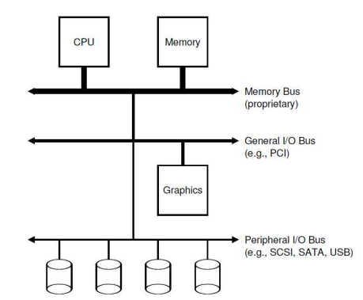
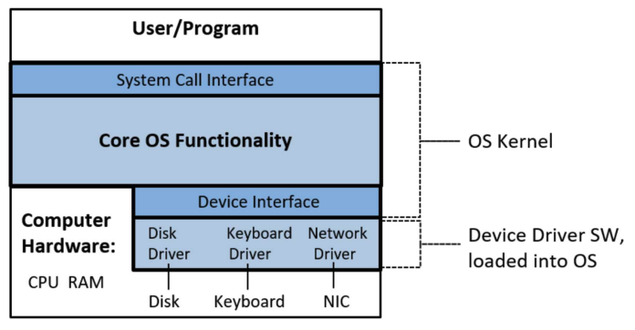

# intro

## The Computer System

- What does a computer system contain?
  - User software: User applications (browser, email client, games, application servers, databases, AI/ML algorithms, etc.)
  - System software: Operating System (OS), etc.
  - Hardware: CPU, memory, I/O devices, etc.

## What Is an Operating System?

- Middleware between user programs and system hardware
  - Not user application software, but system software
  - Examples: Linux, Windows, MacOS
- Manages computer hardware: CPU, main memory, I/O devices (hard disk, network card, mouse, keyboard etc.)
  - User applications do not have to worry about low-level hardware details
- Components
  - Kernel: The core functionality of the OS
  - Other programs: Shell, commands, and utilities that help users interact with the OS

## Goals of Operating Systems

- Abstracts detailed hardware resources for user programs
- Optimizes the use of the CPU, memory, and other resources
- Ensures separation between multiple processes

## History of Operating Systems

- Initially, OS was a library providing common functionality to access hardware via function calls from user programs
  - Convenient, as users did not need to write code to manage hardware
  - Centralized management of hardware resources is more efficient
- As computers evolved to run multiple processes concurrently
  - Multiple untrusted users shared the same hardware
- So, OS evolved into trusted system software, providing isolation between users and protecting hardware
  - Ensures multiple users are isolated and protected from each other
  - Protects system hardware and software from unauthorized access

## Key Concepts in Operating Systems

- Virtualization: The OS provides a "virtual" or logical view of the hardware, hiding the complex physical view, giving each user/program the illusion of having entire hardware to itself
- Concurrency: The OS runs multiple user programs simultaneously (at the same time), sharing system resources efficiently and securely
- Persistence: The OS stores user data persistently on external I/O devices

## What Is a Program?

- Consist of code (CPU instructions) and data for a specific task
- Store program concept
  - User programs are stored in main memory (instructions + data)
  - Memory is byte-addressable, data is accessed via memory addresses
  - The CPU fetches code/data from memory using addresses and executes instructions
- Processes
  - A process is a running program
  - Modern CPUs have multiple cores for parallel execution
  - Each core runs one process at a time
  - Hyper-threading allows one physical core to appear as multiple logical cores, running multiple processes simultaneously

## What Happens When You Run a Program?

Stage 1: OS

- A compiler translates high-level code into an executable
- The executable file (e.g., “a.out”) is stored on the hard disk
- When executed, a new process is created
- The process is allocated a virtual address space in RAM to store code and data (compile-time data allocated at start, runtime data allocated as the program runs)
- The executable is loaded from disk to main memory when the program starts
- The CPU begins executing the program's instructions

Stage 2: CPU

- Fetches the instruction pointed by the PC from memory
- Increments the PC to point to the next instruction
- Loads data required into registers
- Decodes and executes the instruction
- Stores results back to memory, if needed

CPU execution context

- When running a process, CPU registers store the execution context (e.g., Program Counter (PC) points to the current instruction, general-purpose registers store data)

## Role of OS in Running a Process

- Allocates memory for the new process in RAM
  - Loads code and data from the disk executable
  - Allocates memory for stack and heap
- Initializes the CPU context (e.g., PC points to the first instruction)
- The process begins execution
  - The CPU runs user instructions
  - The OS steps out but intervenes when needed

## Concurrent Execution and CPU Virtualization

- The CPU runs multiple programs concurrently
  - The OS switches between processes, running one for a short time before switching to another
- How the OS ensures correct concurrent execution
  - Runs process A for some time
  - Pauses A, saves its context, and loads the context of process B (context switching)
  - Runs process B for some time
  - Pauses B, restores A's context, and resumes A
- Each process believes it is running alone on the CPU
  - Context switching ensures no disruption is perceived by the process
- The OS virtualizes the CPU across multiple processes
- The OS scheduler decides which process to run on which CPU and when

## Context Switching

## Memory Image of a Process

- Memory image: The code and data of a process in memory
  - Code: CPU instructions in the program
  - Compile-time data: Global/static variables in the program executable
  - Runtime data: Stack and heap for dynamic memory allocation
- The heap and stack can grow/shrink during execution with OS assistance
  - The stack pointer (CPU register) tracks the top of the stack
- The memory image includes additional code (e.g., language libraries, kernel code) that the process may execute

## Address Space of a Process

- The OS gives each process the illusion that its memory image is laid out contiguously from address 0 (virtual address space)
- In reality, processes are allocated memory in chunks across RAM at physical addresses, which the programmer does not see
  - Pointer addresses in a program are virtual, not physical
- The OS maps virtual addresses to physical addresses when accessed
- The OS virtualizes memory, providing each process with its own virtual address space

## Isolation and Privilege Levels

- Protecting concurrent processes
  - Can one process interfere with another's code or data?
  - How does the OS ensure safe sharing during virtualization?
- CPU mechanisms for isolation
  - Privileged instructions: Access sensitive information or perform sensitive actions
  - Unprivileged instructions: Regular operations (e.g., add)
- CPUs have multiple modes (e.g., Intel x86 CPUs use 4 rings)
  - Low privilege (e.g., ring 3): Only unprivileged instructions
  - High privilege (e.g., ring 0): Both privileged and unprivileged instructions

## User Mode and Kernel Mode

- User programs run in user mode (unprivileged)
  - The CPU executes only unprivileged instructions
- OS runs in kernel mode (privileged)
  - The CPU can execute both privileged and unprivileged instructions
- Mode transitions
  - The CPU shifts to kernel mode to execute OS code during
    - System calls: User requests for OS services
    - Interrupts: External events requiring OS attention
    - Program faults: Errors needing OS intervention
  - After completing kernel-mode tasks, the OS returns to user mode

## System Calls

- A system call is made when a user program requires an OS service (e.g., reading from a hard disk)
  - Why? User processes cannot execute privileged instructions to access hardware, ensuring one user cannot harm another
  - The CPU jumps to OS code to handle the system call and returns to user code afterward
- User programs typically use library functions (e.g., `printf` in C), which invoke (cause) system calls (e.g., to write to the screen)

## Interrupts

- The CPU handles external events (e.g., mouse clicks, keyboard input) via interrupts
- An interrupt is an external signal from an I/O device requesting CPU attention
- Example: A program requests disk data, and the disk raises an interrupt when the data is ready (avoiding program waiting)

## Interrupt Handling

- Process - How are interrupts handled?
  - The CPU is running process P when an interrupt arrives
  - The CPU saves P's context, switches to kernel mode, and runs OS interrupt-handling code (e.g., reading a keyboard character)
  - The CPU restores P's context and resumes P in user mode
- Interrupt-handling code is part of the OS
- The CPU executes the OS interrupt handler and returns to user code

## I/O Devices

- The CPU and memory are connected via a high-speed system (memory) bus
- I/O devices connect to the CPU and memory via separate buses
  - I/O devices interface with the external world
  - Store user data persistently
- The OS manages I/O devices on behalf of users

## Device Controller and Device Driver

- Each I/O device is managed by a device controller (a microcontroller communicating with the CPU/memory over a bus)
- Device driver: Special OS software with device-specific knowledge to handle I/O operations
- Functions of the kernel device driver
  - Initialize I/O devices
  - Start I/O operations and issue commands to the device (e.g., read data from a hard disk)
  - Handle interrupts from the device (e.g., when data is ready)

## Advice

### Why Study Operating Systems?

- Knowledge of hardware (architecture) and system software (OS), and how user programs interact with these lower layers, is essential for writing high-performance, reliable user programs
- Key questions addressed by studying OS
  - What happens when you run a user program?
  - How can you make your program run faster and more efficiently?
  - How can you make your programs more secure, reliable, and tolerant to failures?
  - Why is your program running slowly, and how can you fix it?
  - How much CPU/memory is your program consuming, and why?
- OS expertise is one of the most critical skills for building high-performance, robust, and complex real-world systems

### Beyond OS to Real Systems and Future Courses

- Architecture + OS: Provides the foundation for understanding how a user program runs on a single machine
- Networking: Explores how programs communicate across machines
- Databases and data storage: Covers how applications store data efficiently and reliably across one or more machines
- Performance engineering: Focuses on making programs run faster
- Distributed systems: Examines how multiple applications across multiple machines work together to perform tasks reliably
- Other topics: Virtualization, cloud computing, security, etc.
