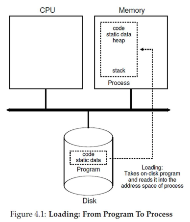

# process abstraction

## The Process Abstraction

--

- A process is a running program.
- When a program runs, the OS creates a process, allocates memory, initializes its CPU context, and starts it in user mode.
- User programs run on the CPU until the OS intervenes for system calls, interrupts, or faults.

## What Defines a Process?

--

- A unique process identifier (PID).
- Its memory image in RAM, containing:
  - Code and data from the executable.
  - Stack and heap for runtime use.
- Its execution context (CPU register values):
  - The Program Counter (PC) holds the instruction address; other registers hold data.
  - Context is in CPU registers when running and saved to memory when paused.
- Its I/O state:
  - Open files, network connections, and other I/O information.

## States of a Process

An active process can be in one of the following states:

- **Running**: Currently executing on the CPU.
  - Its context is in the CPU registers.
- **Blocked/Sleeping**: Cannot run; waiting for an event (e.g., I/O completion).
- **Ready/Runnable**: Ready to run, but waiting for the OS scheduler.
- The context of blocked and ready processes is saved in OS memory.

## Example: Process State Transitions

- P0 is running, P1 is ready.
- P0 makes a blocking system call (e.g., disk read) and moves to the **blocked** state. The OS switches to P1.
- A disk interrupt signals data is ready. The OS handles the interrupt and moves P0 to the **ready** state.
- The OS continues running P1; the scheduler will run P0 later.

## Process Control Block (PCB)

--

- The PCB is a kernel data structure storing all process information.
- It contains
  - PID and process state.
  - Pointers to related processes (parent, children).
  - Saved CPU context.
  - Memory and I/O information.
- Known by different names in different OSes (e.g., `task_struct` in Linux).

## CPU Scheduler

--

- The OS maintains a list of all PCBs.
- The scheduler loops through this list, picking a ready process to run on each CPU core.
- It periodically performs context switches between processes.

## Booting

--

- On boot, the BIOS runs from non-volatile memory to set up hardware.
- BIOS locates and runs the boot loader from a boot disk (e.g., hard disk).
- The boot loader loads the OS kernel into memory and transfers control to it.
- The OS then starts and allows users to run programs.

## Booting Real Systems

--

- Modern bootloaders are too complex for the first disk sector.
- They need to read large kernel images from disk or network.
- Booting is often a multi-stage process: BIOS -> simple bootloader -> complex bootloader -> OS.
