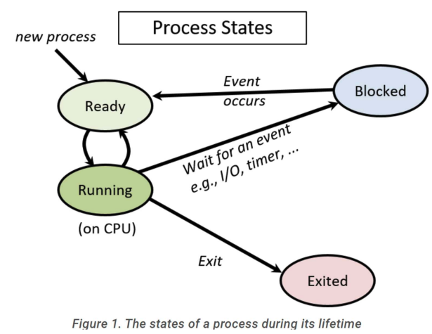

# process abstraction

## The Process Abstraction

- A process is a running program
- When a program runs, the OS creates a new process, allocates memory, initializes the CPU context, and starts it in user mode
- User programs run on the CPU until the OS intervenes for system calls, interrupts, or faults

## What Defines a Process?

- A unique process identifier (PID)
- Memory image in RAM, including
  - Code and data from the executable
  - Stack and heap for runtime use
- Execution context (CPU register values)
  - The Program Counter (PC) holds the instruction address
  - Other registers hold data
  - Context is in CPU registers when running and saved to memory when paused
- I/O state
  - Open files, network connections, and other I/O information

## States of a Process

- Running: Currently executing on the CPU
  - Its context is in the CPU registers
- Blocked/Suspended/Sleeping: Cannot run, or wait for an event (e.g., I/O completion)
- Ready/Runnable: Ready to run, but waiting for the OS scheduler
- The context of blocked and ready processes is saved in OS memory so they can resume later

## Example: Process State Transitions

- Initially, P0 is running, and P1 is ready
- If P0 requests data from a disk via a system call, the OS handles it but moves P0 to the blocked state since the data isn't immediately available. The OS then switches to P1
- P1 runs for a while, and an interrupt from the disk occurs, signaling that P0's requested data is ready. The CPU jumps to the OS, which handles the interrupt and moves P0 to the ready state
- The OS can continue running P1, and the scheduler will switch to P0 later

## Process Control Block (PCB)

- The PCB is a kernel data structure storing all process information
- It contains
  - Process identifier (PID)
  - Process state (running, ready, blocked, terminated, etc.)
  - Pointers to other related processes (parent, children)
  - Saved CPU context of the process when it's not running
  - Information related to memory locations of the process
  - Information related to ongoing I/O communication
- Known by different names in different OSes (e.g., `task_struct` in Linux)

## CPU Scheduler

- The OS maintains a list of all PCBs
- The scheduler loops through this list, picking a ready process to run on each CPU core
- It periodically performs context switches between processes

## Booting

When a computer system boots up, the Basic Input Output System (BIOS) starts running

- BIOS is stored in non-volatile memory and initialize other hardware
- BIOS locates the boot loader in the boot disk (hard disk, USB, etc.)
- The boot loader is a simple program (assembly and C code) whose job is to locate and load the OS
- The boot loader sets up CPU registers, loads the kernel image from disk to memory, and transfers control to the kernel
- After control is transferred, the OS code begins to run, exposes a terminal to the user, and the user can start programs

## Booting Real Systems

- Bootloaders for simple or old OSs could fit into the 512 bytes of the first sector of the boot disk, as required for easy discovery by BIOS
- However, modern OS bootloaders are complex, needing to read large kernel images from disk and network, and thus do not fit into 512 bytes
- Real-life booting is a two-step process
  - BIOS loads a simple bootloader - Loads a more complex bootloader
  - Loads the OS
