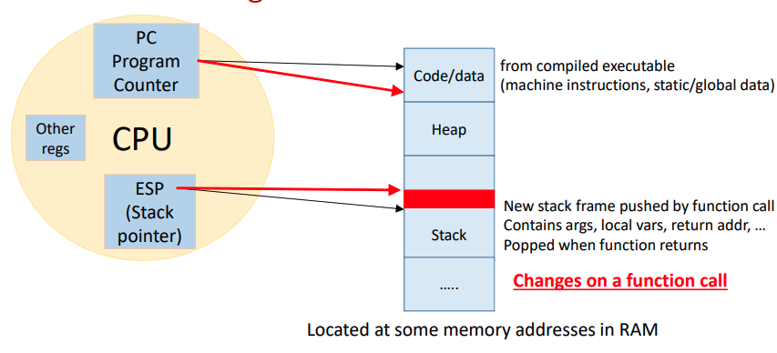

# process execution

## User Mode vs. Kernel Mode

--

- The CPU typically runs user code in user mode (low privilege)
- The CPU switches to kernel mode for
  - System calls from a process
  - Interrupts from external devices
  - Program execution faults
- These events are called "traps," causing the CPU to execute OS code
  - During a trap, the CPU enters kernel mode to handle the event
  - Afterward, it returns to user mode to resume the user code
- A process running OS code in kernel mode is still the same process
- The OS is not a separate process; it executes in the kernel mode of existing processes

## Function Call vs. System Call

Function call

- Allocates memory on the user stack
- Pushes return address and jumps to function code
- Pushes register context to the user stack
- Executes function code
- Pops return address and context upon return
- Function address is known, allowing a direct jump instruction (e.g., call)

System call

- Pushes register context to a stack
- Saves PC and jumps to OS code
- Runs system call and restores context
- User cannot be trusted to jump to the correct OS address
- The OS avoids using the user stack for security
- Requires a secure stack and a secure jump mechanism to OS code

## Kernel Stack and Interrupt Descriptor Table (IDT)

Kernel Stack

- Each process has a separate kernel stack for running kernel code
- It's part of the process's PCB in OS memory, inaccessible from user mode
- Used like a user stack but for kernel mode execution
- Context is pushed to the kernel stack during a system call and popped on completion

Interrupt Descriptor Table (IDT)

- The CPU uses the IDT to find the address of OS code to execute for events
- The IDT is a table of kernel code addresses
- It's set up by the OS at boot and is inaccessible from user mode
- The IDT's base address is stored in a CPU register
- On a trap, the CPU uses the IDT to find the correct interrupt handler address
- The kernel stack and IDT together provide a secure way to locate and run OS code

## Hardware Trap Instruction

--

- User code invokes a special "trap instruction" to make a system call
- Example: int n in x86, where n is an index into the IDT for the corresponding OS function
- When the CPU executes a trap instruction
  - It switches to a higher privilege level (kernel mode)
  - It switches the stack pointer to the process's kernel stack
  - It saves the register context on the kernel stack
  - It gets the OS code address from the IDT and sets the PC
  - OS code begins running on the secure kernel stack
- The trap instruction provides a secure mechanism for transferring control to the OS, as user code cannot be trusted
- It's typically invoked by library functions (like printf) or triggered by hardware interrupts

## Trap Handling and Return From Trap

--

- The basic trap mechanism involves saving context on the kernel stack, finding the OS handler address in the IDT, and running the OS code
- After handling a trap, the OS executes a "return-from-trap" instruction
- This instruction
  - Restores CPU register context from the kernel stack
  - Switches the CPU back to user mode
  - Restores the PC to resume user code right after the trap
- The user process resumes as if uninterrupted
- Before returning to user mode, the OS may decide to perform a context switch to another process

## Why Switch Between Processes?

--

- The OS cannot return to the same process if it has
  - Exited or been terminated (e.g., segmentation fault)
  - Made a blocking system call (e.g., waiting for I/O)
- The OS may choose not to return to the same process if it has
  - Exceeded its time slice
  - To ensure fair CPU time-sharing with other processes
- In these cases, the OS scheduler performs a context switch to another process
  - The switch happens between the kernel modes of the two processes

## OS Scheduler

--

- The OS maintains a list of active processes as Process Control Blocks (PCBs)
  - Processes are added on fork() and removed after wait()
- The OS scheduler is code that periodically selects a process to run
- The scheduler's basic operation
  - Saves the context of the current process to its PCB
  - Selects the next ready process to run
  - Restores the context of the selected process from its PCB
  - This cycle repeats continuously

## Scheduling and Context Switching

--

- OS scheduling involves two tasks
  - Policy: Deciding which process to run next
  - Mechanism: Implementing the switch to the selected process
- Non-preemptive (cooperative) schedulers only switch when a process blocks or terminates
- Preemptive (non-cooperative) schedulers can switch processes at any time, even if the current one is ready
  - This is often triggered by a periodic timer interrupt
  - The OS then checks if the process's time slice has expired and may initiate a context switch

## Mechanism of Context Switch

Phase 1: Entry into kernel mode and initial state

- When Process A traps into kernel mode, its user context is saved on its kernel stack
- If Process A must block (e.g., for I/O), the scheduler selects Process B to run

Phase 2: Saving kernel context

- The OS saves Process A's kernel context (PC, registers, kernel stack pointer) onto its kernel stack
- This captures the state of execution within the OS itself

Phase 3: The actual context switch moment

- The OS switches the Stack Pointer (ESP) register to point to Process B's kernel stack
- Process B's stack now becomes the active kernel stack

Phase 4: Restoring context and resuming execution

- The OS restores Process B's kernel context from its kernel stack, resuming execution in kernel mode
- The OS then restores Process B's user context from its kernel stack, resuming execution in user mode
- The context switch is now complete

## Understanding Saving and Restoring Context

--

- Context (PC and registers) is saved on the kernel stack in two scenarios
  - User-to-Kernel transition: The trap instruction saves the user context
    - The return-from-trap instruction restores it
  - Context switch: The context switching code saves the kernel context
    - This context is restored when the process is scheduled to run again
