# memory

## Intro to Virtual Memory

### Why Virtualize Memory?

- Because the real view of memory is messy
- Earlier, memory had only code of one running process (and the OS code)
- Now, multiple active processes timeshare the CPU
  - Memory of many processes
  - Non-contiguous
- Need to hide this complexity from user

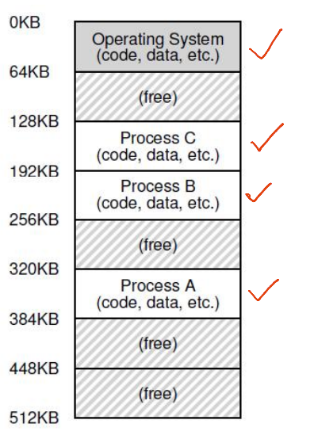

- Three processes: Sharing memory

### Abstraction: (Virtual) Address Space

- Virtual address space: Each process believes it has a large, continuous block of memory, starting from address 0 up to a maximum limit
  - In reality, this memory may not be fully available or contiguous in physical RAM. The virtual memory system creates the illusion of a seamless memory space for each process
- Components
  - Program code and static data: The executable instructions and fixed data
  - Heap: Dynamically allocated memory that grows downward as needed
  - Stack: Memory used for function calls, growing upward during execution
- CPU operations: The CPU uses virtual addresses to read from (load) or write to (store) memory, relying on the virtual memory system to map these to physical memory

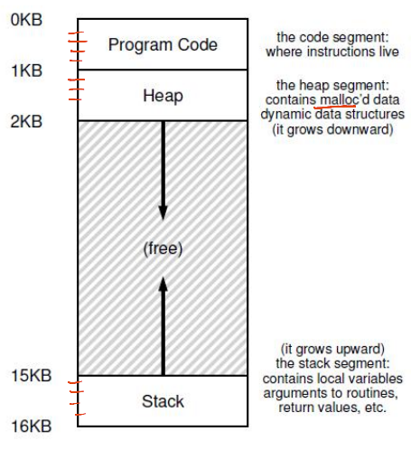

### How Is Actual Memory Reached?

- Address Translation: Converts virtual addresses (VA) used by a process into physical addresses (PA) in actual memory
  - The CPU sends load/store commands using virtual addresses, but the memory hardware works with physical addresses
- The OS manages memory allocation and keeps track of where each process's data is stored in physical memory
- Memory Management Unit (MMU): Special hardware that performs the translation from virtual to physical addresses, using information provided by the OS

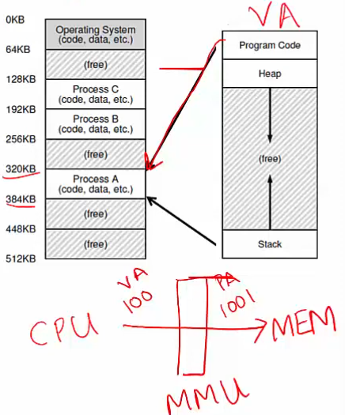

- Virtual address space - the right one
  - This is not stored anywhere physically
  - It is an abstraction created by the OS for each process to simplify memory management
  - It exists as a concept to give each process its own isolated memory view
- RAM - the left one

### Example: Paging

- The OS splits the virtual address space into equal-sized chunks called pages, and physical memory (RAM) into matching chunks called frames
- To assign memory, the OS maps a virtual page to an available physical frame
- A table that keeps track of these mappings for each process (e.g., virtual page 0 might map to physical frame 3)
- The MMU uses the page table to convert virtual addresses (VA) into physical addresses (PA) during memory access

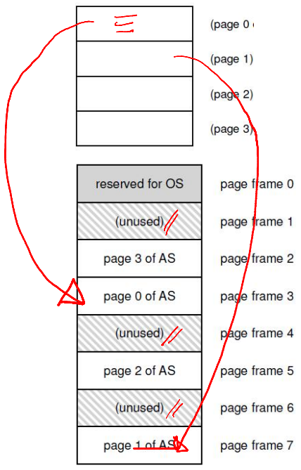

### Goals of Memory Virtualization

- Transparency: User programs should not be aware of the messy details
- Efficiency: Minimize overhead and wastage in terms of memory space and access time
- Isolation and protection: A user process should not be able to access anything outside its address space

### How Can a User Allocate Memory?

- OS allocates a set of pages to the memory image of the process
- Within this image
  - Static/global variables are allocated in the executable
  - Local variables of a function on stack
  - Dynamic allocation with malloc on the heap

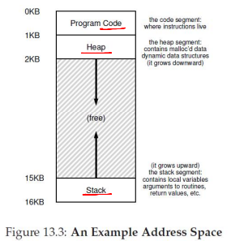

### Memory Allocation System Calls

- malloc implemented by C library
  - Algorithms for efficient memory allocation and free space management
- To grow heap, libc uses the brk/sbrk system call
- A program can also allocate a page sized memory using the mmap() system call
  - Gets "anonymous" page from OS

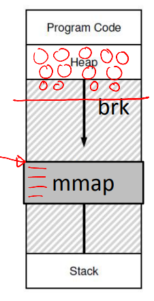

### A Subtle Point: What Is the Address Space of the OS?

- OS is not a separate process with its own address space
- Instead, OS code is part of the address space of every process
- A process sees OS as part of its code (e.g., library)
- Page tables map the OS addresses to OS code

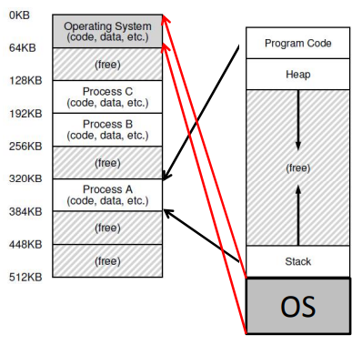

### How Does the OS Allocate Memory?

- OS needs memory for its data structures
- For large allocations, OS allocates a page
- For smaller allocations, OS uses various memory allocation algorithms (more later)
  - Cannot use libc and malloc in kernel!

## Address Translation Mechanism

### A Simple Example

- Consider a simple C function

```c
void func() {
  int x = 3000;
  x = x + 3;
}
```

- It is compiled as follows

```assembly
128: movl 0x0(%ebx), %eax    ; load 0+%ebx into eax
132: addl $0x03, %eax        ; add 3 to eax register
135: movl %eax, 0x0(%ebx)    ; store eax back to mem
```

- Virtual address space is set up by OS during process creation

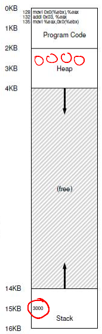

### Address Translation

- Simplified OS: Places the entire memory image in one chunk
- The following translation from VA to PA is needed
  - 128 to 32896 (32KB + 128)
  - 1KB to 33 KB
  - 20KB? Error!

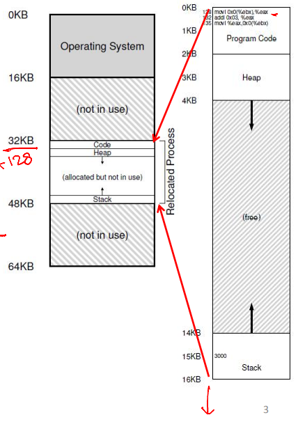

### Who Performs Address Translation?

- In this simple example, OS tells the hardware the base (starting address) and bound (total size of process) values

```text
physical address = virtual address + base
```

```text
33 KB = 1 KB + 32 KB
```

- Memory hardware, the Memory Management Unit (MMU), calculates PA from VA
- MMU also checks if the address is beyond the bound
- OS is not involved in every translation

### Role of Hardware in Translation

- CPU provides a privileged mode of execution
- Instruction set has privileged instructions to set translation information (e.g., base, bound)
- Hardware (MMU) uses this information to perform translation on every memory access
- MMU generates faults and traps to the OS when access is illegal (e.g., VA is out of bounds)

### Role of OS in Translation

- OS maintains a free list of memory
- Allocates space to a process during creation (and when requested) and cleans up when done
- Maintains information on where space is allocated to each process (in PCB)
- Sets address translation information (e.g., base & bound) in hardware
- Updates this information upon context switch
- Handles traps due to illegal memory access

### Segmentation

- Generalized base and bounds
- Each segment of the memory image is placed separately
- Multiple (base, bound) values are stored in the MMU
- Good for sparse address spaces
- But variable-sized allocation leads to external fragmentation
  - Small holes in memory are left between segments

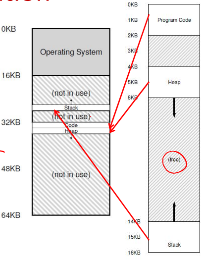

## Paging

### What Is It?

- Allocate memory in fixed-size chunks ("pages")
- Avoids external fragmentation (no small "holes")
- Has internal fragmentation (partially filled pages)

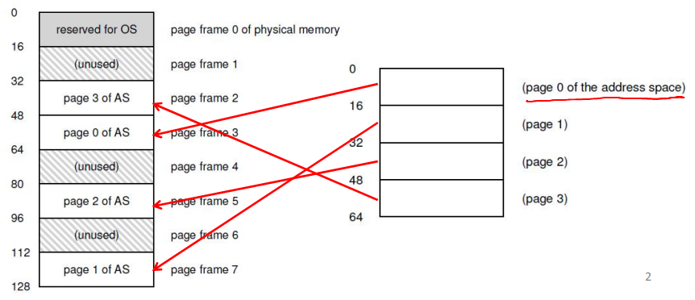

### Page Table

- Per-process data structure to help VA-PA translation
- An array stores mappings from the virtual page number (VPN) to the physical frame number (PFN)
  - E.g., VP 0 &rarr; PF 3, VP 1 &rarr; PF 7
- Part of OS memory (in PCB)
- MMU has access to the page table and uses it for address translation
- OS updates the page table upon a context switch

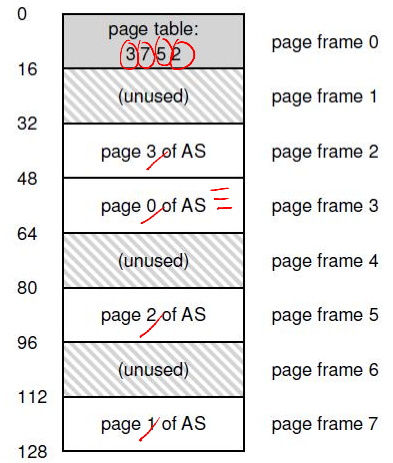

### Page Table Entry (PTE)

- Simplest page table: Linear page table
- Page table is an array of page table entries, one per virtual page
- VPN (virtual page number) is the index into this array
- Each PTE contains PFN (physical frame number) and a few other bits
  - Valid bit: Is this page used by the process?
  - Protection bits: Read/write permissions
  - Present bit: Is this page in memory?
  - Dirty bit: Has this page been modified?
  - Accessed bit: Has this page been recently accessed?

### Address Translation in Hardware

- Most significant bits of VA give the VPN
- Page table maps VPN to PFN
- PA is obtained from PFN and offset within a page
- MMU stores the physical address of the start of the page table, not all entries
- "Walks" the page table to get the relevant PTE

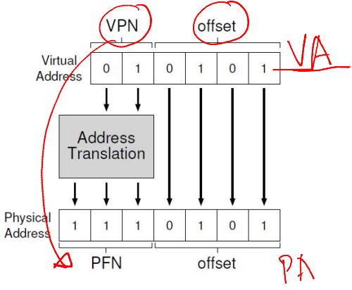

### What Happens on Memory Access?

- The CPU requests code or data at a virtual address
- MMU must translate VA to PA
  - First, access memory to read the page table entry
  - Translate VA to PA
  - Then, access memory to fetch code/data
- Paging adds overhead to memory access
- Solution? A cache for VA-PA mappings

### Translation Lookaside Buffer (TLB)

- A cache of recent VA-PA mappings
- To translate VA to PA, the MMU first looks up the TLB
- If TLB hit, PA can be directly used
- If TLB miss, the MMU performs additional memory accesses to "walk" the page table
- TLB misses are expensive (multiple memory accesses)
  - Locality of reference helps to have a high hit rate
- TLB entries may become invalid on context switch and change of page tables

### How Are Page Tables Stored in Memory?

- What is the typical size of a page table?
  - 32-bit VA, 4 KB pages, so 2^32/2^12 = 2^20 entries
  - If each PTE is 4 bytes, then the page table is 4MB
  - One such page table per process!
- How to reduce the size of page tables?
  - Larger pages, so fewer entries
- How does the OS allocate memory for such large tables?
  - Page table is itself split into smaller chunks!

### Multilevel Page Tables (1)

- A page table is spread over many pages
- An "outer" page table or page directory tracks the PFNs of the page table pages

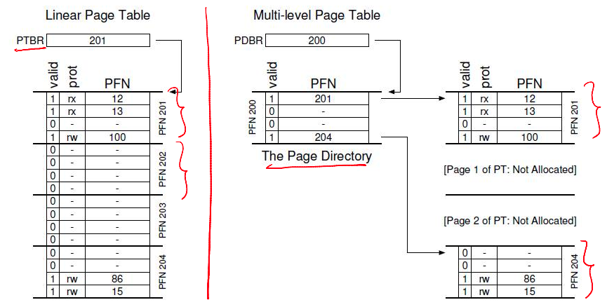

### Multilevel Page Tables (2)

- Depending on how large the page table is, more than 2 levels may be needed
  - 64-bit architectures may need 7 levels
- What about address translation?
  - First few bits of VA identify the outer page table entry
  - The next few bits index into the next level of PTEs
- In case of TLB miss, multiple accesses to memory are required to access all levels of page tables

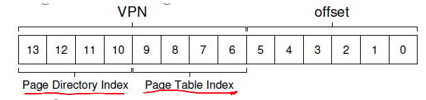

## Demand Paging

### Is Main Memory Always Enough?

- Are all pages of all active processes always in main memory?
  - Not necessary, especially with large address spaces
- OS uses a part of disk (swap space) to store pages that are not in active use

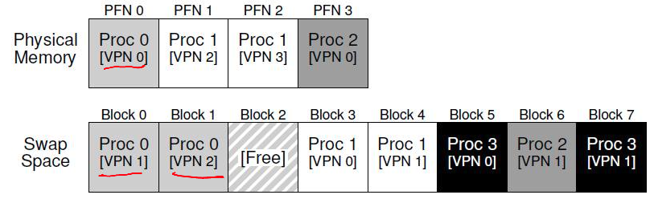

### Page Fault

- Present bit in the page table entry indicates if a page of a process resides in memory or not
- When translating VA to PA, the MMU reads the present bit
- If the page is present in memory, it is directly accessed
- If the page is not in memory, the MMU raises a trap to the OS - this is a page fault

### Page Fault Handling

- A page fault traps the OS and moves the CPU to kernel mode
- OS fetches the disk address of the page and issues a read to the disk
  - OS keeps track of the disk address (eg, in the page table)
- OS context switches to another process while the current process is blocked
- When the disk read completes, the OS updates the page table and marks the process as ready
- When the process is scheduled again, the OS restarts the instruction that caused the page fault

### Summary: What Happens on Memory Access

- CPU issues a load to a VA for code or data
  - Checks the CPU cache first
  - Goes to main memory in case of a cache miss
- The MMU looks up the TLB for the VA
  - If TLB hit, the PA is obtained, and the memory location is fetched and returned to the CPU (via CPU caches)
  - If TLB miss, the MMU accesses memory, walks the page table, and obtains the page table entry
    - If the present bit is set in the PTE, the memory is accessed
    - If the present bit is not set but valid, a page fault is raised, and the OS handles the fault, restarting the CPU load instruction
    - If the access is invalid, a trap is raised to the OS for illegal access

### More Complications in a Page Fault

- When servicing page fault, what if OS finds that there is no free page to swap in the faulting page?
- OS must swap out an existing page (if it has been modified, ie, dirty) and then swap in the faulting page - too much work!
- OS may proactively swap out pages to keep a list of free pages handy
- The decision of which pages to swap out is made by the page replacement policy

### Page Replacement Policies

- Optimal: Replace the page not needed for the longest time in the future (not practical!)
- FIFO: Replace the page that was brought into memory earliest (may replace a popular page)
- LRU/LFU: Replace the page that was least recently (or frequently) used in the past

### Example: Optimal Policy

- Example: 3 frames for 4 pages (0, 1, 2, 3)
- The first few accesses are cold (compulsory) misses

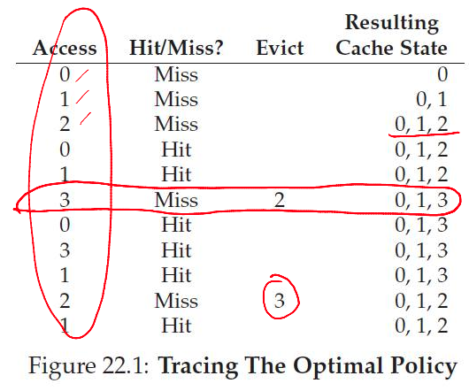

### Example: FIFO

- Usually worse than optimal
- Belady's anomaly: Performance may get worse when memory size increases!

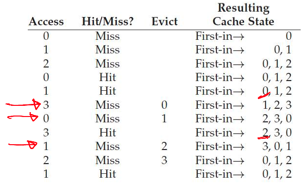

### Example: LRU

- Equivalent to optimal in this simple example
- Works well due to locality of references

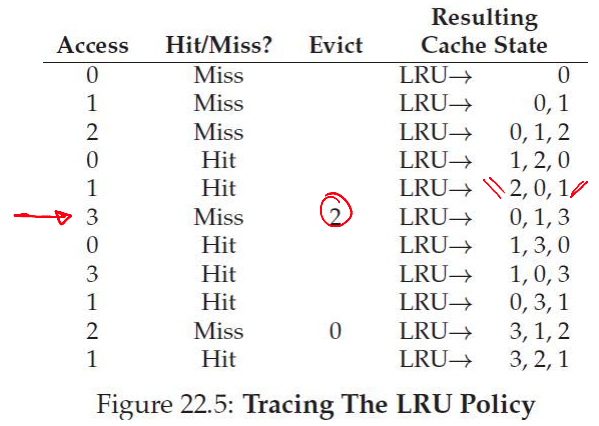

### How Is LRU Implemented?

- OS is not involved in every memory access, so how does it know which page is LRU?
- Hardware help and approximations are used
- MMU sets an "accessed" bit in the PTE when a page is accessed
- OS periodically checks this bit to estimate which pages are active and inactive
- To replace, the OS tries to find a page without the access bit set
  - It may also look for a page without the dirty bit set to avoid swapping out to disk

## Memory Allocation and Free Space Management Algo

### Variable Sized Allocation

- Given a block of memory, how do we allocate it to satisfy various memory allocation requests?
- This problem must be solved in the C library
  - Allocates one or more pages from the kernel via brk/sbrk or mmap system calls
  - Gives out smaller chunks to user programs via malloc
- This problem also occurs in the kernel
  - The kernel must allocate memory for its internal data structures

### Variable Sized Allocation: Headers

- Consider a simple implementation of malloc
- Every allocated chunk has a header with information like the size of the chunk
  - Why store size? We should know how much to free when free() is called

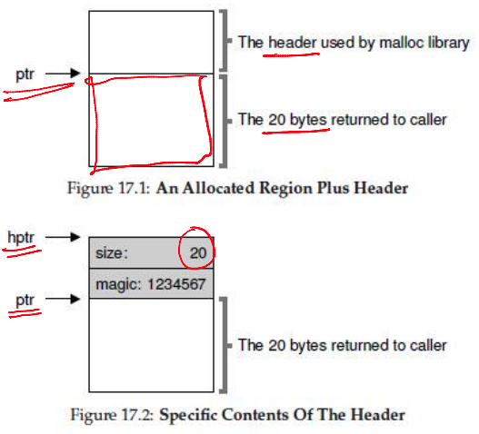

### Free List

- Free space is managed as a list
  - A pointer to the next free chunk is embedded within the free chunk
- The library tracks the head of the list
  - Allocations happen from the head

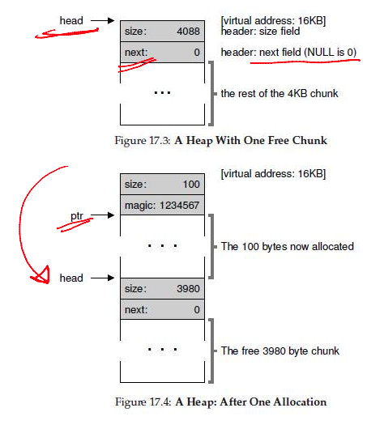

### External Fragmentation

- Suppose 3 allocations of size 100 bytes each occur. Then, the middle chunk pointed to by sptr is freed
- The free list now has two non-contiguous elements
- Free space may be scattered around due to fragmentation
  - Cannot satisfy a request for 3800 bytes, even though the space is available

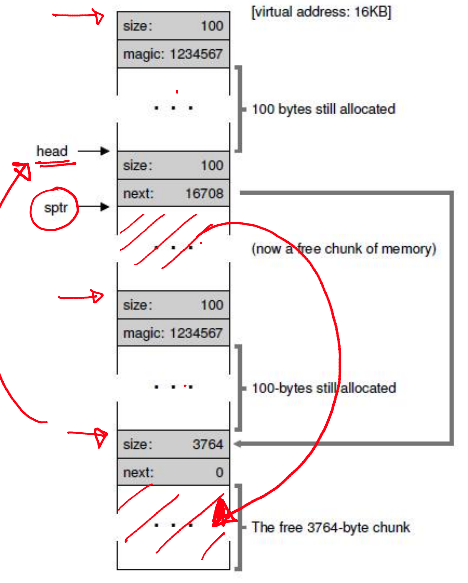

### Splitting and Coalescing

- Suppose all three chunks are freed
- The list now has several free chunks that are adjacent
- A smart algorithm would merge them into a bigger free chunk
- Must split and coalesce free chunks to satisfy variable-sized requests

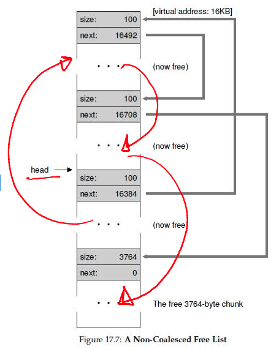

### Buddy Allocation for Easy Coalescing

- Allocate memory in sizes that are powers of 2
  - For example, for a request of 7000 bytes, allocate an 8 KB chunk
- Why? Two adjacent power-of-2 chunks can be merged to form a bigger power-of-2 chunk
  - For example, if an 8KB block and its "buddy" are free, they can form a 16KB chunk

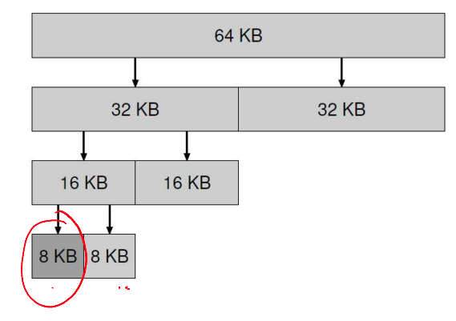

### Variable Size Allocation Strategies

- First fit: Allocate the first free chunk that is sufficient
- Best fit: Allocate the free chunk that is closest in size
- Worst fit: Allocate the free chunk that is farthest in size

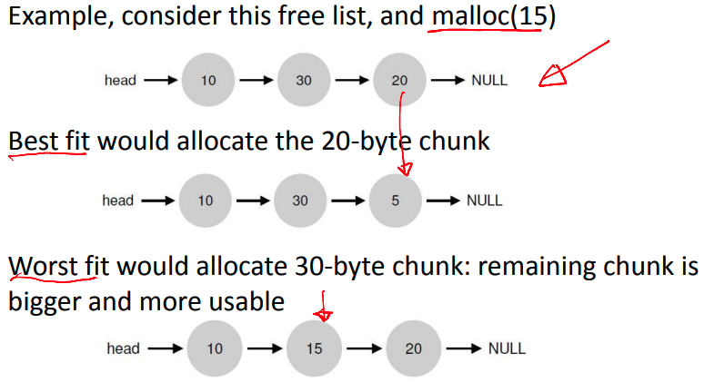

### Fixed Size Allocations

- Memory allocation algorithms are much simpler with fixed-size allocations
- Page-sized fixed allocations in the kernel
  - Has a free list of pages
  - A pointer to the next page is stored in the free page itself
- For some smaller allocations (eg, PCB), the kernel uses a slab allocator
  - Object caches for each type (size) of objects
  - Within each cache, only fixed-size allocation
  - Each cache is made up of one or more "slabs"
- Fixed-size memory allocators can be used in user programs too (instead of generic malloc)
