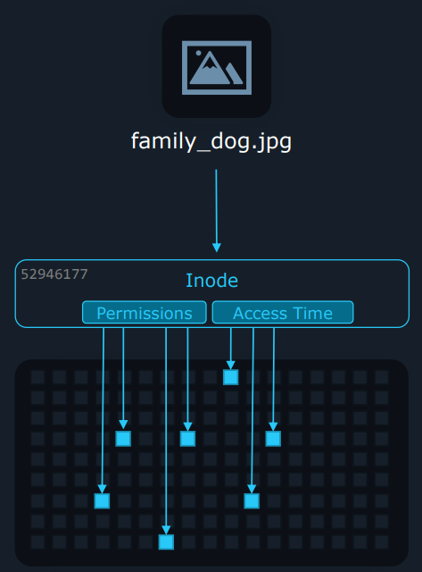
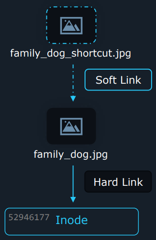
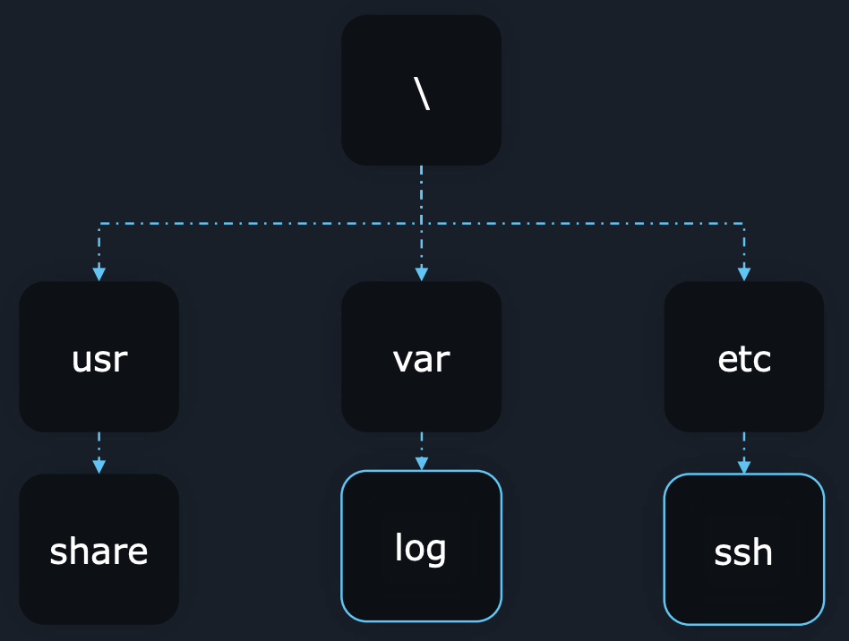

# understand and use essential tool

## Basics

Login methods

- Local text-mode console: Log in directly on the computer using a text-based interface
- Local graphical-mode console: Log in directly on the computer using a graphical interface, like a desktop
- Remote text-mode login: Log in to a remote computer over a network using a text-based interface (e.g., via SSH or Telnet)
- Remote graphical-mode login: Log in to a remote computer with a graphical desktop

Old terms

- Console: The physical or main interface for interacting with a computer
- Virtual terminal: A software-based text interface, like a command-line window
- Terminal emulator: A program that mimics a text-based console on your screen

SSH

- Computer (SSH Client) &rarr; Server (SSH daemon)

```bash
# Show all network interface configurations
ip a

# Connect to the remote server as the user "kyphan"
ssh kyphan@192.168.0.17
```

## User and Group

Security features

- Access controls: Defines who access resources and what they can do
- PAM (Pluggable Authentication Modules): Handles authentication, authorization, and session management
- Network security: Protects systems from network-based threats
- SSH hardening: Secures the secure shell service for remote access
- SELinux: Enforces stricter security policies

Account types

| Account Type         | Purpose                                                                 | Examples              | Attributes                                                                                                                                   | Typical UID Range                |
|----------------------|-------------------------------------------------------------------------|-----------------------|---------------------------------------------------------------------------------------------------------------------------------------------|----------------------------------|
| User account         | Standard accounts for interactive login by humans                        | bob, michael, dave    | Username, Password (stored securely), User ID (UID), Group ID (GID), Home directory, Login Shell                                           | Often starts at 1000 (>= 1000)   |
| Superuser account    | Full administrative access to the system                                | root                  | Username: root, UID: always 0                                                                                                                 | UID is 0                        |
| System account       | Used by system services or daemons running in the background            | sshd, mail, daemon    | Username, User ID (UID), Group ID (GID), Home directory, typically no login capabilities                                                    | Reserved range, often below 1000|
| Service account      | Dedicated accounts for specific applications or services to run under    | nginx, postgres       | Username, User ID (UID), Group ID (GID), Home directory, service-specific permissions                                                        | Often within system account range or user range|

User

```bash
# Display the content of the user account file
cat /etc/passwd
---
root:x:0:0:root:/root:/bin/bash
sara:x:1001:1001:Sara Lee:/home/sara:/bin/bash

# Display user and group information for specific users
id sara
---
uid=1001(sara) gid=1001(sara) groups=1001(sara),27(sudo)

# Show who is currently logged into the system
who
---
sara pts/0 2025-06-11 07:08 (192.168.1.15)
john pts/1 2025-06-11 07:05 (10.0.0.84)

# Show the history of last logged in users
last -n 2
---
sara pts/0 192.168.1.15 Wed Jun 11 07:08 still logged in
john pts/1 10.0.0.84    Wed Jun 11 07:05 - 07:06 (00:01)

# Search for specific users (case-insensitive) in the user account file
grep -i "sara" /etc/passwd
---
sara:x:1001:1001:Sara Lee:/home/sara:/bin/bash
```

- `su`
  - Switches to another user account. If no user is specified, it defaults to root
  - Requires the target user's password with `su -`
  - Directly using `su` to become root for extended periods or sharing the root password is often discouraged for security reasons

```bash
# Switch to the root user
su -
---
Password: 

# Switch to a different user account (e.g., sara)
su - sara
---
Password: 

# Execute a single command as the root user
su -c "whoami"
---
Password:
```

- `sudo`
  - Allows permitted users to execute specific commands as another user (typically root) without needing the target user's password
  - It requires the user's own password for authentication
  - Provides better accountability and allows granting specific, limited administrative privileges instead of full root access

```bash
# Execute a command with root privileges
sudo apt-get update
---
[sudo] password for sara: 

# Display the sudoers configuration file
sudo cat /etc/sudoers
---
[sudo] password for sara: 
root    ALL=(ALL:ALL) ALL
%admin ALL=(ALL) ALL
%sudo   ALL=(ALL:ALL) ALL
```

- no-login shell
  - Assigns a shell like `/sbin/login`, `/usr/sbin/nologin`, or `/bin/false` to an account (often system accounts or even root on hardened systems) prevents users from logging in directly using that account
  - Enhances security by forcing administrative tasks through mechanisms like sudo or requiring a switch from a standard user account

```bash
# Find the specific entry for the 'root' user at the beginning of a line
grep '^root:' /etc/passwd
---
root:x:0:0:root:/root:/bin/bash

# Find all users who have /bin/bash as their shell
grep '/bin/bash$' /etc/passwd
---
root:x:0:0:root:/root:/bin/bash
sara:x:1001:1001:Sara Lee:/home/sara:/bin/bash
```

Groups

- A collection of users, primarily used to manage permissions efficiently
- Users can belong to multiple groups

```bash
# Display group database
cat /etc/group
---
root:x:0:
sara:x:1001:
```

## System Documentation

- `--help`: Displays a brief summary of their usage and options
- `man`: Displays a comprehensive manual pages

```bash
# Display the manual page for the journalctl command
man journalctl

# Display the section 3 manual page for the 'printf' C library function
man 3 printf
```

- `apropos`: Searches the names and short descriptions of all manual pages for a specific keyword

```bash
# Search all manual pages for the keyword "director"
apropos director
---
chdir (2) - change working directory
dir (1)   - list directory contents

# Search only sections 1 and 8 of the manuals for "director"
apropos -s 1,8 director
---
dir (1)              - list directory contents
mkdir (1)            - make directories

# Update the manual page database
sudo mandb
```

- `info`: Accesses documentation in the GNU Info format

```bash
# Display the detailed 'info' documentation for bash
info bash
```

- `/usr/share/doc`: Contains supplementary documentation provided by installed packages

```bash
# Change the current directory to the bash documentation folder
cd /usr/share/doc/bash

# View the 'INTRO' file using the 'less' pager
less INTRO

# Find and display all lines containing "command" in the 'INTRO' file
grep "command" INTRO
```

## File and Directory

List files and directories

- `ls`: Lists the contents of a directory

Filesystem tree

- Current working directory: `/home/userx/documents`
- Relative path: `notes.txt`
- Absolute path: `/home/userx/documents/notes.txt`

```bash
# Change to the previous working directory
cd -
```

Create files

- `touch`: Creates an empty file if it doesn't exist, or updates the access and modification timestamps of an existing file

Create directories

- `mkdir`

```bash
# Create a directory, including any parent directories if they don't exist
mkdir -p /home/kyphan/folder
```

Copy files and directories

- `cp`: Copies files or entire directory structures

```bash
# Copy a file into a directory
cp hello.text folder/

# Copy a file and give the copy a new name
cp hello.txt folder/hello_copy.txt

# Recursively copy the contents of a directory into another directory
cp -r folder/ hello/
```

Move files

- `mv`: Moves files/directories to a different location or renames them

```bash
# Move a file into a directory
mv abc.txt hello/

# Rename a file
mv abc.txt abcd.txt

# Rename a directory
mv folder/ new_folder/
```

Delete files and directories

- `rm`: Removes files and directories

```bash
# Recursively remove a directory and all of its contents
rm -r folder
```

## Hard Links

Inodes

- An inode (index node) is a data structure on Unix-like filesystems
- Each file and directory on the filesystem has a unique inode
- It stores metadata about the file or directory, excluding the filename and the actual file content
- Key metadata includes file type, permissions, owner, file size, timestamps, link count, pointers, etc.

```bash
# Create a new file with some text content
echo "Picture of Milo the dog" > /home/sara/Pictures/family_dog.jpg

# Display detailed file status, including the Inode number
stat /home/sara/Pictures/family_dog.jpg
---
File: /home/sara/Pictures/family_dog.jpg
Size: 24 Blocks: 8 IO Block: 4096 regular file
Device: 10302h/66306d Inode: 12345 Links: 1
Access: (0664/-rw-rw-r--) Uid: (1000/sara) Gid: (1000/sara)
```

- How it works
  - When accessing a path like `Pictures/family_dog.jpg`, the system locates the Pictures directory
  - It searches the directory's contents for the entry family_dog.jpg
  - This entry contains the corresponding inode number
  - The system uses the inode number to find the inode structure itself
  - From the inode, it reads metadata (like permissions) and gets the pointers to the data blocks to retrieve the file's content
- Relationship
  - A directory entry links a filename to an inode number
  - The inode stores metadata and points to the data blocks



Hard links

- A hard link is simply another directory entry (another filename, potentially in a different directory) that points to the exact same inode as the original file
- Benefit
  - Allows multiple filenames to refer to the same file data without duplicating the data itself, thus saving storage space
  - Instead of having two separate copies of a large file, you have two names pointing to one set of data blocks via the shared inode

```bash
# ln path_to_target_file path_to_link_file

# Recursively copy the contents of sara's Pictures directory to Jane's
cp –r /home/sara/Pictures/ /home/jane/Pictures/

# Create a hard link: Jane's path now points to the same inode as sara's path
ln /home/sara/Pictures/family_dog.jpg /home/jane/Pictures/family_dog.jpg

# Display detailed status information
stat Pictures/family_dog.jpg
---
File: Pictures/family_dog.jpg
Size: 49 Blocks: 8 IO Block: 4096 regular file
Device: fd00h/64768d Inode: 52946177 Links: 2
Access: (0640/-rw-r-----) Uid: ( 1000/ sara) Gid: ( 1005/ family)
...

# The link count for inode 52946177 decreases from 2 to 1
rm /home/sara/Pictures/family_dog.jpg

# The link count for inode 52946177 decreases from 1 to 0
rm /home/jane/Pictures/family_dog.jpg
```

- Data deletion
  - The actual file data (disk blocks) associated with an inode is only marked for deletion (and eventually overwritten) when its link count reaches zero
  - Removing a hard link (rm) just deletes that specific directory entry and decrements the inode's link count

Limitiations and considerations

- Only hardlink to files, not folders
- Only hardlink to files on the same filesystem

```bash
# Add existing user 'sara' to the supplementary group 'family'
useradd -a -G family sara

# Add existing user 'jane' to the supplementary group 'family'
useradd -a -G family jane

# Change file permissions: owner=read/write, group=read/write, others=none
chmod 660 /home/sara/Pictures/family_dog.jpg
```

## Soft Links

Soft (symbolic) links

- Unlike a hard link which points directly to an inode, a symbolic link's content is simply the pathname (text string) of another file or directory (the target)
- It is used to create convenient access points, redirect paths, or link across different filesystems or partitions



```bash
# ln -s path_to_target_file path_to_link_file

# Create a symbolic link named 'family_dog_shortcut.jpg' and points to the absolute path '/home/sara/Pictures/family_dog.jpg'
ln –s /home/sara/Pictures/family_dog.jpg family_dog_shortcut.jpg

ls -l
---
lrwxrwxrwx. 1 sara sara family_dog_shortcut.jpg -> /home/sara/Pictures..

readlink family_dog_shortcut.jpg
---
/home/sara/Pictures/family_dog.jpg

echo "Test" >> fstab_shortcut
---
bash: fstab_shortcut: Permission denied

ls -l
---
lrwxrwxrwx. 1 sara sara family_dog_shortcut.jpg -> /home/sara/Pictures..

ln –s Pictures/family_dog.jpg relative_picture_shortcut
```

- If the target file or directory is deleted, moved, or renamed, the symbolic link is not automatically updated or removed
- It continues to point to the original path, which now leads nowhere. Such links are called "broken" or "dangling" links - "No such file or directory" error

Limitations and considerations

- Softlink to files and folders
- Softlink to files on different filesystem as well

## Permissions

Owners and groups

```bash
chgrp kyphan family_dog.jpg
sudo chown kpfamily family_dog.jpg

ls -l
---
-rw-r-----. 1 kyphan kpfamily 49 Oct 27 14:41 family_dog.jpg

sudo chown kyphan1:kpfamily1 family_dog.jpg

ls -l
---
-rw-r-----. 1 kyphan1 kpfamily1 49 Oct 27 14:41 family_dog.jpg
```

File and directory permissions

- First character
  - Directory: d
  - Regular file: -
  - Character device: c
  - Link: l
  - Socket file: s
  - Pipe: p
  - Block device: b
- Next ones (owner, group, others)
  - r: read
  - w: write
  - x: execute
  - -: no permission
- Directory
  - r: ls, etc.
  - w: mkdir, rm, etc.
  - x: cd, etc.

Evaluating permissions

- Permissions are checked in order: Owner, group, and Others, and the system applies the permissions from the first match

```bash
ls -l
---
-r--rw----. 1 kyphan family 49 family_dog.jpg

echo “Add this content to file” >> family_dog.jpg
---
bash: family_dog.jpg: Permission denied
```

Adding permissions

- user: u+x / u+rw / u+rwx
- group: g+w / g+rw / g+rwx
- others: o+w / o+rw / o+rwx

```bash
chmod u+w family_dog.jpg
```

Removing permissions

- user: u-x / u-rw / u-rwx
- group: g-w / g-rw / g-rwx
- others: o-w / o-rw / o-rwx

```bash
chmod o-r family_dog.jpg
```

Setting exact permissions

- user: u=x / u=rw / u=rwx
- group: g=w / g=rw / g=rwx
- others: o=w / o=rw / o=rwx

```bash
chmod g=r family_dog.jpg
chmod g=rw family_dog.jpg
chmod g= family_dog.jpg
chmod g-rwx family_dog.jpg
```

Chaining permissions

```bash
chmod u+rw,g=r,o= family_dog.jpg
chmod u=rw,g-w family_dog.jpg
```

Octal permissions

```bash
stat family_dog.jpg
---
File: family_dog.jpg
Size: 49 Blocks: 8 IO Block: 4096 regular file
Device: fd00h/64768d Inode: 52946177 Links: 1
Access: (0640/-rw-r-----) Uid: ( 1000/ kyphan) Gid: ( 10/ wheel)

chmod 640 family_dog.jpg
```

## Special Bits

SUID

- Set User Identification
- When an executable file has the SUID bit set, any user who runs that file temporarily gains the privileges of the file's owner during its execution
- This allows regular users to perform specific actions that would normally require higher privileges

```bash
chmod u+s family_dog.jpg
chmod 4755 family_dog.jpg
```

SGID

- When set on an executable file, the process runs with the privileges of the file's group. This is similar to SUID but operates at the group level
- This is the more common and significant use of SGID. When a directory has the SGID bit set, any new files or subdirectories created within it will automatically inherit the group ownership of the parent directory, rather than the primary group of the user who created the file
- This is particularly useful for shared project directories where multiple users need to collaborate on a set of files. All new files will belong to the designated project group, ensuring consistent access for all team members

```bash
chmod g+s family_folder
chmod 2755 family_folder
```

Sticky bit

- When the sticky bit is set on a directory, it restricts file deletion
- Even if a user has write permissions to the directory, they can only delete or rename files that they personally own
- The directory owner and the root user are exceptions and can delete or rename any file within the directory

```bash
chmod 777 family_folder
chmod +t family_folder

chmod 1777 family_folder
```

Note

- Lowercase s or t: The special permission is set, and the underlying execute (x) permission is also set for that user/group/other. This is the correct and effective state
- Uppercase S or T: The special permission is set, but the underlying execute (x) permission is not set. In this state, the special permission has no effect

## File Search



```bash
# find [/path/to/directory] [search_parameters]

find /usr/share/ -name '*.jpg'
find /lib64/ -size +10M
find /dev/ -mmin -1
find /bin/ -name file1.txt
```

Name

```bash
find -name felix
find -iname felix
find -name "f*"
```

Modified

- Modification = Create or Edit
- Modified Time != Change Time

```bash
# find -mmin [minute] # modified minute


find -mmin 5

find -mmin -5

find -mmin +5

find -mtime 2

find -cmin -5
```

Size

```bash
find -size [size]
felix freya fin
find -size 512k
c bytes
k kilobytes
M megabytes
G gigabytes
find -size +512k
find -size -512k
```

Search expressions

```bash
find -size [size]
felix freya fin
find -size 512k
c bytes
k kilobytes
M megabytes
G gigabytes
find -size +512k
find -size -512k
# Exactly 512 kb
# Greater than 512 kb
# Less than 512 kb

find -size [size]
felix freya fin
james john jacob
bob bean ben
10 kb 512 kb 1024 kb
10 kb 512 kb 1024 kb
10 kb 512 kb 1024 kb
find -name "f*"
find -size 512k
find -name "f*" -size 512k # AND operator
find -name "f*" -o -size 512k # OR operator

find –not -name "f*"
felix freya fin
james john jacob
bob bean ben
find \! -name “f*"
# NOT operator
# alternate NOT operator

find –perm 664
find –perm -664
find -perm /664
# find files with exactly 664 permissions
# find files with at least 664 permissions
# find files with any of these permissions
find –perm u=rw,g=rw,o=r
find –perm –u=rw,g=rw,o=r
find –perm /u=rw,g=rw,o=r
# find files with exactly 664 permissions
# find files with at least 664 permissions
# find files with any of these permissions

find -perm 600
find -perm -100
find \! -perm –o=r
find -perm /u=r,g=r,o=
```

## File Content

tac

```bash
cat /home/users.txt
---
user1
user2
user3
user4
user5
user6

tac /home/users.txt
---
user6
user5
user4
user3
user2
user1
```

tail

```bash
tail /var/log/dnf.log
tail -n 20 /var/log/dnf.log

head /var/log/dnf.log
head –n 20 /var/log/dnf.log
```

Transforming text: sed

```bash
sed 's/canda/canada/g' userinfo.txt

sed 's/canda/canada/' userinfo.txt

sed 's/canda/canada' userinfo.txt

# --in-place
sed –i 's/canda/canada/g' userinfo.txt
```

cut

```bash
cut –d ' ' –f 1 userinfo.txt

cut –d ',' –f 3 userinfo.txt > countries.txt
```

uniq and sort

```bash
uniq countries.txt

sort countries.txt

sort countries.txt | uniq
```

Comparing files

```bash
diff file1 file2

# Contextlibsystemd0:amd64 257.4-1ubuntu3
2025-06-10 07:34:28 status unpacked libsyste
diff –c file1 file2

# Side-by-side diff
diff –y file1 file2
sdiff file1 file2

# Search files with grep

Sear

```

## Text Editors

less ... dnf.log
search: / &rarr; N (next instance)
ignore case: -i

more
space for next page

vim
search: /
ignore case: `/<word>\c`
specific line: `:<line_number>`
copy: `yy`
paste: `p`
cut: `dd`

## Regular Expressions

## Archiving

## Redirection

## Remote Backup

## File Transfer

## Lab

### Logging in and System Documentation

```bash
man ssh | grep version
ssh -V
apropos hostname
hostnamectl
mandb
man ssh | grep verbose
ssh -v alex@localhost
ls -la /home/bob/data
ssh bob@dev-host01
touch myfile
apropos ssh
sudo mandb
apropos "NFS mounts"
touch nfsmount.conf
```

### File Links

```bash
mkdir -p /home/bob/lfcs
touch /home/bob/lfcs/lfcs.txt
cp -r /tmp/Invoice/ /home/bob/
cp -a /home/bob/myfile.txt /home/bob/data/
cp -r /home/bob/lfcs /home/bob/old-data
rm /home/bob/lfcs/lfcs.txt
mv /home/bob/lfcs/ /home/bob/new-data/
rm -rf /home/bob/lfcs
ln -s /tmp /home/bob/link_to_tmp
ln /opt/hlink /home/bob/hlink
mv /home/bob/new_file /home/bob/old_file
mkdir -p /tmp/1/2/3/4/5/6/7/8/9
ls --full-time
```

### File Permissions

```bash
sd
```

### Content Analysis

```bash
...
```
