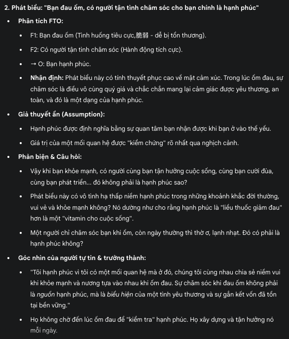
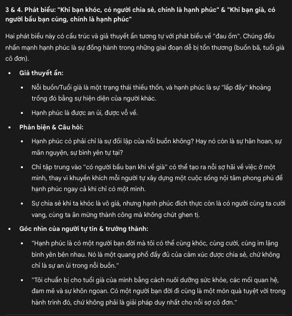
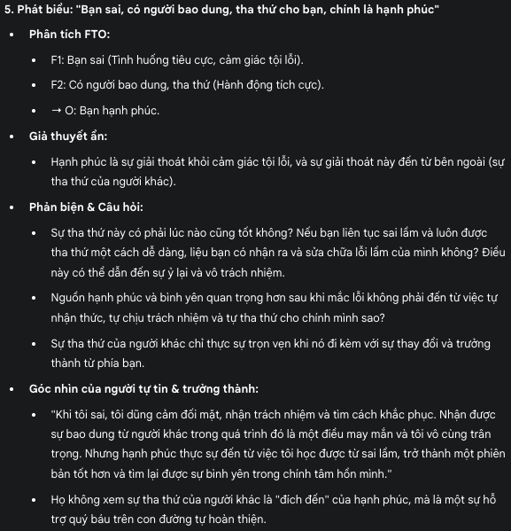
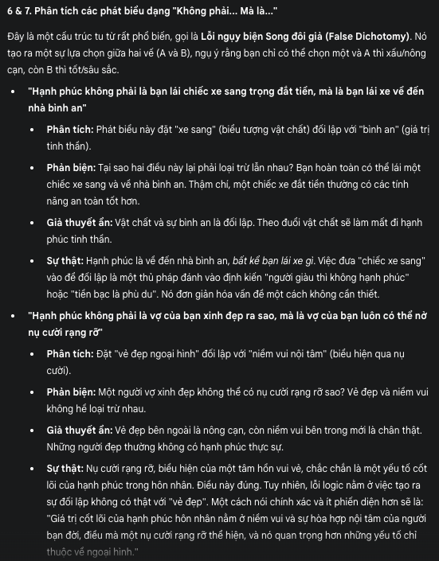
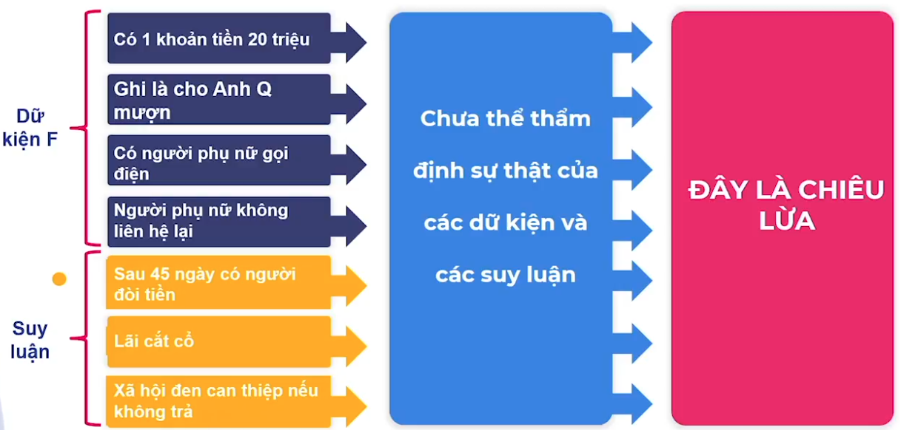

# prescriptions

## Thuốc Đặc Trị

Quyết định sai vì?

- Dữ liệu sai (F) &rarr; Nhận định sai (O) &rarr; Quyết định sai (T)

Quyết định chọn đối tác kinh doanh

- Vì nghe nói đối tác rất giàu &rarr; Đối tác tốt &rarr; Hợp tác
- Dữ liệu ít, yếu, không quan trọng &rarr; Nhận định ẩu &rarr; Quyết định sai
- Dữ liệu (F)
  - Khả năng tài chính
  - Cam kết, đạo đức
  - Kinh nghiệm kinh doanh
  - Tiềm năng của thị trường
- Kiểm chứng dữ liệu
  - Các dữ liệu này bạn lấy từ đâu?
  - Từ nghe đối tác nói?
  - Hay nghe ai đó nói?
  - Hay tìm trên mạng?
  - Chúng có đủ tin cậy?
- Thẩm định dữ liệu (T)
  - Thảo luận với các đối tác
  - Từ các báo cáo
  - Từ đến thăm các cơ sở kinh doanh
  - Từ kế hoạch kinh doanh
  - Từ trao đổi với những người biết về đối tác
  - Từ các nguồn khác
- Nhận định (O)
  - Đối tác tốt
- Thu thập đầy đủ dữ liệu &rarr; Thẩm định chặt chẽ &rarr; Nhận định đúng

## Thuốc Đặc Trị FTO

Dữ liệu

- Đầy đủ
- Từ nhiều góc nhìn
- Được tổ chức logic
- Liên quan và có ý nghĩa

Thẩm định dữ liệu

- Thẩm định khách quan, đúng đắn, chính xác

Nhận định

- Nhận định dựa trên sự thật

10 tiêu chuẩn để đánh giá

- Ý nghĩa
- Liên quan
- Đúng đắn
- Chính xác
- Rõ ràng
- Rộng
- Sâu
- Logic
- Toàn diện
- Công bằng

## Các Trạng Thái Bệnh Lý Theo FTO

Thu thập dữ kiện, dữ liệu (F)

- Thiếu, không có dữ liệu
- Góc nhìn hạn chế
- Không biết tìm kiếm, khai thác, sàng lọc
- Không biết phân tích, tổng hợp
- Thiếu công nghệ

&rarr; Bệnh liên quan

- Cảm tính
- Cả tin
- Phiến diện
- Thích âm mưu
- Thiếu thuyết phục

Thẩm định dữ liệu (T)

- Không có hoài nghi khoa học
- Không có phương pháp thẩm định dữ liệu
- Thiếu thận trọng và chuyên nghiệp
- Thiếu nguồn để đối sánh
- Không nhận ra các điểm thiếu logic giữa các nguồn hay giữa các dữ liệu

&rarr; Bệnh liên quan

- Cả tin
- Chả biết tin ai
- Phiến diện
- Thích âm mưu
- Thiếu thuyết phục

Đưa ra nhận định (O)

- Không hiểu ý nghĩa dữ liệu
- Nhận định ẩu, sai, cảm tính
- Nhận định phiến diện
- Không biết nhận định gì

&rarr; Bệnh liên quan

- Cảm tính
- Cả tin
- Chả biết tin ai
- Thiếu chính kiến
- Thiếu thuyết phục

## Quy Trình Đánh Giá 1 Nhận Định

Dữ liệu (F) &rarr; Sự thật (T) &rarr; Nhận định (O)

Quy trình

- Bước 1: Vẽ mô hình FTO
  - Diễn nhận định, dữ liệu, và sự thật
- Bước 2: Đánh giá dữ liệu
  - Có dữ liệu khách quan không? Có đầy đủ không? Có thiên lệch về góc nhìn nào không? Có cần bổ sung thêm dữ liệu nào không? Dữ liệu có cập nhật không?
- Bước 3: Kiểm chứng sự thật
  - Các dữ liệu có trích dẫn từ nguồn đáng tin cậy không? Có thể kiểm tra được không? Có phương pháp nào có thể kiểm tra các dữ liệu quan trọng không?
- Bước 4: Đánh giá nhận định
  - Các nhận định có thực sự dựa trên số liệu hay mang tính chủ quan? Các dữ kiện đi đến nhận định có kết hợp logic không? Có thể có các nhận định khác từ dữ liệu đang trình bày không?

## Điều Trị Tận Gốc 7 Căn Bệnh

| **Căn bệnh**         | **Nguyên nhân**         |
|----------------------|-------------------------|
| Cảm tính             | Không hoặc thiếu F      |
| Cả tin               | Thiếu F và T            |
| Chả biết tin ai      | Thiếu T                 |
| Phiến diện           | Thiếu F                 |
| Thích âm mưu         | Thiếu F và T            |
| Thiếu chính kiến     | Thiếu F, T, O           |
| Thiếu thuyết phục    | Không biết sắp xếp FTO  |

## Bài Học Và Tóm Tắt

Bài học

- Nhận định (O) tốt được hình thành dựa trên các dữ kiện khách quan, đa chiều, toàn diện
- Các dữ kiện (F) càng đầy đủ thì nhận định càng tốt
- Dữ kiện phải được thẩm định để đảm bảo tính đúng đắn và chính xác, hay sự thật (T)

Tóm tắt

- Liều thuốc đặc trị FTO chính là Dữ kiện – Sự thật – Nhận định
- Nhận định tốt dựa trên dữ kiện đầy đủ, toàn diện, đúng đắn, và chính xác

## Thực Hành

### Tình Huống 1: Mẹ Vợ Kén Rể

Câu hỏi

- Nhận định của bà mẹ về chàng trai đúng hay sai?
- Làm thế nào để có thể đánh giá nhận định của bà mẹ một cách tường minh

Quy trình

- Vẽ mô hình FTO

- Đánh giá
  - Các nhận định của bà mẹ đều phiến diện, cảm tính, và mang nặng yếu tố kinh nghiệm
  - Kinh nghiệm có thể tốt để tham khảo. Nhưng kinh nghiệm đúng cho trường hợp này mà sai với trường hợp khác
  - Để tránh phiến diện, bà mẹ cần
    - Tìm hiểu anh chàng về nhiều góc độ với thời gian lâu hơn
    - Nghề nghiệp, thu nhập, tài sản, tính cách, gia đình, lối sống, ...

- Ra quyết định
  - FTO giúp chúng ta phân tích tình huống
  - Nhưng để ra quyết định, trong tình huống này còn 1 thành phần cần xem xét: Mục tiêu và tiêu chuẩn chọn chồng, rể
  - Không có mục tiêu và tiêu chuẩn có khả năng cô gái mãi mãi "thấp không thông, cao thì không tới"

Mục tiêu và tiêu chuẩn

- Xác định đúng mục tiêu và tiêu chuẩn cho người chồng tương lai
  - Hình thức cao 1m8 và 6 múi thì quá tốt, nhưng thực tế là không thấp hơn 1m6, dễ nhìn, khỏe mạnh
  - Là tỷ phú thì quá hay, nhưng thực tế là có nghề nghiệp, thu nhập ổn định từ 20 triệu/tháng
  - Trên hết, cầu tiến và yêu thương vợ con

### Tình Huống 2: Bạn Có Hạnh Phúc

Phát biểu

- Bạn nghèo khó, nhưng có người nguyện đi cùng bạn chính là hạnh phúc
- Bạn đau ốm, có người tận tình chăm sóc cho bạn chính là hạnh phúc
- Khi bạn khóc, có người chia sẻ, chính là hạnh phúc
- Khi bạn già, có người bầu bạn cùng, chính là hạnh phúc
- Bạn sai, có người bao dung, tha thứ cho bạn, chính là hạnh phúc
- Hạnh phúc không phải là bạn lái chiếc xe sang trọng đắt tiền, mà là bạn lái xe về đến nhà bình an
- Hạnh phúc không phải là vợ của bạn xinh đẹp ra sao, mà là vợ của bạn luôn có thể nở nụ cười rạng rỡ

Bạn nghèo khó, nhưng có người nguyện đi cùng bạn chính là hạnh phúc

- Áp dụng FTO
  - F1: Bạn nghèo khó
  - F2: Có người đi cùng bạn
  - &rarr; 0: Bạn hạnh phúc
  - Nhận định
    - O dựa trên 2 dữ kiện. Có cơ sở, nhưng chưa mạnh
    - Nhìn kỹ thì 2 dữ kiện đơn giản này đại diện cho 2 yếu tố quan trọng:Khả năng tài chính và tinh yêu. Nên nó khá thuyết phục
- So sánh
  - Phát biểu 1A
    - F1: Bạn nghèo khó (NO)
    - F2: Có người đi cùng bạn (YES)
    - &rarr; 0: Bạn hạnh phúc
  - Phát biểu 1B
    - F3: Bạn giàu có (YES)
    - F2: Có người đi cùng bạn (YES)
    - &rarr; 0: Bạn hạnh phúc
  - Cái nào là hạnh phúc đích thức? A hay B?
    - Rõ ràng về lý trí, B (giàu có + người đi cùng) phải hạnh phúc hơn A (nghèo khó + có người đi cùng)
    - Nhưng hình như vẫn hơi lắn cấn, đôi lúc ta vẫn "cảm thấy" A mới là hạnh phúc đích thực
    - Vì sao?
- Kết luận tạm thời
  - Phát biểu 1A
    - F1: Bạn nghèo khó
    - F2: Có người đi cũng bạn
    - &rarr; Đây mới là tinh yêu đích thực
    - &rarr; Bạn hạnh phúc
  - Phát biểu 1B
    - F3: Bạn giàu có
    - F2: Có người đi cùng bạn
    - &rarr; Chưa chắc người ta yêu bạn thật lòng
    - &rarr; Bạn hạnh phúc
- Tình yêu chân thật
  - Như vậy tình yêu chân thật mới là hạnh phúc đích thực
  - Chọn A vì có lễ A cho ta sự yên tâm của "Tình yêu chân thật", B thì chưa chắc
  - Nghèo và giàu lúc này không chỉ đóng vai trò của dữ kiện (F) mà còn là phép thử "tình yêu chân thật" - T (truth)
- Câu hỏi
  - Có chắc không?
  - Có chắc giàu nghèo là phép thử đúng đắn, và chính xác cho tình yêu chân thật không?
  - Phải chăng cứ nghèo mà còn bên nhau nghĩa là yêu nhau chân thật?
  - Còn bên nhau khi giàu có thì không chân thật?
  - Chắc chắn là không đúng
  - Vậy làm thế nào để biết 1 người có yêu mình thực lòng hay không?
- Kiểm tra
  - Tình yêu chân thật
  - &rarr; Kiểm tra dữ kiện
    - Quan sát quá trình hai bên yêu nhau
    - Cư xử trong các tình huống khác nhau
    - Cách thức hai bên sử dụng tiền và quan điểm về tiền
  - &rarr; Bạn hạnh phúc
- Vì sao chúng ta dễ "like" những phát biểu này
  - Vì sao chúng ta không nói: Giàu mà có người đi cùng là hạnh phúc? Mà lại thích "Nghèo mà có người đi cùng mới là hạnh phúc?"
  - Bởi vì nó ve vuốt chúng ta là: Dù có nghèo thì cũng còn có tình yêu còn giàu thì chưa chắc có"
  - Và khi bị người yêu bỏ, thì nghèo sẽ được mang ra làm cái cớ nhanh nhất, dễ nhất
  - Thực chất đây là 1 biến thể của bệnh phiến diện và bệnh đỗ thừa. Hạnh phúc của chúng ta, tình yêu của chúng ta đến từ chính chúng ta: tính cách, sự quan tâm, lối sống, trình độ, nỗ lực, và tiền
    - Mà tiền chỉ là 1 trong số đó. Không nhìn nhận chính xác, chúng ta sẽ tự huyễn hoặc minh và sẽ đau khổ
- Những người tự tin sẽ nói gì?
  - Họ nói: Tôi hạnh phúc vì tôi có khả năng tạo ra hạnh phúc cho mình và người khác
  - Tôi mang chân tình của mình để đáp lại chân tình của người khác
  - Tình cảm chân thật sẽ được chứng minh qua thời gian
  - Tôi sẽ nỗ lực tạo ra của cải để cho tôi và bạn đời của tôi có cuộc sống tốt đẹp hơn
  - Tôi không muốn người tôi yêu phải sống cuộc sống nghèo khó với tôi để chứng minh đó mới là hạnh phúc chân thực
- Hãy cẩn thận các giả thuyết ẩn chúng ta
  - Còn tiền còn bạn còn bè
  - Người giàu cũng khóc
  - Tiền không mang lại hạnh phúc
  - Đối lập giữa tiền và tình yêu và hạnh phúc
- Giả thuyết ẩn là những điều chúng ta chấp nhận là đúng, mà không kiểm tra nó có thực sự đúng hay không

Mô hình AVB

- Assumption: Giả thuyết niềm tin &rarr; Value: Giá trị sống, suy nghĩ &rarr; Behavior: Hành động, cảm xúc
- & rarr; Hãy thận trọng với các giả thuyết của chúng ta

### Tình Huống 3: Chiêu Lừa Gửi Tiền Qua Ngân Hàng

Thiết lập FTO của câu chuyện

- Không đủ cơ sở để kết luận đây là chiêu lừa
- Mà cẩn thận chúng ta bị chủ status dẫn dắt thiếu cơ sở

Bài học

- Bài học: Cần phân biệt rõ giữa dữ kiện, sự thật và suy đoán
- Khi chưa đủ dữ kiện, suy đoán chỉ là suy đoán và không thể đưa ra nhận định dựa trên đó
- Có thể dùng suy đoán để dự báo các kịch bản, nhưng việc chỉ dựa vào suy đoán là biểu hiện của bệnh "thích âm mưu"
