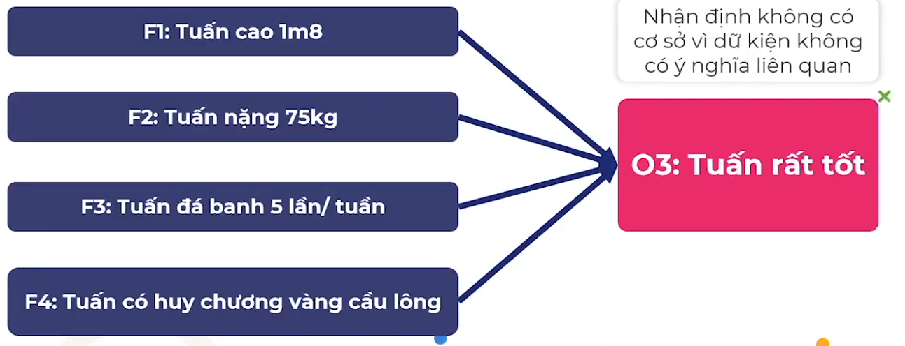
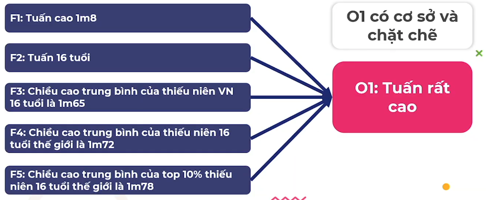
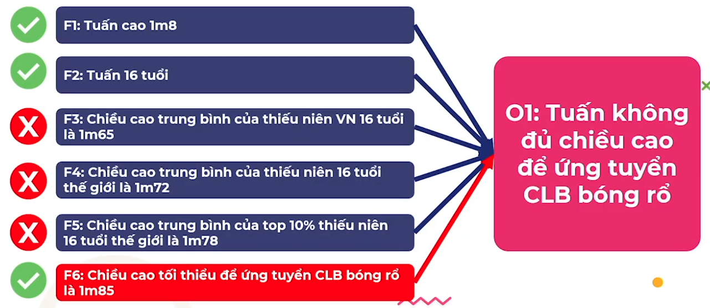

# forming judgments

## Thuốc Đặc Trị Từ F Đến O

### Dữ Kiện Và Nhận Định

Dữ kiện (Fact) là những sự kiện, con số, tồn tại khách quan so với quan điểm. Thuờng có thể kiểm chứng được

- Ví dụ
  - Tuấn cao 1m8 - Dữ kiện khách quan vì nó không phụ thuộc người nói suy nghĩ như thế nào về viêc này
  - Tuấn nặng 75kg
  - Tuấn đá banh 5 lần/ tuần
  - Tuấn có huy chương vàng cầu lông cá nhân cấp Thành phố
- Dữ kiện mang tính khách quan nhưng KHÔNG có nghĩa là nó đúng sự thật
- Tuấn có thể cung cấp sai thông tin về chiều cao của mình, thực chất Tuấn cao 1m75 nhưng anh nói mình cao 1m8
- Đây chính là chỗ chúng ta phải kiểm tra các Fact xem nó có đúng không, nếu đúng nó trở thành Sự thật (Truth)

Nhận định (Opinion) là quan điểm mang tính chủ quan của mỗi chúng ta. Thường khó kiểm chứng hay chứng minh là đúng

- Tuấn rất cao - Quan điểm chủ quan của người nói. Quan điểm này luôn phụ thuộc vào người nói, vì đối với 1 số người 1m8 là rất cao, 1 số khác. Ví dụ cầu thủ bóng rổ Mỹ thì 1m8 là thấp
- Tuấn giỏi thế thao

Dữ liệu là cơ sở hình thành Nhận định

- Một nhận định gọi là có cơ sở khi nó được hình thành dựa trên các dữ kiện có liên quan và quan trọng
- Ngược lại, nhận định gọi là không có cơ sở khi nó không dựa trên bất cứ dữ kiện nào hoặc dựa trên các dữ kiện không liên quan

### Nhận Định

Nhận định có cơ sở

Nhận định không có cơ sở

Thế nào là một nhận định có cơ sở và chặt chẽ?

Nhận định phù hợp với mục tiêu

Thế nào là nhận định mạnh?

- Có cơ sở và chặt chẽ: Dựa trên đầy đủ dữ kiện khách quan; các dữ kiện này phải có ý nghĩa, liên quan một cách logic với nhau và với nhận định
- Đáp ứng đúng mục tiêu: Các dữ kiện phù hợp với mục tiêu của nhận định

Thế nào là nhận định không mạnh?

- Thiếu cơ sở và thiếu chặt chẽ: Không hoặc dựa trên rất ít dữ kiện; các dữ kiện không có ý nghĩa liên quan đến nhận định
- Không đáp ứng đúng mục tiêu: Các dữ kiện không phù hợp với mục tiêu của nhận định

### Dùng F Và O

--

- Cảm tính
  - Hình thành nhận định mà không dựa trên dữ kiện
- Cả tin
  - Tin ngay vào nhận định của người khác mà khônh xem xét nhận định đó có mạnh không?
- Chả biết tin ai
  - Không biết cách đánh giá 1 nhận định là mạnh hay không?
- Phiến diện
  - Hình thành nhận định dựa trên dữ liệu không đầy đủ
- Thích âm mưu
  - Dựa trên các dữ kiện đồn đoán, suy diễn
- Thiếu chính kiến
  - Không đưa ra được nhận định mạnh dù có dữ liệu
- Thiếu thuyết phục
  - Không biết cách tố chức dữ kiện làm cơ sở cho nhận định

## Tình Huống 1: Bất Cập Lương Hưu
